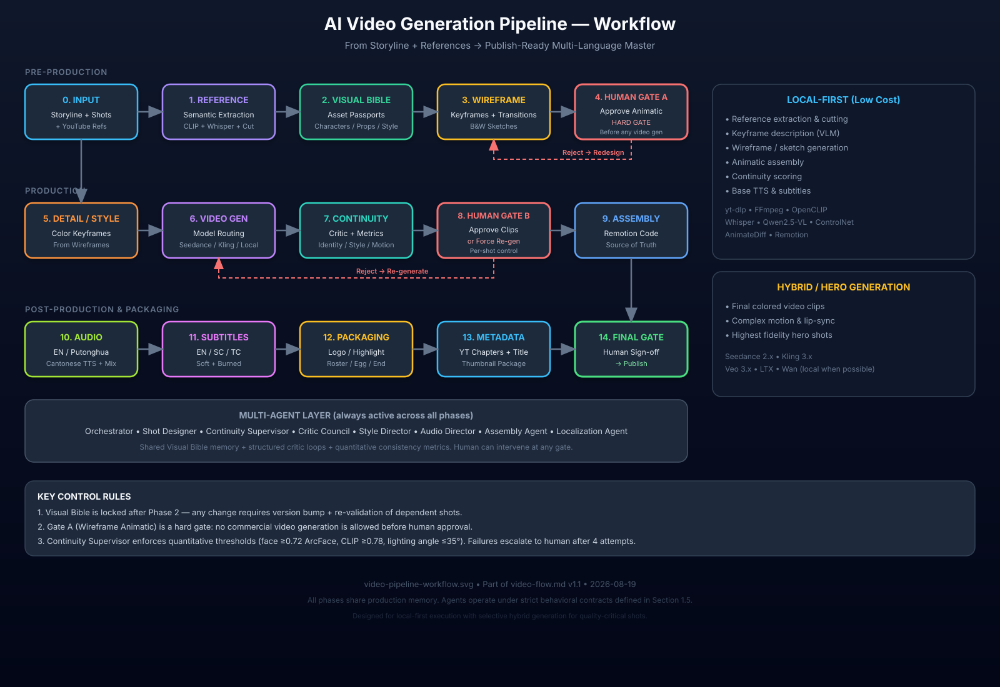

# AI Video Generation Pipeline — Complete Implementation Plan

**Version:** 1.1 (Requirements significantly expanded)  
**Date:** 2026-08-19  
**Goal:** Turn a finished storyline + per-scene shooting instructions (with partial YouTube reference clips) into a fully produced, multi-language, YouTube-ready video through a controlled, low-cost, multi-agent, human-in-the-loop pipeline.

> **v1.1 Change Note:** Section 1 (Requirements) was previously too high-level for production use. It has been rewritten with formal schemas, quantitative consistency thresholds, agent behavioral contracts, precise deliverable specs, cost/audit rules, measurable success criteria, and explicit non-goals.

---

## 1. Detailed Requirements Specification (Enhanced)

> **Assessment of previous version:** The original requirements were functional but under-specified for production use. They lacked quantitative thresholds, formal input/output schemas, failure modes, audit requirements, cost budgets, localization edge cases, and agent behavioral contracts. The section below expands every area into enforceable engineering criteria.

### 1.1 Input Requirements (Strict Schema)

#### 1.1.1 Storyline Document
Must be provided as structured data (JSON or YAML) containing at minimum:

| Field | Type | Required | Description |
|-------|------|----------|-------------|
| `title` | string | Yes | Working title |
| `logline` | string | Yes | One-sentence premise |
| `genre` | string[] | Yes | Primary + secondary genres |
| `target_duration_sec` | number | Yes | Intended final length (excluding packaging) |
| `aspect_ratio` | string | Yes | e.g. `"16:9"`, `"9:16"`, `"2.39:1"` |
| `target_platform` | string[] | Yes | `["youtube"]` minimum |
| `acts` | array | Yes | Ordered list of acts with emotional purpose |
| `characters` | array | Yes | Canonical character list (id, name, role, age range, key traits) |
| `locations` | array | Yes | Canonical location list |
| `themes` | string[] | No | Narrative themes for style guidance |
| `tone` | string | Yes | Overall tone (e.g. “cinematic wuxia, melancholic, high-contrast”) |
| `language_primary` | string | Yes | `"yue"` / `"zh-Hans"` / `"en"` etc. |
| `notes` | string | No | Director notes, constraints, taboos |

#### 1.1.2 Shooting Instruction Schema (per shot)
Every shot must conform to:

```json
{
  "shot_id": "S03-02",
  "scene_id": "S03",
  "order": 12,
  "duration_estimate_sec": 4.5,
  "narrative_purpose": "Reveal the antagonist's true identity through a slow push-in",
  "when": "After the protagonist opens the wooden box",
  "what": [
    {
      "type": "character",
      "entity_id": "char_antagonist",
      "action": "turns slowly toward camera, eyes narrowing",
      "emotion": "cold recognition"
    },
    {
      "type": "prop",
      "entity_id": "prop_jade_seal",
      "state": "held in left hand, partially obscured by sleeve"
    }
  ],
  "how": {
    "shot_size": "MCU → CU",
    "camera_angle": "slight low angle",
    "camera_movement": "slow push-in 15%",
    "lens": "85mm equivalent",
    "lighting": "single hard key from upper left, deep shadows",
    "color_intent": "desaturated teal shadows, warm skin highlight",
    "sound_design_notes": "diegetic wind + low drone swell"
  },
  "references": [
    {
      "url": "https://youtube.com/shorts/xxxx",
      "relevant_portion_hint": "middle 40% of the short, the close-up face turn",
      "notes": "Ignore the product placement at start and end logo"
    }
  ],
  "constraints": ["no modern objects", "period costume only", "no text on screen"],
  "priority": "hero"   // "hero" | "supporting" | "broll"
}
```

All `entity_id` values must resolve to entries in the Visual Bible (Phase 2). Missing or ambiguous fields must be rejected by the Orchestrator before any generation begins.

#### 1.1.3 Reference Video Constraints
- Maximum reference length accepted: 180 seconds (longer videos must be pre-trimmed by user or by the extraction agent with explicit human confirmation).
- Only publicly accessible YouTube videos (or user-provided local files) are supported.
- System must never store full original YouTube videos longer than the extracted relevant segment after processing.
- User must declare that references are used under fair-use / transformative-use assumptions for the purpose of style and composition reference only. The pipeline does not copy audio or distinctive copyrighted music.

### 1.2 Output Requirements (Precise Deliverables)

#### 1.2.1 Master Video File
- Container: MP4
- Video codec: H.264 (High Profile) or H.265 (Main10) — user selectable
- Resolution: 1920×1080 (default) or 3840×2160
- Frame rate: 24 / 25 / 30 fps (locked to project setting, no mixed rates)
- Bitrate target: ≥ 12 Mbps (1080p) / ≥ 35 Mbps (4K) for final master
- Audio: AAC-LC, 48 kHz, stereo or 5.1 (if music stems support it)
- Color space: Rec.709 (SDR) unless HDR is explicitly requested
- Must contain embedded chapters matching the scene boundaries

#### 1.2.2 Language & Subtitle Variants
Three complete spoken versions must be generated:
1. English
2. Putonghua (Mandarin, Mainland pronunciation)
3. Cantonese (Hong Kong / Guangdong standard, Traditional Chinese script for any on-screen text)

Subtitle requirements:
- Soft subtitle tracks (`.srt` or `.vtt`) for all three languages
- Optional burned-in versions for platforms that strip soft tracks
- Timing accuracy: ±2 frames against spoken audio
- Maximum two lines, 42 characters per line preferred
- Style must not conflict with the visual language (font, size, position, outline defined in project style guide)

#### 1.2.3 Packaging Elements (Mandatory Order)
1. Highlight / teaser (8–20 seconds, strongest moments, no spoilers of final twist if present)
2. Introduction logo / bumper (2–5 seconds)
3. Main content
4. End roster / credits
5. Easter egg (optional, 3–12 seconds, after credits)
6. Final end card / static or animated image (3–8 seconds)

#### 1.2.4 YouTube Metadata Package
Must include:
- Title (≤ 100 characters, optimized)
- Short description (≤ 200 characters)
- Long description (with timestamps, links, hashtags)
- Chapter markers (exact seconds)
- Tags / keywords
- Thumbnail image (1280×720, high contrast, readable text if any)
- End-screen element suggestions
- Playlist / series metadata if applicable

#### 1.2.5 Production Audit Bundle
For every completed project the system must export a complete audit package containing:
- All prompts used (with model, seed, temperature, timestamp)
- All intermediate assets (wireframes, keyframes, rejected takes)
- Critic scores and full feedback text
- Human feedback logs with timestamps and shot IDs
- Asset hashes (SHA-256) of every final clip and the master
- Model version strings and local environment snapshot
- Cost estimate breakdown (local GPU-hours + commercial API credits)

### 1.3 Consistency Requirements (Quantitative)

These thresholds are enforced by the Continuity Supervisor agent. Failure to meet them blocks progression past the relevant gate.

| Dimension | Metric | Minimum Threshold | Measurement Method |
|-----------|--------|-------------------|--------------------|
| Character face identity | ArcFace / InsightFace cosine similarity | ≥ 0.72 (same identity) | Compare all face crops of same `entity_id` against the locked passport reference |
| Character overall appearance | CLIP image-image similarity | ≥ 0.78 | Full-body or mid-shot embeddings |
| Key prop identity | CLIP + optional object detector embedding | ≥ 0.80 | Cropped prop vs passport |
| Location / background | CLIP + spatial layout features | ≥ 0.70 | Wide shots of same location |
| Global style / palette | Color histogram + CLIP aesthetic embedding distance | ≤ 0.35 (distance) | Project-level style embedding vs each shot |
| Lighting direction consistency | Estimated light vector angle difference | ≤ 35° between adjacent shots of same location | Local lighting estimation model |
| Shot-to-shot temporal continuity | Optical flow magnitude discontinuity + critic score | No hard unexplained jumps | Critic + simple motion analysis |

Any shot that fails two or more of the above metrics after the maximum allowed regeneration attempts must be escalated to human review.

### 1.4 Quality Gates & Process Requirements

#### Gate A — Wireframe Animatic Approval (Hard Gate)
- Must occur before any commercial video model is called.
- Deliverable: single playable animatic (B&W or limited color) with approximate timing and temp audio.
- Human must explicitly approve, reject, or request changes per shot ID.
- System may not proceed to Phase 5+ without a recorded approval event.

#### Gate B — Clip Selection Approval
- Human reviews the selected video takes in context.
- Can force regeneration of individual shots with new constraints.

#### Gate C — Final Master Approval
- Full review of picture + all language audio tracks + subtitles + packaging.
- Sign-off required before publish package is generated.

#### Additional Process Rules
- Maximum 4 automatic regeneration attempts per shot before mandatory human escalation.
- All agent decisions that change a locked passport require a new version number and re-validation of dependent shots.
- Critic agents must return structured JSON (scores + free-text rationale + suggested prompt deltas). Free-text-only feedback is rejected.
- Prefer local compute for: reference extraction, keyframe description, wireframe generation, animatic assembly, continuity scoring, base TTS, subtitle generation.
- Commercial models may be used only for final hero video generation and high-quality voice cloning when local quality is insufficient.

### 1.5 Agent Behavioral Contracts

| Agent | Must | Must Not |
|-------|------|----------|
| Orchestrator / Creative Producer | Maintain global context, enforce Visual Bible, route tasks, record all decisions | Invent new characters or locations without human approval |
| Shot Designer | Produce descriptions and wireframes that strictly obey passports and original instruction intent | Change narrative purpose of a shot |
| Continuity Supervisor | Score every entity against locked references using quantitative metrics | Override human approval decisions |
| Critic Council | Return structured scores + actionable feedback | Approve a shot that fails hard consistency thresholds |
| Style Director | Protect global palette, grain, lens language | Introduce new aesthetic elements after Visual Bible is locked |
| Assembly Agent | Keep Remotion (or equivalent) code as single source of truth | Hard-code timings that cannot be edited |
| Localization Agent | Preserve emotional intent and timing across languages | Invent dialogue not present in the source script |

### 1.6 Non-Functional & Operational Requirements

- **Reproducibility**: Given the same locked Visual Bible, same prompts, same seeds, and same model versions, the pipeline must be able to regenerate any intermediate asset to within normal generative variance.
- **Cost Budget Awareness**: System must estimate and display projected commercial credit cost before starting Phase 6. User can set a hard budget cap.
- **Local Resource Awareness**: Detect available VRAM and automatically choose quantized models or offload strategies when necessary.
- **Privacy**: Reference videos and intermediate frames never leave the local machine unless the user explicitly enables a commercial model that requires upload.
- **Failure Modes**: Network failure, model timeout, low similarity scores, and human rejection must all be handled gracefully with clear recovery paths and no silent data loss.
- **Auditability**: Every state change is append-only logged with timestamp, agent ID, and content hash.

### 1.7 Success Criteria (Measurable)

1. **Process Success**
   - Gate A (wireframe animatic) is reached and approved before any commercial video generation occurs in ≥ 95% of projects.
   - Average number of human interventions per 60-second finished film ≤ 8 (excluding pure approvals).

2. **Consistency Success**
   - ≥ 90% of final shots meet all quantitative consistency thresholds in Section 1.3 without human override.
   - Face identity similarity across the entire film never drops below 0.68 for any named character.

3. **Output Completeness**
   - All three language audio tracks + three subtitle tracks + packaging elements + YouTube metadata package are present and technically valid.
   - Master video plays correctly on YouTube, Chrome, Safari, and VLC without codec or timing errors.

4. **Audit Success**
   - Complete production audit bundle can be exported and independently verified (hashes match, prompts reconstructible).

5. **Cost & Time Success (target for a 60–90 s finished film)**
   - Local analysis + wireframe stage completable on a 16 GB VRAM machine in < 4 hours wall time.
   - Commercial generation cost kept under a user-defined budget (default recommendation: <$25 for a polished 60 s piece using mixed models).

### 1.8 Explicit Non-Goals (Out of Scope for v1)

- Real-time collaborative multi-user editing.
- Full automatic dialogue writing from logline only (script is assumed provided or derived from the storyline).
- Photorealistic human performance capture / neural avatar replacement beyond what current image-to-video models support.
- Automatic copyright clearance of reference material.
- Live streaming or interactive video generation.

---

---

## 2. High-Level Architecture & Workflow Diagram

### 2.1 Primary Workflow Diagram (Standalone SVG File)

The complete pipeline workflow is provided as a dedicated SVG file that can be opened independently or rendered by any Markdown viewer that supports local images:

**File:** [`video-pipeline-workflow.svg`](./video-pipeline-workflow.svg)



> The diagram shows all 14 phases, the two hard human gates (Gate A = wireframe animatic, Gate B = clip approval), reject/redesign loops (dashed red arrows), the always-on multi-agent layer, and the local-first vs hybrid generation split.

### 2.2 Text Flow Summary (for accessibility)

```
PRE-PRODUCTION
0. INPUT  →  1. REFERENCE ANALYSIS  →  2. VISUAL BIBLE  →  3. WIREFRAME  →  4. HUMAN GATE A
                                                                              ↓ (reject)
                                                                         back to Wireframe

PRODUCTION
5. DETAIL/STYLE  →  6. VIDEO GEN  →  7. CONTINUITY + CRITIC  →  8. HUMAN GATE B  →  9. ASSEMBLY
                                              ↑ (reject)                   ↓
                                         re-generate clips            Remotion code

POST + PACKAGING
10. AUDIO (EN / Putonghua / Cantonese)  →  11. SUBTITLES  →  12. PACKAGING  →  13. METADATA  →  14. FINAL GATE → Publish
```

**Key control points highlighted in the diagram:**
- **Gate A** (Wireframe Animatic) is a *hard gate* — no commercial video generation is allowed before human approval of the animatic.
- **Gate B** allows surgical re-generation of individual shots without restarting the whole pipeline.
- Continuity Supervisor enforces quantitative thresholds (face ArcFace ≥ 0.72, CLIP ≥ 0.78, lighting angle ≤ 35°, etc.).
- Visual Bible is locked after Phase 2; any change requires a version bump and re-validation of dependent shots.
- Multi-agent layer runs continuously and shares production memory + locked passports.

---

## 3. Complete Improved Pipeline (Detailed Phases)

### Phase 0 — Input Preparation (Already Done by User)
- Structured storyline document.
- Scene list with ordered shooting instructions.
- Each instruction linked to one or more YouTube reference URLs + optional notes about which part of the video is relevant.

**Deliverable:** `storyline.json` + `shots.json` (machine-readable).

---

### Phase 1 — Reference Video Analysis & Relevant Segment Extraction  
**(Low-cost, fully local algorithm)**

**Goal:** For every reference URL, download the video once and extract only the temporally coherent segment that best matches the corresponding shooting instruction.

#### Algorithm (Recommended Local Pipeline)

1. **Download**
   ```bash
   yt-dlp -f "bv*+ba/b" --merge-output-format mp4 -o "refs/%(id)s.%(ext)s" URL
   ```
   (or use `--download-sections` if approximate times are already known).

2. **Transcription (optional but high value)**
   - Local `faster-whisper` (large-v3 or turbo) → word-level timestamps.
   - Store as `refs/<id>.json`.

3. **Candidate Segment Generation**
   - Run PySceneDetect (ContentDetector) → list of hard cuts.
   - Also sample frames at 1–2 fps for dense coverage.
   - Produce candidate intervals (scene-bounded + sliding windows of 4–15 s).

4. **Semantic Scoring**
   - Extract 3–8 representative frames per candidate interval.
   - Encode frames with OpenCLIP / SigLIP / MobileCLIP (local).
   - Encode the shooting instruction text (and any “what/how” sub-items) with the same text encoder.
   - Score = mean cosine similarity of frames to instruction + optional transcript similarity + temporal smoothness bonus.
   - Prefer continuous high-score regions over scattered high scores.

5. **Boundary Refinement**
   - Expand or shrink the highest-scoring interval by ±0.5–1.5 s so it starts and ends on relatively clean frames (avoid mid-motion cuts when possible).
   - Optional human override of start/end times.

6. **Cut**
   ```bash
   ffmpeg -ss START -to END -i full.mp4 -c copy refs/<id>_relevant.mp4
   ```
   (re-encode only if precise frame accuracy is required).

7. **Quality Gate**
   - Discard candidates below a similarity threshold.
   - Log the chosen interval and its score.

**Tools (all local):** yt-dlp, FFmpeg, PySceneDetect, OpenCLIP / SigLIP, faster-whisper, optional local VLM for extra verification.

**Deliverable:** One clean reference clip per relevant instruction + metadata (timestamps, score, transcript snippet).

---

### Phase 2 — Visual Bible / Asset Passport Locking

Before any creative generation:

1. **Entity Extraction**
   - Orchestrator + LLM parse the entire storyline + instructions → list of characters, key props, locations, recurring visual motifs.

2. **Reference-Driven Asset Creation**
   - From the extracted relevant clips, generate:
     - Character turnaround sheets (front / 3⁄4 / side / back + face close-up).
     - Prop reference images.
     - Location / environment plates.
     - Style / color palette extraction (dominant colors, lighting quality, grain, lens feel).

3. **Passport Creation**
   - Every entity receives a locked “passport”:
     - Canonical text description (immutable wording).
     - Reference image set.
     - Negative descriptors (what it must never look like).
   - Passports are stored in production memory and copied verbatim into every subsequent prompt that uses the entity.

4. **Human Review Gate (optional but recommended)**
   - Approve the Visual Bible before proceeding.

**Why this exists:** Modern AI video models have no memory between generations. The pipeline itself must be the memory.

---

### Phase 3 — Wireframe / Storyboard Design (Multi-Agent)

**Agents involved:**
- Shot Designer Agent
- Continuity Supervisor
- Critic Council (composition, lighting, camera language, narrative clarity)
- Style Director (keeps overall aesthetic coherent)

**Process per shot / sequence:**

1. Shot Designer produces:
   - Detailed text description of the new shot (camera, action, lighting, mood) that satisfies the original instruction while incorporating the locked Visual Bible.
   - Black-and-white wireframe / sketch keyframe(s) (start, mid, end if needed). Preferred methods:
     - ControlNet (Lineart / Canny / SoftEdge) + sketch LoRA on a local SD / Flux model.
     - Or pure text-to-sketch models.
   - Transition description between consecutive keyframes (camera move, subject motion, lighting change, optical effect).

2. Continuity Supervisor checks identity, prop, and environment consistency against the Visual Bible and previous approved keyframes.

3. Critic Council scores the proposal on a rubric and returns structured feedback.

4. Loop until all critics pass thresholds **or** human intervenes.

5. Generate simple transition wireframes (cross-dissolve sketches, motion arrows, or short animated morphs via AnimateDiff / FFmpeg).

**Output of this phase:** Ordered set of approved B&W keyframes + transition descriptions + timing estimates.

---

### Phase 4 — Wireframe Animatic (Human Gate A — Highest Leverage)

1. Assemble all wireframe keyframes + transitions into a low-fidelity animatic video (FFmpeg or Remotion).
2. Add placeholder timing, simple sound design, and optional temp narration.
3. Human reviews the full animatic.
4. Human can request changes to any shot or transition; the system returns to Phase 3 for only the affected parts.
5. Only after explicit approval does the pipeline proceed to expensive generation.

**This gate prevents the majority of wasted generation cost.**

---

### Phase 5 — Detailed Style & Color Pass on Still Keyframes

- Style Director + Image agents take each approved wireframe and produce high-quality colored still keyframes that strictly follow the Visual Bible.
- Multiple variations can be generated; human or critic selects the keeper.
- These colored stills become the primary conditioning images for video generation (image-to-video / keyframe conditioning).

---

### Phase 6 — Video Clip Generation (Model Routing)

- For each shot, the Orchestrator / DoP agent chooses the most suitable model:
  - Long continuous action / lip-sync → Seedance family
  - Cinematic motion / multi-shot → Kling
  - Highest fidelity hero moments → Veo
  - Local / cost-sensitive → LTX, Wan, AnimateDiff + ControlNet, etc.
- Conditioning: colored keyframe(s) + passport text + motion / camera description + negative prompts.
- Generate 2–4 variations per shot when budget allows.
- Continuity Supervisor + Critic immediately score each take.

---

### Phase 7 — Continuity & Critic Loop

- Multimodal Continuity Supervisor re-identifies characters/props across the selected takes.
- Critic Council evaluates motion naturalness, lighting continuity with adjacent shots, style drift, artifacts.
- Failed shots are automatically re-prompted (surgical changes only) or returned to human.

---

### Phase 8 — Human Gate B (Clip Approval)

Human reviews the selected video clips in context of the animatic. Can force re-generation of individual shots.

---

### Phase 9 — Final Assembly (Remotion Preferred)

- Assembly Agent writes / updates a Remotion composition (React code).
- All video clips, audio stems, timing, transitions, text overlays live in code.
- Benefits: agents are excellent at writing and editing React; humans can open Remotion Studio and surgically tweak; full reproducibility.

Alternative: pure FFmpeg / MoviePy pipeline if code-based composition is not desired.

---

### Phase 10 — Audio & Multilingual Speech

1. Script / dialogue extraction or generation per language.
2. TTS:
   - English: high-quality commercial or local (e.g., CosyVoice, Tortoise, etc.).
   - Putonghua: CosyVoice / ChatTTS / commercial.
   - Cantonese: GPT-SoVITS fine-tuned or equivalent high-quality local/commercial Cantonese voice.
3. Sound design + music (agent or human).
4. Mix and sync to picture (lip-sync where applicable).

---

### Phase 11 — Subtitles

- Generate accurate timed subtitles for EN / Simplified Chinese / Traditional Chinese (Cantonese).
- Soft tracks (preferred) + optional burned-in versions for social platforms.
- Style consistent with overall visual language.

---

### Phase 12 — Packaging Elements

- Highlight / teaser (first 5–15 s) generated from the strongest moments.
- Introduction logo / bumper.
- End roster (credits).
- Easter egg (short unexpected clip after credits).
- Final end card / image.

All inserted into the Remotion composition or FFmpeg timeline.

---

### Phase 13 — Metadata & YouTube Packaging

- Auto-generate chapters / breakpoints from scene boundaries.
- Title, short description, long description, tags.
- Thumbnail: best keyframe (or specially designed) + text overlay.
- End-screen suggestions, cards, etc.

---

### Phase 14 — Final Human Approval & Publish

Human watches the complete master. After sign-off the Publish Agent can upload (or hand off the package).

---

## 4. Recommended Tool Stack (2026)

| Stage                        | Preferred Local / Low-cost                          | Higher-quality / Hybrid                  |
|-----------------------------|-----------------------------------------------------|------------------------------------------|
| Download & cut              | yt-dlp + FFmpeg                                     | —                                        |
| Scene / keyframe detect     | PySceneDetect + FFmpeg                              | —                                        |
| Semantic matching           | OpenCLIP / SigLIP                                   | —                                        |
| Transcription               | faster-whisper                                      | —                                        |
| Frame description           | Qwen2.5-VL 7B / 32B, LLaVA, Moondream               | GPT-4o / Claude vision                   |
| Wireframe sketches          | ControlNet (Lineart/Canny) + SD/Flux                | —                                        |
| Animatic                    | FFmpeg / simple Remotion / AnimateDiff              | —                                        |
| Colored stills              | Flux / SD3 / local + IP-Adapter                     | Midjourney / Flux pro                    |
| Video generation            | LTX, Wan, AnimateDiff + ControlNet                  | Seedance 2.x, Kling 3.x, Veo 3.x         |
| Composition                 | **Remotion** (strongly recommended)                 | DaVinci / Premiere                       |
| TTS                         | GPT-SoVITS (Cantonese), CosyVoice, Edge-TTS         | ElevenLabs / commercial                  |
| Orchestration               | LangGraph / CrewAI / custom swarm + production memory | invideo-style agent platforms          |

---

## 5. Implementation Notes & Best Practices

- Always work **act-by-act or scene-by-scene**. Full-film context windows still drift.
- Treat the Visual Bible as immutable once locked. Any change requires explicit version bump and re-validation of downstream assets.
- Log every generation (prompt, seed, model, score, selected/rejected). Reproducibility is more valuable than raw generation speed.
- Human feedback should be structured (shot ID + specific critique) so agents can act surgically.
- Cost control: the wireframe animatic gate is the single highest-ROI decision point. Never skip it.
- For Cantonese content: invest early in a high-quality voice (GPT-SoVITS fine-tune or commercial equivalent). Lip-sync accuracy matters for final polish.

---

## 6. Next Immediate Actions

1. Convert the existing storyline + shooting instructions into strict `storyline.json` + `shots.json`.
2. Implement the Phase 1 local extraction pipeline (yt-dlp → Whisper → CLIP scoring → FFmpeg cut) and test on 3–5 reference videos.
3. Build the Visual Bible extraction agent and human review UI for character/prop/style passports.
4. Stand up the multi-agent orchestrator with Continuity Supervisor + Critic Council.
5. Prototype the wireframe → animatic path (ControlNet sketches + FFmpeg/Remotion assembly).

This plan is designed to be production-ready, cost-aware, consistency-first, and fully aligned with the best practices observed in 2026 agentic AI filmmaking systems.

---

*Document generated for the complete AI video production pipeline. All phases are designed for iterative human-AI collaboration with strong local-first defaults.*