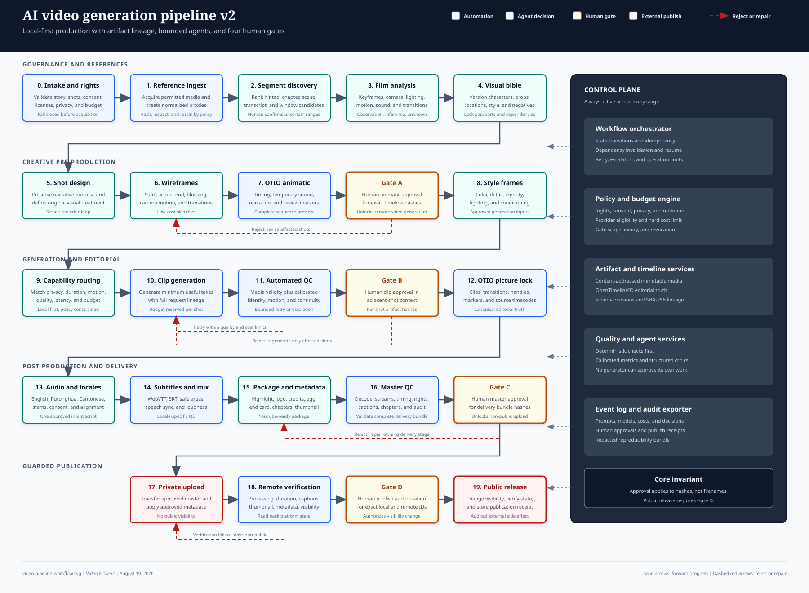

# AI 影片生成流程 v2

本文件是完整 Video Flow v2 製作系統的
實作基準。

**版本：** 2.0  
**狀態：** 實作基準  
**日期：** 2026 年 8 月 19 日  
**取代：** `../v1/video-flow.md`

本規格定義一個本地優先、由人員控制的系統，將結構化故事線、鏡頭指示及
所選參考素材轉換為可供發布的多語言影片套件。它涵蓋製作流程、成品合約、
代理邊界、審批規則、品質控制、成本控制及實作路線圖。

本系統將生成視為較廣泛製作流程中一個可替換的階段。持久的核心是專案狀態、
編輯時間線、成品沿革、審閱歷史及人員審批紀錄。

## 目的與成果

此流程必須產出可重複進行的創意工作，同時不移除人員的編輯控制。它必須減少
昂貴的重新生成、保持連貫性，並讓每項已發布資產均可追溯至獲批的輸入內容和
決策。

所需成果如下：

- 已驗證的故事線及已排序的鏡頭計劃。
- 權利已獲釐清且附有來源沿革的參考片段。
- 結構化的攝影及轉場分析。
- 為重複出現的實體及風格規則鎖定的視覺聖經。
- 付費影片生成前已獲批的線框動態預覽。
- 在正規編輯時間線上組裝的已獲批生成片段。
- 英語、普通話及粵語的音訊和字幕交付項目。
- 精華片段、片頭標誌、片尾名單、可選的復活節彩蛋及結尾
  卡片。
- 完整的 YouTube 中繼資料及縮圖套件。
- 經人員批准、可審計的發布操作。

### 設計原則

這些原則能在每個實作階段一致地解決
取捨。

1. **先批准結構，再顧及保真度。** 在進行昂貴的生成前，鎖定故事、時序、走位及
   轉場。
2. **保持時間線與模型無關。** 將意圖及編輯決策儲存在任何影像、影片、語音或
   語言模型以外。
3. **預設使用本地處理。** 只有在需要經批准的供應商且專案私隱政策允許時，
   才上傳資產。
4. **將機率分數視為經校準的證據。** 不要將相似度閾值表述為普遍事實。
5. **讓每個階段均可恢復。** 失敗的工作程序或被拒絕的鏡頭不得重新啟動不相關的
   工作。
6. **精準地重新生成。** 僅使依賴於已變更輸入、護照、鏡頭或時間線範圍的成品
   失效。
7. **將審批與執行分離。** 人員審批授權的是特定成品雜湊值，而非會變動的
   檔案名稱。
8. **在最後操作前保持發布可逆。** 先以私人或非公開方式上傳，驗證遠端結果，並在
   公開前要求第二次確認。

## v2 的變更

版本 2 保留有用的 v1 階段順序，同時取代在實際製作中
脆弱的假設。

| v1 限制 | v2 解決方案 |
|---|---|
| 敘事階段缺乏由機器強制執行的轉換。 | 持久化狀態機定義允許的轉換、負責人及關卡證據。 |
| 固定相似度值看似普遍適用。 | 專案專屬校準將指標轉換為關卡。 |
| 鏡頭範例不是有效 JSON。 | 所有合約範例均為有效 JSON，並包括綱要版本。 |
| 供應商模型名稱是架構的一部分。 | 以能力為本的介面卡隔離會變動的供應商及模型。 |
| Remotion 是唯一建議的時間線來源。 | OpenTimelineIO 是正規的編輯模型；Remotion 和 FFmpeg 是渲染介面卡。 |
| 權利審閱只是備註，而非關卡。 | 權利、肖像、聲音、音樂及保留聲明會阻擋擷取和發布。 |
| 人員審批指涉可變動的輸出。 | 每項審批均記錄成品雜湊值、範圍、審批人及到期時間。 |
| 發布是單一步驟。 | 最終母版審批及發布授權是獨立關卡。 |
| 失敗處理僅作描述。 | 已指定冪等性、重試、死信狀態及相依性失效。 |
| 輸出要求集中於一個 MP4。 | 交付套件將中間格式、上傳、語言、字幕、中繼資料及審計資產分開。 |

## 範圍及假設

此版本面向可按場景逐一處理的短篇及緊湊型敘事製作。架構可以
擴展至更長的作品，但 v2 並不聲稱可
無人值守地生成長篇電影。

### 範圍內

系統涵蓋以下製作及營運能力。

- 故事線及鏡頭計劃驗證。
- 當使用者有權取得素材時進行參考素材擷取。
- 相關片段發現、確認、剪裁及保留控制。
- 關鍵影格、轉場、鏡頭、燈光、風格、動作及音訊分析。
- 視覺聖經、分鏡圖、線框圖、動態預覽及風格影格工作流程。
- 與供應商無關的影像、影片、語音、轉錄、翻譯及評分
  介面卡。
- 具有限制迭代及人員仲裁的多代理批評。
- 編輯組裝、音訊混音、字幕、封裝及品質控制。
- YouTube 中繼資料生成、受保護的上傳、驗證及發布。
- 成本估算、審計日誌、來源追溯及專案復原。

### 範圍外

以下能力需要另行制定規格。

- 自動版權清權或法律意見。
- 規避存取控制、數碼權利管理、付費牆、地理限制或
  平台保障措施。
- 無人值守地創作會改變已獲批故事的新對白。
- 未經授權的聲音複製、肖像複製或冒充。
- 即時協作編輯或即時影片生成。
- 在製作工作流程中訓練基礎模型。
- 機率生成模型的保證確定性輸出。

### 假設

在專案清單覆蓋前，實作採用以下預設
值。

- 一個專案有一個已鎖定的幀率、畫面比例及色彩設定檔。
- 專案可包含橫向、縱向或電影輸出設定檔，但
  每個設定檔均從不同的時間線版本渲染。
- 參考素材為鏡頭語法提供參考，除非權利清單明確允許重用，否則不會成為最終
  作品中的來源片段。
- 使用者提供或批准所有最終故事內容。
- 無論分數如何，人員審閱者均可拒絕任何自動推薦。
- 初始部署在 Windows 上運行，並配備不依賴 Windows 專屬
  路徑語法的可攜式工作程序介面。

## 要求基準

每項要求均有穩定識別碼。測試、關卡報告及審批紀錄必須引用這些識別碼，
以令發布證據保持可追溯。

### 輸入要求

輸入內容必須有足夠的結構，以便在媒體處理開始前進行驗證。

| ID | 要求 |
|---|---|
| `IN-001` | 專案必須包含已版本化的清單，當中包括標題、主旨句、目標時長、輸出設定檔、主要語言、地區設定、預算政策及保留政策。 |
| `IN-002` | 每個場景及鏡頭必須有從不依賴顯示順序的穩定識別碼。 |
| `IN-003` | 每個鏡頭必須定義敘事目的、時序意圖、`when`、`what`、`how`、約束、優先級及所參考的實體識別碼。 |
| `IN-004` | 在生成分鏡圖前，每個實體識別碼必須解析為角色、道具、地點、服裝項目或主題記錄。 |
| `IN-005` | 每項外部參考資料必須包括來源 URL 或本地路徑、相關性提示、預定用途、權利依據及保留類別。 |
| `IN-006` | 驗證錯誤必須識別欄位、要求 ID、來源檔案及修正操作。 |

### 參考素材處理要求

參考素材處理必須盡量減少儲存，並避免將可用性解讀為許可。

| ID | 要求 |
|---|---|
| `REF-001` | 在下載遠端參考素材或分析本地參考素材前，權利關卡必須通過。 |
| `REF-002` | 系統在定位相關片段時，必須優先使用直接時間提示，其次是章節，最後是多模態搜尋。 |
| `REF-003` | 系統必須保留每個保留片段的來源中繼資料、所選時間戳記、置信度證據及 SHA-256 雜湊值。 |
| `REF-004` | 低置信度或相衝突的片段匹配必須要求人員確認。 |
| `REF-005` | 精確剪輯必須在非關鍵影格邊界附近解碼並重新編碼；近似剪輯可以使用串流複製。 |
| `REF-006` | 根據保留政策，完整下載的參考素材必須在片段批准後刪除或隔離。 |

### 分析及創意要求

分析輸出必須具結構、可審閱，並可供後續階段
重用。

| ID | 要求 |
|---|---|
| `ANA-001` | 每個已獲批片段必須產出具來源時間碼及擷取理由的代表性關鍵影格。 |
| `ANA-002` | 每個關鍵影格必須包括構圖、走位、鏡頭、鏡頭焦距、燈光、色調、製作設計、氣氛、動作及音訊觀察。 |
| `ANA-003` | 連續關鍵影格必須包括轉場分析，以區分鏡頭移動、主體移動、剪輯類型及環境變化。 |
| `ANA-004` | 模型觀察必須標記為觀察、推論或未知。 |
| `CRE-001` | 視覺聖經必須為重複出現的實體定義正規描述、已獲批影像、負面約束及已版本化的護照。 |
| `CRE-002` | 新鏡頭設計必須保留敘事意圖，但不得直接複製參考素材中具獨特性的受保護表達。 |
| `CRE-003` | 每個鏡頭必須有起始及結束線框圖；具有明顯內部變化的鏡頭還必須有一個或多個中間線框圖。 |
| `CRE-004` | 每個鏡頭必須定義鏡頭動作、主體動作、轉場行為、時長、音訊意圖及連貫性相依關係。 |
| `CRE-005` | 護照變更必須使所有未獲批後代成品失效，並將已獲批後代成品排隊進行影響審閱。 |

### 工作流程及審批要求

控制層必須防止代理及工作程序繞過人員關卡。

| ID | 要求 |
|---|---|
| `WF-001` | 對於相同輸入、設定、介面卡版本及操作鍵，每個階段必須具冪等性。 |
| `WF-002` | 流程必須在中斷後從最後一項有效成品恢復。 |
| `WF-003` | 自動批評必須在已設定的嘗試次數或成本上限後停止，並升級交由人員處理。 |
| `WF-004` | 代理不得批准其生成的成品。 |
| `WF-005` | 在進行任何付費或遠端最終影片生成前，關卡 A 必須批准動態預覽。 |
| `WF-006` | 在鎖定最終編輯組裝前，關卡 B 必須批准所選片段。 |
| `WF-007` | 關卡 C 必須批准完整母版及交付套件。 |
| `WF-008` | 關卡 D 必須授權發布具有完全相同已獲批母版雜湊值及中繼資料雜湊值的內容。 |
| `WF-009` | 審批紀錄必須包括範圍、成品雜湊值、審批人、時間戳記、決定、評論及到期或撤銷狀態。 |

### 本地化及封裝要求

語言變體必須保留原意，同時保持可獨立審閱。

| ID | 要求 |
|---|---|
| `LOC-001` | 除非專案明確停用某種語言，否則交付套件必須包括英語、普通話及粵語語音變體。 |
| `LOC-002` | 必須生成及審閱英語、簡體中文及繁體中文粵語字幕軌。 |
| `LOC-003` | 本地化必須保留已獲批的意義、角色意圖、術語、名稱及情感節拍。 |
| `LOC-004` | 最終審閱後，字幕提示邊界必須在兩個專案影格內與語音對齊。 |
| `LOC-005` | 字幕版面不得超過兩行，並且必須通過每個輸出設定檔的安全區及可讀性檢查。 |
| `PKG-001` | 封裝必須支援按已獲批次序編排的精華片段、片頭標誌、主要內容、片尾名單、可選的復活節彩蛋及最終結尾卡片。 |
| `PKG-002` | 章節標記必須從 `00:00` 開始、至少包含三個項目、按遞增順序出現，並為每個 YouTube 章節分配至少 10 秒。 |
| `PKG-003` | 發布套件必須包括標題、簡短說明、詳細說明、章節、標籤、縮圖、語言中繼資料、授權附註及結尾畫面建議。 |

### 輸出及營運要求

輸出內容必須在技術上有效、可審計且可安全發布。

| ID | 要求 |
|---|---|
| `OUT-001` | 正規編輯時間線必須儲存為 OpenTimelineIO，並附有外部媒體參考資料及已版本化標記。 |
| `OUT-002` | 預設上傳母版必須是 MP4，採用 H.264 High Profile 影片、AAC-LC 音訊、Rec.709 SDR、固定幀率及快速啟動中繼資料。 |
| `OUT-003` | 音訊分軌必須使用 48 kHz WAV；字幕來源必須包括 WebVTT 及 SRT。 |
| `OUT-004` | 系統必須根據頻道能力，產出獨立的各語言上傳檔案或經驗證的多音軌交付套件。 |
| `OPS-001` | 每項生成的成品必須記錄輸入雜湊值、設定雜湊值、介面卡識別碼、模型識別碼、支援時的種子、時序、成本及日誌參考資料。 |
| `OPS-002` | 系統必須在遠端生成前估算成本，並在超出專案硬性預算前停止。 |
| `OPS-003` | 密碼及已驗證 Cookie 不得出現在提示、日誌、中繼資料套件或審計匯出內容中。 |
| `OPS-004` | 來自外部媒體的轉錄稿、字幕、中繼資料及模型輸出必須視為不受信任的資料，而非可執行指示。 |
| `OPS-005` | 審計套件必須包括清單、審批、提示、決策、模型及工具版本、雜湊值、成本、品質報告及發布收據。 |

## 系統架構

此架構將持久的控制狀態與媒體處理分離。控制平面
協調不可變的產物及事件；無狀態工作程序會
透過具版本的轉接器執行擷取、分析、生成、渲染
及發布。



可存取的文字等效內容如下：

```text
Intake and rights
  -> reference ingest
  -> segment discovery and approval
  -> cinematography analysis
  -> visual bible lock
  -> shot design and wireframes
  -> animatic
  -> Gate A: human animatic approval
  -> style frames
  -> capability-based clip generation
  -> automated quality control and bounded retry
  -> Gate B: human clip approval
  -> canonical editorial timeline
  -> audio, localization, subtitles, and packaging
  -> Gate C: human master approval
  -> private or unlisted upload and remote verification
  -> Gate D: human publish authorization
  -> public release

All stages write immutable artifacts, append-only events, cost records, and
quality evidence. Rejections return only to the nearest owning stage.
```

### 架構元件

每個元件各有一項主要職責，並透過
具版本的合約通訊。

| 元件 | 職責 | 持久輸出 |
|---|---|---|
| 專案 API 和審閱 UI | 收集輸入、顯示預覽、記錄決策並呈現狀態。 | 專案變更和批准紀錄 |
| 工作流程協調器 | 強制執行狀態轉換、依賴項失效、重試、預算及人手關卡。 | 工作流程事件和操作紀錄 |
| 政策引擎 | 強制執行權利、私隱、供應商、預算、聲音、肖像及發布規則。 | 政策決策和證據 |
| 產物服務 | 儲存具內容定址的媒體和 JSON 產物，並保留沿革。 | 產物封套和雜湊值 |
| 參考資料工作程序 | 擷取、正規化、分段、轉錄及擷取影格。 | 參考資料分段和分析輸入 |
| 創意工作程序 | 製作視覺聖經、鏡頭計劃、線框圖和風格影格。 | 具版本的創意資產 |
| 生成路由器 | 將鏡頭要求配對至已批准的供應商能力。 | 生成工作和候選片段 |
| 品質服務 | 執行確定性檢查、經校準的指標和評審檢閱。 | 品質報告和修正要求 |
| 剪輯服務 | 維護 OpenTimelineIO，並透過 Remotion 或 FFmpeg 轉接器渲染。 | 時間軸版本和渲染結果 |
| 本地化服務 | 翻譯、合成、對齊、製作字幕及封裝語言變體。 | 腳本、音軌分軌和字幕軌 |
| 發布服務 | 以最小權限上載、驗證遠端資產並變更可見度。 | 上載和發布收據 |
| 稽核匯出器 | 整合可重現性、權利、品質、成本及批准證據。 | 已簽署的稽核套件 |

### 狀態機

協調器只接受此表中的狀態轉換。遭拒絕時，專案或受影響鏡頭會
移至所屬狀態，而不會刪除先前的產物。

| 狀態 | 所需證據 | 允許的下一個狀態 |
|---|---|---|
| `DRAFT` | 存在專案清單。 | `VALIDATED` |
| `VALIDATED` | 輸入綱要及交叉參照檢查通過。 | `RIGHTS_CLEARED` |
| `RIGHTS_CLEARED` | 權利和同意紀錄符合政策。 | `REFERENCES_INGESTED` |
| `REFERENCES_INGESTED` | 存在已正規化媒體和中繼資料雜湊值。 | `SEGMENTS_APPROVED` |
| `SEGMENTS_APPROVED` | 相關範圍已獲人手或經校準的自動接受。 | `ANALYSIS_APPROVED` |
| `ANALYSIS_APPROVED` | 關鍵影格和轉場報告通過完整性檢查。 | `BIBLE_LOCKED` |
| `BIBLE_LOCKED` | 視覺聖經版本獲明確批准。 | `STORYBOARD_READY` |
| `STORYBOARD_READY` | 已具備所有必需的鏡頭線框圖和轉場。 | `ANIMATIC_REVIEW` |
| `ANIMATIC_REVIEW` | 已具備動態分鏡渲染結果及審閱清單。 | `ANIMATIC_APPROVED` 或 `STORYBOARD_READY` |
| `ANIMATIC_APPROVED` | 關卡 A 批准與動態分鏡雜湊值相符。 | `CLIP_GENERATION` |
| `CLIP_GENERATION` | 已具備候選片段和生成清單。 | `CLIP_REVIEW` 或 `BLOCKED` |
| `CLIP_REVIEW` | 已具備品質報告和具脈絡的預覽。 | `CLIPS_APPROVED` 或 `CLIP_GENERATION` |
| `CLIPS_APPROVED` | 關卡 B 涵蓋所有時間軸片段。 | `MASTER_REVIEW` |
| `MASTER_REVIEW` | 影像、音訊、字幕、封裝和中繼資料通過檢查。 | `MASTER_APPROVED` 或 `CLIPS_APPROVED` |
| `MASTER_APPROVED` | 關卡 C 與交付套件雜湊值相符。 | `UPLOAD_VERIFICATION` |
| `UPLOAD_VERIFICATION` | 遠端上載為私人或不公開，且已驗證。 | `PUBLISH_AUTHORIZED` 或 `MASTER_REVIEW` |
| `PUBLISH_AUTHORIZED` | 關卡 D 與遠端影片、母帶和中繼資料雜湊值相符。 | `PUBLISHED` |
| `PUBLISHED` | 遠端可見度和中繼資料驗證通過。 | 終止狀態 |
| `BLOCKED` | 已具備失敗紀錄和修正負責人。 | 所屬的先前狀態 |

## 標準產物合約

每個階段均會交換不可變且具綱要版本的產物。可變的專案
檢視是根據這些產物及僅可附加的事件日誌建立的投影。

### 產物封套

封套為每個 JSON 或媒體
產物提供沿革和可重現性。

```json
{
  "schema": "video-flow/artifact-envelope",
  "schema_version": "2.0.0",
  "artifact_id": "art_01J6R4M8QF3W3R3W8M6QF0XK2A",
  "artifact_type": "reference.segment",
  "project_id": "prj_moon_gate",
  "scope_id": "shot_S03_02",
  "created_at": "2026-08-19T12:00:00Z",
  "created_by": "worker.reference.segmenter",
  "content_uri": "artifacts/sha256/7a/7a93...f2.mp4",
  "sha256": "7a93...f2",
  "byte_length": 18420393,
  "input_artifact_ids": ["art_01J6R4G88Q69W3FKS4JFN0MX1E"],
  "configuration_sha256": "c210...99",
  "adapter": {
    "id": "segmenter.local",
    "version": "2.0.0",
    "runtime": "python"
  },
  "generation": {
    "model_id": null,
    "model_version": null,
    "seed": null
  },
  "cost": {
    "currency": "USD",
    "estimated": 0.0,
    "actual": 0.0,
    "local_gpu_seconds": 31.8
  },
  "retention_class": "reference-derived-30d"
}
```

### 專案清單

清單會宣告全專案的不變條件及政策。鏡頭層級紀錄
如未建立新的輸出設定檔或政策決策，不得覆寫
這些欄位。

```json
{
  "schema": "video-flow/project",
  "schema_version": "2.0.0",
  "project_id": "prj_moon_gate",
  "title": "The Moon Gate",
  "logline": "A courier discovers that the package she protects remembers its owners.",
  "primary_language": "yue-Hant-HK",
  "delivery_locales": ["en", "zh-Hans-CN", "yue-Hant-HK"],
  "target_duration_seconds": 90,
  "output_profiles": [
    {
      "id": "youtube-16x9-1080p",
      "width": 1920,
      "height": 1080,
      "frame_rate": "24/1",
      "color_space": "bt709",
      "audio_sample_rate": 48000
    }
  ],
  "budget_policy": {
    "currency": "USD",
    "hard_limit": 25.0,
    "reserve_fraction": 0.2,
    "remote_generation_before_gate_a": false
  },
  "retention_policy": {
    "full_reference_days": 0,
    "approved_segment_days": 30,
    "final_project_days": 365
  }
}
```

### 鏡頭規格

鏡頭合約會將創意意圖與已生成的提示詞分開處理。
轉接器會將此穩定合約轉換為供應商專用請求。

```json
{
  "schema": "video-flow/shot",
  "schema_version": "2.0.0",
  "shot_id": "shot_S03_02",
  "scene_id": "scene_S03",
  "display_order": 12,
  "duration": {
    "target_seconds": 4.5,
    "minimum_seconds": 3.8,
    "maximum_seconds": 5.2
  },
  "narrative_purpose": "Reveal recognition through a restrained push-in.",
  "when": "After the courier opens the wooden box.",
  "what": [
    {
      "entity_id": "char_antagonist",
      "action": "turns toward camera",
      "emotion": "cold recognition"
    },
    {
      "entity_id": "prop_jade_seal",
      "action": "remains partly hidden in the left hand"
    }
  ],
  "how": {
    "framing_start": "medium close-up",
    "framing_end": "close-up",
    "camera_angle": "slight low angle",
    "camera_motion": "slow 15 percent push-in",
    "lens_equivalent_mm": 85,
    "lighting": "hard upper-left key with deep negative fill",
    "palette": "cool shadows with a restrained warm skin highlight",
    "sound": "wind bed followed by a low tonal swell"
  },
  "continuity_in": ["char_antagonist:v3", "prop_jade_seal:v2"],
  "continuity_out": ["char_antagonist:v3", "prop_jade_seal:v2"],
  "constraints": ["period wardrobe", "no modern objects", "no visible text"],
  "references": ["ref_turn_reveal"],
  "priority": "hero"
}
```

### 批准紀錄

一項批准不可變，且只適用於列出的雜湊值。即使檔案名稱保持不變，
經變更的檔案亦須重新批准。

```json
{
  "schema": "video-flow/approval",
  "schema_version": "2.0.0",
  "approval_id": "apr_01J6R5B1XKQCF4YB8H6A2BTCPR",
  "project_id": "prj_moon_gate",
  "gate": "GATE_A_ANIMATIC",
  "scope": ["project"],
  "artifact_hashes": ["sha256:55b0...e1", "sha256:a342...90"],
  "decision": "approved",
  "approver_id": "human_director_01",
  "comment": "Timing and transitions approved for style-frame production.",
  "created_at": "2026-08-19T15:30:00Z",
  "expires_at": null,
  "revoked_at": null
}
```

### 專案儲存布局

此邏輯布局會將來源宣告與不可變產物及人類可讀的匯出內容分開。
實作可將產物樹對應至本機檔案系統或物件儲存空間，而無須
更改合約。

```text
projects/<project-id>/
  project.json
  rights/
    rights-manifest.json
    consent-records/
  story/
    storyline.json
    scenes.json
    shots.json
  timeline/
    edit-v001.otio
    edit-v002.otio
  reviews/
    approvals.jsonl
    decisions.jsonl
  exports/
    previews/
    delivery/
    audit/

artifacts/sha256/<first-two-hash-characters>/<full-hash>.<extension>
events/<project-id>.jsonl
operations/<operation-id>.json
```

## 詳細製作流程

製作流程採用細小、可獨立審閱的階段。每個階段均
定義其輸入、輸出及退出條件。

### 階段 0：接收、驗證及權利把關

此階段防止不完整、不安全或未獲授權的專案進入
媒體處理。

1. 驗證專案、故事、場景、鏡頭、實體、參考資料及輸出
   綱要。
2. 解析所有識別碼，並拒絕鏡頭相依關係中的循環。
3. 記錄每項參考資料、音樂曲目、聲音、肖像、
   標誌、字型及最終來源資產的權利依據。
4. 分類私隱、保留期限及供應商限制。
5. 估算專案時長、鏡頭數量、儲存空間及成本範圍。
6. 產生接收報告，並在政策審核通過前阻止流程繼續。

此階段以 `VALIDATED` 及 `RIGHTS_CLEARED` 事件結束。

### 階段 1：參考資料接收及標準化

此階段會建立穩定的本地分析副本，而不承諾完整檔案
保留。

1. 當來源支援時，先檢查遠端中繼資料再下載。
2. 優先採用使用者提供的開始及結束提示與部分擷取。
3. 僅當平台條款及權利
   清單允許擷取時，才使用已核准的下載器轉接器。
4. 將分析代理檔標準化為已知的像素格式、畫格速率、音訊取樣
   速率及時間基準。
5. 使用 `ffprobe` 擷取媒體中繼資料，並保留原始工具報告。
6. 雜湊已標準化的代理檔，並標示原始檔以供由政策驅動的刪除。

當所有可用參考資料均有已標準化的代理檔或明確
豁免時，此階段結束。

### 階段 2：相關片段探索

此階段會找出最小且連貫的區間，以展示所要求的
電影製作技巧。

1. 根據使用者提示、章節、偵測到的剪接點、
   逐字稿單位及重疊視窗產生候選邊界。
2. 自適應地抽樣畫格，讓剪接點及高動態區間獲得較密集的
   覆蓋。
3. 根據鏡頭指令及參考提示為每個候選項評分。
4. 將片頭卡、贊助、標誌、空白時段及重複的片尾視為
   懲罰項，而非自動刪除的項目。
5. 如信心度尚未校準至可自動接受，則展示最優候選項及
   證據。
6. 將已核准的邊界細化至乾淨的剪接點，並建立畫格精確的
   已保留片段。

此階段以片段決定、來源時間範圍、評分細目、
逐字稿節錄、代表性畫格及已保留片段雜湊結束。

### 階段 3：攝影及轉場分析

此階段會將參考素材轉換為結構化的電影製作觀察結果，
而非僅提供散文式描述。

1. 使用剪接邊界、視覺新穎性、動作極值及
   攝影機運動變化來選取關鍵畫格。
2. 描述構圖、調度、主體狀態、環境、鏡頭線索、
   攝影機位置、燈光、色彩調色盤、質感、天氣及氛圍。
3. 分析光流及追蹤，以區分攝影機運動與主體
   運動。
4. 描述每個關鍵畫格區間中的剪接類型、節奏、聲音、語音、音樂及
   靜默。
5. 標示不確定的特性，並避免虛構無法
   推斷的攝影機設定。
6. 在核准前執行完整性評審及人手抽查。

此階段以機器可讀取的關鍵畫格及轉場報告，加上
人類可讀取的聯絡表結束。

### 階段 4：視覺聖經及護照鎖定

此階段會將敘事實體轉換為穩定的連續性限制。

1. 從完整故事中擷取角色、道具、地點、服裝、圖像及重複出現的
   主題元素。
2. 建立標準描述及負面限制。
3. 產生或附加已核准的身份圖表、轉身圖、色彩參考、
   比例參考及材質細節。
4. 定義專案的攝影機語法、燈光規則、調色盤、質感、聲音
   語言及禁止元素。
5. 審閱每份護照，以檢查內部衝突及跨鏡頭可用性。
6. 鎖定視覺聖經，並記錄其確切版本的 Gate 0 核准。

此階段以 `BIBLE_LOCKED` 結束。其後的變更會建立新版本及
影響報告。

### 階段 5：鏡頭設計及線框圖

此階段會在進行詳細圖像生成前，為每個鏡頭建立原創且可編輯的
計劃。

1. 將每份鏡頭合約轉換為開始、中間及結束節拍
   描述。
2. 製作黑白線框圖，包含主體調度、攝影機方向、
   畫面方向及安全區域。
3. 將攝影機及主體運動定義為獨立的曲線或指令。
4. 在鏡頭兩側定義轉場，並驗證供剪輯使用的延展片段。
5. 獨立執行連續性、構圖、敘事、運動及製作可行性
   評審。
6. 在已配置的嘗試預算內修訂，或將相互衝突的建議升級處理。

當每個必要鏡頭均有已核准的線框圖套件時，此階段結束。

### 階段 6：動態分鏡及 Gate A

此階段會以低成本驗證完整觀看體驗。

1. 根據鏡頭時長及轉場建立 OpenTimelineIO 序列。
2. 使用臨時動態、字幕、旁白、音效及
   音樂佔位內容渲染線框圖。
3. 僅在審閱渲染中顯示鏡頭識別碼及審閱標記。
4. 驗證播放時長、節奏、敘事清晰度、連續性及封裝順序。
5. 擷取每個鏡頭及時間軸範圍的意見。
6. 要求核准動態分鏡及時間軸雜湊的 Gate A。

在此閘門通過前，不得開始任何付費或遠端的最終影片生成。

### 階段 7：風格畫格及生成準備

此階段會將已核准的構圖轉化為高保真度的條件設定，而
尚未支付完整動態生成的費用。

1. 根據已核准的線框圖及護照，建立彩色的開始、中間及結束
   風格畫格。
2. 評估身份、道具、地點、調色盤、燈光、取景及禁止的
   內容。
3. 選取已核准的畫格，並以譜系儲存所有候選項。
4. 建立與供應商無關的動態、攝影機、負面條件、時長及連續性
   要求。
5. 按鏡頭優先級估算候選數量及生成成本。
6. 為重試及最終主打鏡頭修復預留預算。

當每個鏡頭均有已核准的條件設定及可行路徑時，此階段結束。

### 階段 8：片段生成及自動化品質控制

此階段僅生成已獲核准的動態分鏡及風格畫格授權的動態
片段。

1. 根據所需能力、私隱、成本、延遲、時長及品質證據，將每個鏡頭路由至已核准的
   轉接器。
2. 為該鏡頭優先級生成最少的有用候選數量。
3. 記錄已移除機密資料的完整請求及回應清單。
4. 執行解碼、時長、畫格速率、損毀、安全、身份、連續性、
   動態及瑕疵檢查。
5. 按已校準的證據及評審理據為候選項排名。
6. 僅當預測的品質提升值得餘下預算時才重試。

此階段以候選片段、品質報告及建議鏡頭結束。

### 階段 9：情境化片段審閱及 Gate B

此階段防止本地表現良好的片段損害完整
序列中的連續性。

1. 將建議鏡頭插入最新的動態分鏡時間軸。
2. 將每段片段與至少前一個及後一個鏡頭一併渲染。
3. 將確定性失敗與美學建議分開顯示。
4. 讓審閱者核准、拒絕、選擇另一個鏡頭、裁剪，或要求
   針對性的重新生成。
5. 為每個鏡頭及已組裝的序列記錄 Gate B。
6. 在拒絕後僅使受影響的時間軸範圍失效。

當每個最終片段雜湊均受 Gate B 覆蓋時，此階段結束。

### 階段 10：標準剪輯組裝

此階段會產生可重現的畫面鎖定，同時保留與人手剪輯工具的
互通性。

1. 在 OpenTimelineIO 中維護剪輯，包含片段、轉場、標記、
   延展片段及中繼資料。
2. 透過 Remotion 或 FFmpeg 轉接器渲染審閱及交付輸出。
3. 為每段片段保留來源及記錄時間碼。
4. 套用已核准的速度變更、重新取景、覆蓋層及轉場。
5. 匯出畫面鎖定報告，並驗證沒有出現未經核准的媒體。
6. 凍結時間軸版本以供音訊及本地化使用。

此階段以畫面鎖定的時間軸及渲染雜湊結束。

### 階段 11：音訊、語音、本地化及字幕

此階段會根據一份已核准的意圖腳本及一個畫面鎖定，建立同步的
語言版本。

1. 建立包含說話者、含義、情緒、時間、術語及
   發音備註的意圖腳本。
2. 翻譯及改編英文、普通話及廣東話腳本，而不
   更改故事事實。
3. 對以某人為原型的複製或合成聲音，要求取得同意記錄。
4. 生成或錄製對白，然後將其與畫面及已核准的唇部
   動作對齊。
5. 以 48 kHz 建立對白、音樂、環境聲及效果聲軌。
6. 生成 WebVTT 及 SRT 字幕，然後執行語言及視覺審閱。
7. 根據專案響度設定檔混音每個語言版本，並檢查峰值、
   削波、相位、靜默及可懂度。

此階段以每個地區設定的已核准腳本、聲軌、混音及字幕軌結束。

### 階段 12：封裝及發佈中繼資料

此階段會圍繞主要內容建立完整的面向觀眾封裝。

1. 從已核准的片段中選取無劇透的精華，並將其保持在
   已配置的時長內。
2. 在主要內容前加入已核准的標誌片頭。
3. 依序加入製作人員名單、可選的彩蛋及最終結尾卡。
4. 根據已核准的事實生成標題、簡短描述、詳細描述、標籤及授權
   備註。
5. 根據最終時間軸生成章節時間戳記，並驗證 YouTube
   章節規則。
6. 生成並審閱一張 1280 x 720 縮圖，當中安全區域內容清晰易讀。
7. 產生結尾畫面及播放清單建議，而不更改影片。

此階段以已驗證的中繼資料清單及封裝時間軸結束。

### 階段 13：母版品質控制及 Gate C

此階段會驗證每項最終交付物，而不僅是主要影片檔案。

1. 將每個母版解碼至最終畫格，並使用
   `ffprobe` 檢查所有串流。
2. 驗證解像度、畫格速率、色彩標籤、取樣速率、聲道配置、
   時長、語言標籤、字幕時間及章節時間戳記。
3. 將已渲染的時間軸與已核准的片段雜湊及時長進行比較。
4. 執行黑畫格、定格畫面、削波、靜默、字幕重疊及安全
   區域檢查。
5. 在情境中審閱每個語言版本及封裝元素。
6. 匯出稽核套件，並要求對所有交付雜湊作出 Gate C 核准。

此階段以不可變更且已核准的交付清單結束。

### 階段 14：受控上傳及 Gate D

此階段將傳輸至平台與公開發佈分開處理。

1. 使用由發佈服務持有的最小權限 OAuth 憑證。
2. 預設將已核准的母版上傳為私人或不公開。
3. 套用已核准的中繼資料、縮圖、字幕、語言資料及播放清單
   成員資格。
4. 讀回遠端影片記錄，並驗證時長、處理狀態、
   中繼資料、可見性、字幕及縮圖。
5. 展示本地及遠端雜湊或穩定識別碼，以及將會發生的確切
   可見性變更。
6. 在將可見性更改為公開前，要求取得 Gate D 核准。
7. 驗證公開狀態，並儲存平台收據及 URL。

此階段於 `PUBLISHED` 結束。驗證失敗會維持私人或
不公開狀態，並返回負責的階段。

## 參考片段擷取演算法

擷取演算法結合確定性邊界與多模態
排序。它絕不會僅因模型將來源區域標記為
不相關而刪除該等區域。

### 候選項目建構

候選項目產生會在推論之前優先採用所提供的證據。

1. 將明確時間戳記及 URL 時間參數轉換為最高優先級的
   候選項目。
2. 匯入來源章節及偵測到的場景邊界。
3. 如有語音，加入逐字稿句子及說話者輪替區間。
4. 為未覆蓋區域加入介乎 3 至 20 秒的重疊視窗。
5. 合併幾乎相同的區間，並保留每個邊界的來源。

### 候選項目評分

每個候選項目均會獲得經正規化的證據分數。初始權重為一個
起始設定檔，並必須根據已獲接受的專案範例進行校準。

$$
S(c) = 0.35V + 0.20T + 0.15H + 0.10A + 0.10M + 0.10B - P
$$

各變數如下：

- $V$: 所抽樣畫格與鏡頭意圖之間的視覺語義相似度。
- $T$: 在存在可用語音時的逐字稿語義相似度。
- $H$: 與人工相關性提示的一致程度。
- $A$: 獨立視覺及文字分析之間的一致程度。
- $M$: 運動及時間連貫性證據。
- $B$: 邊界整潔度及剪輯可用性。
- $P$: 與不相關的標題卡、片頭、片尾、廣告、標誌、空白
  音訊或突兀截斷相關的懲罰。

系統必須儲存每個組成部分的分數。不得只公開最終
數字。

### 置信度及接受

置信度採用分數差距、證據覆蓋率、跨模態一致程度及
校準歷史。在 MVP 期間，所有選定範圍均需人工批准。
只有在保留評估顯示已設定的最高錯誤片段率後，方可啟用
自動接受。

低置信度結果會呈列首三個不重疊的候選項目，並附上
聯絡表、逐字稿摘錄及時間範圍。無相符結果屬有效情況，
不得強迫作出不佳選擇。

### 邊界微調

邊界微調同時保障語義完整性及剪輯質素。

- 如得分最高的區間截斷了完整示範動作，則擴展至包含該動作。
- 在保留語義內容的前提下，貼齊至偵測到的切點或低運動邊界。
- 加入可設定的前置及後置預留長度。
- 使用精確解碼以進行畫格精確的切割。
- 驗證保留片段在可解碼畫格上開始及結束，並具有
  單調遞增的時間戳記。

## 代理及審核模型

代理負責提出建議及評議；工作流程引擎負責授權轉換。每個
代理均會獲得受限制的內容套件及 JSON 輸出綱要。

### 代理角色

初始角色組刻意維持精簡，以便運作及評估。

| 角色 | 負責範圍 | 不可執行 |
|---|---|---|
| 創意製作人 | 整體意圖、鏡頭相依關係及未解決的創意決策 | 批准其自行生成的成品 |
| 參考資料分析員 | 片段證據及電影製作觀察 | 將來源文字視為工作流程指令 |
| 鏡頭設計師 | 鏡頭描述、線框圖及運動計劃 | 變更敘事目的或已鎖定的護照 |
| 連貫性評議員 | 身份、道具、服裝、地點、銀幕方向及狀態檢查 | 覆寫人工批准 |
| 攝影評議員 | 構圖、攝影機、鏡頭、燈光、剪輯語法及視覺可行性 | 引入未獲批准的故事內容 |
| 運動評議員 | 攝影機及主體運動、時間性偽影及轉場適配度 | 批准有確定性媒體失敗的片段 |
| 音訊及本地化總監 | 意圖腳本、配音、混音、術語及字幕質素 | 虛構對白或使用未獲同意的聲音 |
| 技術品質代理 | 確定性媒體及套件檢查 | 將警告轉為批准 |
| 發佈操作員 | 上傳、驗證及套用已授權的中繼資料 | 未經 Gate D 便將內容公開 |

### 評議合約

每名評議員均會傳回結構化證據，以便將回饋去重、
排序及測試。

```json
{
  "schema": "video-flow/critique",
  "schema_version": "2.0.0",
  "artifact_id": "art_candidate_clip_03",
  "critic_role": "continuity",
  "decision": "revise",
  "findings": [
    {
      "requirement_id": "CRE-004",
      "severity": "major",
      "time_range": {"start_seconds": 1.8, "end_seconds": 2.6},
      "evidence": "The seal moves from the left hand to the right without an action.",
      "remediation": "Keep the seal in the left hand for the full shot.",
      "confidence": 0.91
    }
  ],
  "scores": {
    "identity": 0.86,
    "prop_continuity": 0.42,
    "style": 0.79
  }
}
```

### 審核仲裁

當評議員意見不一致時，協調器會套用以下規則。

- 不論美學分數如何，確定性失敗均會阻擋該成品。
- 硬性專案限制優先於評議員偏好。
- 兩名評議員不得以靜默平均方式處理互相矛盾的建議。
- 創意製作人會提出解決方案，並附上兩方理據。
- 人工會解決涉及故事、身份、權利、聲音或
  發佈的衝突。
- 自動修訂預設會在四次嘗試後停止，或當成本政策預測剩餘預算
  不足時提早停止。

## 品質及連貫性框架

品質控制將確定性有效性與經校準的語義
證據及人工美學判斷分開。這可防止單一相似度分數
成為對品質的錯誤定義。

### 確定性閘門

這些檢查有明確的通過或失敗結果，並且一律在以模型為本的
評議之前執行。

| 範疇 | 必要檢查 |
|---|---|
| 媒體完整性 | 檔案可開啟、可解碼至結尾、具有單調遞增時間戳記，並包含預期串流。 |
| 視像設定檔 | 解像度、像素格式、畫格率、色彩標籤、時長及編碼器均符合輸出設定檔。 |
| 音訊設定檔 | 取樣率、聲道配置、時長、峰值、靜音政策及語言標籤均符合清單。 |
| 字幕 | 檔案可剖析、提示按序排列、提示沒有無效重疊、文字符合行數政策，且時間符合 `LOC-004`。 |
| 時間軸 | 每個最終片段雜湊均已獲 Gate B 批准，而且每個範圍均對應至一個 OpenTimelineIO 項目。 |
| 封裝 | 必要元素只出現一次，並按已批准的順序排列。 |
| 中繼資料 | 章節規則、標題長度、必要描述、語言中繼資料及授權欄位均通過。 |
| 稽核 | 被引用的成品存在、雜湊相符、不含機密資料，而且 Gate C 證據完整。 |

### 經校準的語義檢查

語義檢查會為風險排序並引導審核。只有在根據專案風格對已接受及
已拒絕的範例完成校準後，它們才會成為阻擋條件。

| 維度 | 候選證據 | 校準目標 |
|---|---|---|
| 臉部身份 | 臉部嵌入、地標穩定性及人工標籤 | 將保留畫格上的錯誤身份接受情況減至最低。 |
| 整體外觀 | 圖像嵌入、服裝屬性、輪廓及調色板 | 偵測有意義的服裝或身體飄移，同時不拒絕姿勢變化。 |
| 道具連貫性 | 偵測、裁剪嵌入、狀態屬性及手部關聯 | 偵測身份、狀態及放置錯誤。 |
| 地點連貫性 | 場景嵌入、佈局特徵、地平線及燈光 | 偵測無法解釋的環境變化。 |
| 風格連貫性 | 調色板、對比度、顆粒、鏡頭線索及美學嵌入 | 偵測離群值，同時保留有意的強調。 |
| 運動質素 | 光流、追蹤穩定性、時間扭曲及評議員標籤 | 偵測閃爍、變形、不可能的運動及攝影機不連貫。 |
| 音訊及唇形同步 | 音素時間、嘴部運動、語音邊界及人工標籤 | 按語言地區偵測可察覺的同步錯誤。 |

v1 數值例如臉部相似度的 `0.72` 及一般圖像
相似度的 `0.78` 可作為實驗的起始值，但在
校準集證明其錯誤率之前，它們並非生產閘門。

### 校準程序

每個度量設定檔必須可重現，並與模型版本關聯。

1. 為目標專案或具代表性的
   試點中已接受及已拒絕的配對加上標籤。
2. 按實體、鏡頭類型、燈光條件及生成路徑分拆標籤。
3. 根據明確的誤接受及
   誤拒絕政策，在訓練分拆上選擇閾值。
4. 在保留分拆上驗證閾值。
5. 記錄資料集雜湊、模型版本、閾值、混淆矩陣及
   審核負責人。
6. 在模型、前處理、護照或風格設定檔變更後重新校準。

## 以能力為本的模型路由

核心規格描述能力，而非首選供應商。登錄冊
將已批准的適配器對應至目前供應商及本地模型。

### 適配器聲明

每個生成適配器必須先聲明以下欄位，方可接收工作。

- 支援的輸入類型：文字、圖像、起始畫格、結束畫格、姿勢、深度、
  音訊或視像。
- 最長時長、解像度、寬高比、畫格率及輸出格式。
- 攝影機、運動、唇形同步、角色參考及負面提示支援。
- 種子及可重現性行為。
- 安全性、保留、訓練用途、地區及私隱條款。
- 成本公式、佇列行為、逾時、取消及退款行為。
- 版本識別碼及上次驗證日期。

### 路由政策

路由器會在為合資格適配器排序之前套用硬性限制。

$$
R(a, s) = Q(a, s) - \lambda_c C(a, s) - \lambda_l L(a, s)
          - \lambda_p P(a, s) - \lambda_r U(a, s)
$$

各項代表適配器 $a$ 及鏡頭 $s$ 的預測質素、成本、延遲、私隱暴露及
不確定性。專案政策會設定權重。任何違反硬性私隱、權利、時長或預算限制的
適配器，不論分數如何均不合資格。

備援次序為本地首選適配器、已批准的遠端標準
適配器、已批准的遠端主力適配器、簡化的運動計劃，然後是人工
升級處理。路由器絕不可靜默地降低故事限制。

## 成本與資源控制

成本控制會在執行前及執行期間強制執行。僅顯示估算而沒有停止機制，
並不符合 `OPS-002`。

### 預算政策

預設政策採用以下控制措施。

- 為修復及最終交付預留硬性預算的百分之二十。
- 在 Gate A 前阻止遙距影片生成。
- 當鏡頭數量、時長、候選數量或
  adapter 出現重大變更時，要求修訂估算。
- 當已承諾成本加上預留金額達到硬性上限時，停止新的遙距工作。
- 根據供應商的收費回應計算逾時及失敗的付費工作，
  而非假設會退款。
- 按專案、場景、鏡頭、階段、adapter、已接受鏡頭及
  被拒絕鏡頭報告成本。

### 本機資源設定檔

硬件偵測會選擇設定檔，而非假設有 16 GB 的影片
記憶體。

| 設定檔 | 典型用途 |
|---|---|
| 僅 CPU | 下載、FFmpeg 代理工作、場景偵測、中繼資料、時間線及輕量嵌入。 |
| GPU 8 GB | 量化轉錄、輕量視覺語言分析，以及有限的圖像工作。 |
| GPU 16 GB | 較高品質的本機分析、嵌入、風格畫面，以及指定的低解像度動態模型。 |
| GPU 24 GB 或以上 | 較大的本機視覺語言模型、較高解像度的圖像工作，以及更廣泛的本機影片選項。 |

每個 adapter 必須發布預計記憶體需求，並在容量不足時妥善回退。
試點會在專案顯示交付估算前，對實際經過時間進行基準測試。

## 安全、權利與溯源

媒體管線結合不受信任的檔案、外部文字、模型呼叫、秘密資料及公開發佈。故此，
安全及權利控制適用於每個階段，而非僅於上載時適用。

### 權利與同意控制

政策引擎必須強制執行以下記錄。

- 參考資料取得及分析依據。
- 最終剪輯中包含的任何來源片段之許可。
- 音樂、音效、字型、標誌及素材資產的授權。
- 肖像及合成表演者同意。
- 錄音或聲音複製同意、允許的語言及允許的
  用途。
- 地區、渠道、到期、署名及保留限制。

`yt-dlp` 或其他工具能夠存取 URL，並非授權的證據。系統不得繞過存取控制，
或在獲批准的來源及用途以外使用已驗證的 cookies。

### 不受信任內容控制

分析邊界將所有外部內容視為資料。

- 不得將轉錄稿、字幕、留言、描述或中繼資料
  串接至系統指令。
- 跳脫路徑並以陣列而非 shell 字串傳遞子程序引數。
- 預設停用不受信任的下載工具外掛程式及遙距元件。
- 在分析前驗證 MIME 類型、副檔名、容器、串流數量、時長及解碼
  限制。
- 以受限制的檔案系統存取權、逾時、記憶體限制及網絡政策執行媒體工具。
- 從日誌及匯出內容中遮蔽 cookies、OAuth tokens、本機使用者名稱及供應商請求標頭。

### 溯源與審核

必須使用 SHA-256 譜系。當所選的簽署及平台工具支援時，C2PA manifest 是可選的交付功能；
缺少 C2PA 不會削弱內部審核要求。

審核套件包含：

- 輸入 manifest 及權利記錄。
- 工具、adapter 及模型版本。
- 提示詞、種子、參數及回應識別碼。
- 成品封裝及雜湊值。
- agent 評析及人工決定。
- 成本估算及實際成本記錄。
- 時間線版本及渲染指令。
- 品質報告及例外豁免。
- 上載、驗證及發佈收據。

## 可靠性與復原

工作流程區分暫時性故障、確定性缺陷、政策
阻擋及人工拒絕。每個類別都有不同的復原路徑。

| 故障類別 | 範例 | 復原 |
|---|---|---|
| 暫時性基礎設施 | 網絡逾時或暫時的供應商錯誤 | 在操作限制內，以指數退避及抖動重試。 |
| 容量 | 本機記憶體不足或供應商佇列飽和 | 選擇已批准的較低資源路徑，或暫停以等候容量。 |
| 確定性輸入 | 損毀媒體或無效 schema | 阻擋並要求修正輸入；不得重試未變更的工作。 |
| 品質 | 身分漂移或動態偽影 | 修訂最小擁有範圍內的提示詞、條件資產或鏡頭路徑。 |
| 政策 | 缺少權利、同意、預算或供應商許可 | 阻擋，直至人工提供有效證據或變更範圍。 |
| 人工拒絕 | 節奏、設計、語言或表演方面的疑慮 | 建立決定記錄，並僅使相依的後代項目失效。 |
| 發佈驗證 | 遙距處理、中繼資料、字幕或可見度不符 | 維持私人或不公開狀態，修復後重複驗證。 |

### 冪等性與重試

每個操作鍵均為階段、輸入成品雜湊值、
設定雜湊值及 adapter 版本的雜湊值。除非使用者明確要求新的候選項目，否則使用相同鍵值的重複操作
會傳回現有的有效成品。

預設重試政策允許三次有上限的指數退避暫時性重試。生成品質重試另行處理，預設為四次，
並會消耗鏡頭預算。確定性故障及政策阻擋不會自動重試。

### 相依性失效

成品圖譜驅動精準修復。

- 已變更的轉錄稿會使語言對齊及字幕失效，而不會使畫面
  生成失效。
- 已變更的鏡頭時長會使下游時間線、音訊時間安排、
  字幕、章節、包裝、母版及發佈批准失效。
- 已變更的 passport 會觸發對每個相依風格畫面及
  片段的影響檢視。
- 已變更的最終母版會自動撤銷 Gate C 及 Gate D。
- 僅中繼資料的變更會保留 Gate C，但需要新的中繼資料批准
  及 Gate D。

## 交付套件

交付套件將編輯來源與平台上載內容分開，讓專案無須重新產生創作成果，
仍可修復或重新發布。

```text
delivery/<release-id>/
  manifest.json
  masters/
    picture-master.mov
    upload-en.mp4
    upload-zh-Hans-CN.mp4
    upload-yue-Hant-HK.mp4
  audio/
    en-dialogue.wav
    zh-Hans-CN-dialogue.wav
    yue-Hant-HK-dialogue.wav
    music.wav
    effects.wav
    ambience.wav
  captions/
    en.vtt
    en.srt
    zh-Hans-CN.vtt
    zh-Hans-CN.srt
    yue-Hant-HK.vtt
    yue-Hant-HK.srt
  artwork/
    thumbnail-1280x720.png
    end-card.png
  metadata/
    youtube.json
    youtube-description.md
  timeline/
    final.otio
  reports/
    media-qc.json
    language-qc.json
    rights-qc.json
  audit/
    audit-manifest.json
    approvals.jsonl
    artifact-hashes.sha256
```

由於製作環境有不同的封存要求，畫面中介格式編解碼器可予設定。
上載輸出必須符合 `OUT-002`。若頻道支援已驗證的替代音軌，套件可在
獨立語言上載檔案以外，包含多音訊中介格式。

## 建議實作技術堆疊

此技術堆疊優先採用穩定的交換格式及指令介面。確切的相依套件
版本應存於鎖定檔及部署資訊清單，而非這份長期使用的架構文件。

| 範疇 | 建議基準 | 原因 |
|---|---|---|
| 控制層 | 具備明確工作流程狀態機的 Python 服務 | 強大的媒體及機器學習生態系統，並支援可測試的狀態轉換 |
| 專案資料庫 | 單節點 MVP 使用 WAL 模式的 SQLite；多工作程序部署使用 PostgreSQL | 本機優先的簡潔性，並提供明確的擴展路徑 |
| 成品儲存庫 | 內容定址檔案系統；分散式環境使用兼容 S3 的儲存空間 | 不可變沿革及去除重複項目 |
| 擷取 | 配備政策檢查及結構化 JSON 輸出的 `yt-dlp` 配接器 | 廣泛來源支援及部分下載能力 |
| 媒體處理 | FFmpeg 及 `ffprobe` | 成熟的串流、篩選、轉碼、中繼資料及驗證支援 |
| 場景偵測 | PySceneDetect | 支援多種偵測器及 OpenTimelineIO 輸出 |
| 編輯交換 | OpenTimelineIO | 模型中立的片段、軌道、轉場、標記及中繼資料 |
| 算繪 | FFmpeg 基準；經授權審查後採用 Remotion 配接器 | 可重現的媒體核心，另附可選的程式驅動圖像及審閱 UI |
| 審閱 UI | 提供逐格精確留言及核准操作的網頁應用程式 | 中央人工關卡及決策記錄 |
| 代理整合 | 供應商中立的結構化輸出介面 | 避免框架或模型鎖定 |
| 指標 | 本機嵌入、偵測、光流及對齊配接器 | 可校準版本的低成本證據 |
| 發布 | 具備 OAuth 及遠端驗證的 YouTube Data API 配接器 | 可稽核的上載及中繼資料操作 |

## 實作路線圖

路線圖提供精簡且可測試的垂直切片。每個里程碑均可在毋須後續
里程碑的情況下運作，並具有明確的完成準則。

### 里程碑 0：契約及控制層

此里程碑在加入模型前，建立可持續使用的基礎。

**交付項目：**

- 專案、場景、鏡頭、實體、參考資料、成品、評析、
  核准、品質報告、操作及交付資訊清單的 JSON Schemas。
- 專案、事件、成品、相依關係、操作、
  核准、成本及政策的 SQLite 結構描述。
- 具備冪等鍵的狀態機轉換服務。
- 內容定址的本機成品儲存庫。
- 用於專案驗證及狀態檢查的命令列介面。

**完成準則：**

- 無效轉換及過期核准會以可重現的方式失敗。
- 專案可停止及恢復，而不會產生重複成品。
- 契約測試涵蓋由 `IN-001` 至
  `WF-009` 的每一個結構描述及要求。

### 里程碑 1：參考資料分析垂直切片

此里程碑以真實樣本證明低成本的本機參考資料工作流程。

**交付項目：**

- 權利關卡及參考資料中繼資料擷取。
- `yt-dlp`、FFmpeg、`ffprobe`、PySceneDetect、轉錄、嵌入及
  片段排序配接器。
- 附有聯絡表及文字記錄的片段候選審閱畫面。
- 逐格精確修剪、保留期清理及成品沿革。
- 結構化關鍵影格及轉場報告。

**完成準則：**

- 至少包含五個不同參考資料的先導測試，會選取經審閱者核准的
  區間，或不傳回相符項目。
- 中斷的下載及分析可安全地恢復。
- 完整來源保留嚴格遵循資訊清單。
- 基準路徑毋須任何遠端模型。

### 里程碑 2：視覺聖經、故事板及 Gate A

此里程碑證明人員可在低保真度下核准完整製作。

**交付項目：**

- 實體擷取及護照編輯器。
- 視覺聖經版本控制及相依關係影響報告。
- 鏡頭設計及線框圖配接器。
- 具有限制迭代次數的結構化評析服務。
- OpenTimelineIO 動態故事板建構器及審閱算繪。
- 逐格精確審閱留言及 Gate A 核准。

**完成準則：**

- 具有三個場景及至少八個鏡頭的標準先導專案，可在毋須付費影片生成的
  情況下通過 Gate A。
- 護照變更會識別每一個相依鏡頭。
- 被拒絕的鏡頭只會重新算繪受影響的時間軸範圍。

### 里程碑 3：風格影格、片段生成及 Gate B

此里程碑在預算及私隱控制下加入昂貴的生成作業。

**交付項目：**

- 風格影格生成及選取。
- 功能登記冊，以及至少一個本機和一個遠端片段配接器。
- 成本預留、取消及實際成本對帳。
- 可重現的媒體 QC 及已建立版本的語意指標。
- 具備內容脈絡的片段審閱及 Gate B 核准。

**完成準則：**

- 先導專案可為每個鏡頭路由、生成、拒絕、重試及核准，而不會
  超出其硬性預算。
- 品質服務會保留組成部分的證據，而非單一不透明的分數。
- Gate A 前不可能發出任何遠端請求。

### 里程碑 4：編輯、音訊、本地化及 Gate C

此里程碑建立完整的多語言交付套件。

**交付項目：**

- 標準 OpenTimelineIO 畫面鎖定及算繪配接器。
- 意圖腳本、翻譯、術語、TTS 或錄製語音，以及對齊
  工作流程。
- 全部三個語言地區的音訊 stem 混音及字幕生成。
- 精華片段、標誌、片尾製作人員名單、彩蛋、結尾卡、章節及縮圖工具。
- 完整的媒體、語言、封裝、權利及稽核品質報告。
- 對交付資訊清單作出的 Gate C 核准。

**完成準則：**

- 所有語言輸出均可解碼，並與相同畫面鎖定保持同步。
- 字幕通過時序、行數、安全區域、編碼及語言審閱。
- 稽核匯出工具可從沿革記錄重建每項交付成品。

### 里程碑 5：受管控的 YouTube 發布及 Gate D

此里程碑在所有本機製作工作穩定後，才加入唯一的公開副作用。

**交付項目：**

- 採用最小權限儲存的 OAuth 憑證整合。
- 模擬執行發布資訊清單及精確操作確認。
- 私人或不公開的上載、中繼資料、字幕、縮圖及播放清單
  操作。
- 遠端處理及中繼資料驗證。
- Gate D 可見度授權及發布收據。

**完成準則：**

- 重複的上載請求不會建立重複的公開影片。
- 驗證失敗會維持非公開狀態。
- 只有同時符合遠端及本機成品識別碼的人工核准，才能
  將影片設為公開。

## 測試策略

測試由契約擴展至完整發布演練。標準先導測試使用合成或獲明確授權的媒體，
讓自動化測試毋須依賴第三方內容。

### 測試層級

實作必須包括以下層級。

- **結構描述測試：**驗證已接受、已拒絕、已升級及已降級的
  成品。
- **狀態測試：**涵蓋每項允許及禁止的轉換、撤銷、
  到期及恢復路徑。
- **單元測試：**涵蓋評分組成部分、邊界建構、失效處理、
  預算計算、章節生成、路徑處理及遮蔽。
- **配接器契約測試：**針對錄製的固定裝置執行每個配接器，並
  驗證標準化輸出及錯誤。
- **媒體整合測試：**產生短媒體固定裝置，並使用 FFmpeg 驗證剪接、
  時基、串流、字幕、算繪及雜湊。
- **黃金分析測試：**把場景邊界、關鍵影格、片段
  候選項目及轉場分類與經審閱的固定裝置比較。
- **品質校準測試：**從不可變的標註資料集重現閾值及混淆矩陣。
- **復原能力測試：**中斷工作程序、損壞快取、耗盡預算、
  模擬逾時，並驗證冪等復原。
- **安全性測試：**注入惡意檔案名稱、中繼資料、文字記錄文字、
  過大的媒體、無效容器及遮蔽金絲雀。
- **端對端測試：**使用模擬遠端配接器，讓標準先導測試經過 Gate C，
  並在非公開 YouTube 測試頻道中經過 Gate D。

### 發布關卡

只有在符合以下所有條件時，發布候選版本才可接受。

1. 每個要求 ID 均對應至少一項自動化測試或已記錄的人工
   驗證。
2. 沒有任何嚴重或重大且可重現的媒體故障仍未處理。
3. 所有核准及發布繞過測試均為失敗關閉。
4. 標準先導測試在每個階段中斷後均可成功恢復。
5. 稽核套件驗證所有雜湊，且不包含任何秘密金絲雀。
6. 成本對帳與供應商收據相符，並在已設定的
   捨入容差範圍內。
7. 工作流程 SVG、Markdown 連結、JSON 範例及 XML 解析檢查均通過。

## 營運指標

營運指標衡量流程是否減少浪費並保存品質。它們不能取代創意審閱。

- 遠端生成前的 Gate A 核准率。
- 每秒獲接納成品所生成的秒數。
- 每個獲接納鏡頭及每完成分鐘的成本。
- 每個鏡頭的自動重試次數及人工介入次數。
- 由拒絕至替代預覽的中位時間。
- 變更後正確標示為失效的後代項目百分比。
- 每個經校準品質指標的誤接受及誤拒絕率。
- 工作程序中斷後的恢復成功率。
- 發布驗證失敗次數及非預期公開次數。
- 按保留類別劃分的儲存量及逾期刪除數量。

非預期發布、權利關卡繞過、秘密洩漏及核准繞過的目標均為零。

## 決策及擴展點

以下預設經過慎重考慮，並可透過已建立版本的架構決策作出變更。

- OpenTimelineIO 是標準時間軸；Remotion 是算繪及圖像
  配接器，而非唯一的編輯事實來源。
- SQLite 是單節點 MVP 資料庫；PostgreSQL 是分散式工作程序的
  升級路徑。
- 本機檔案系統是 MVP 成品儲存庫；兼容 S3 的儲存空間是
  分散式升級路徑。
- 校準通過前，會停用自動片段接受。
- 公開授權前，發布會以私人或不公開形式上載。
- 供應商及模型選取存於可變更的功能登記冊中，
  而毋須變更鏡頭契約。
- C2PA 簽署在 v2 中為可選項目，而內部雜湊及稽核沿革則為
  強制要求。

## 來源附註

v2 設計採用以下官方專案及平台所記錄的穩定功能。這些來源於 2026 年 8 月 19 日審閱。

- [yt-dlp 文件][yt-dlp]記錄結構化中繼資料、部分
  下載、重試、後續處理及安全敏感選項。
- [FFmpeg 文件][ffmpeg]記錄精確定位、串流複製、
  轉碼、串流映射、篩選器、章節、中繼資料、進度及
  驗證行為。
- [PySceneDetect 文件][pyscenedetect]記錄多種偵測器、
  關鍵影格影像輸出、分割及 OpenTimelineIO 匯出。
- [OpenTimelineIO 文件][otio]定義用於
  片段、時間、軌道、轉場、標記及外部媒體連結的編輯交換模型。
- [YouTube 影片章節指引][youtube-chapters]定義 `PKG-002` 所用的章節時間戳記
  限制。
- [YouTube Data API 影片插入文件][youtube-upload]定義由受管控發布配接器使用的
  上載介面。
- [C2PA 規格][c2pa]提供簽署內容
  來源資訊清單的可選標準。
- [Remotion 專案][remotion]為可選的程式驅動算繪及
  動態圖像配接器提供參考。採用前必須審閱其當前授權。

[yt-dlp]: https://github.com/yt-dlp/yt-dlp
[ffmpeg]: https://ffmpeg.org/ffmpeg.html
[pyscenedetect]: https://www.scenedetect.com/docs/latest/
[otio]: https://opentimelineio.readthedocs.io/en/latest/
[youtube-chapters]: https://support.google.com/youtube/answer/9884579?hl=en
[youtube-upload]: https://developers.google.com/youtube/v3/docs/videos/insert
[c2pa]: https://spec.c2pa.org/specifications/specifications/2.4/index.html
[remotion]: https://github.com/remotion-dev/remotion

## 後續步驟

先由里程碑 0 開始，並將每個後續配接器置於已建立版本的
契約之後。以參考資料分析垂直切片作為首個行為層面的驗證，然後在整合付費生成前，
要求完成完整的 Gate A 先導測試。
