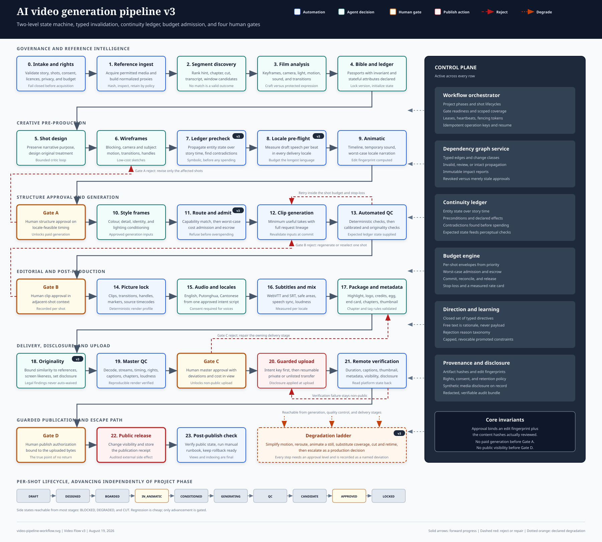

# AI 影片生成管道 v3

本文件是 Video Flow v3 製作系統的實作基準。

**版本：** 3.0
**狀態：** 實作基準
**日期：** 2026 年 8 月 19 日
**取代：** [`../v2/video-flow.md`](../v2/video-flow.md)，而該文件取代了
`../v1/video-flow.md`

本規格定義了一個本地優先、由人員控制的系統，可將結構化故事線、鏡頭指示及所選參考資料轉化為多語言、可供發布的影片套件。

版本 2 奠定了正確的基礎：不可變工件、供應商中立的配接器、四個人為閘門、經校準而非杜撰的品質閾值，以及不寄存於模型中的編輯時間線。版本 3 保留了以上所有內容，並修正 v2 所描述但從未明確規定的一層——**執行模型**。v2 聲稱管道可恢復、可精準修復、具併發安全性及受預算限制。它並未定義令這些特性成真的狀態機、相依圖、審批綁定規則、鎖定紀律或帳務機制。遵循 v2 的實作者必須自行杜撰全部這些內容，而且很可能會以不一致的方式杜撰。

版本 3 亦修正了一項排序缺陷及一項合規遺漏，兩者在製作中均會造成返工或下架風險：

- v2 在本地化之前鎖定畫面。由於相同意思以英語、普通話及廣東話說出時所需時間存在實質差異，這保證至少有一個語言地區將無法配合已核准的剪輯。
- v2 從未向發布平台披露合成內容，即使整個管道都會生成合成內容，而目標平台要求披露並為此提供 API 欄位。

---

## 目的與成果

此管道必須產生可重複的創作工作，同時不移除人類編輯控制。它必須減少昂貴的重新生成、維持連續性，並令每項已發布資產均可追溯至已核准的輸入及決策。

所需成果與 v2 不變：

- 已驗證的故事線及已排序的鏡頭計劃。
- 具來源傳承的權利已釐清參考片段。
- 結構化的攝影及轉場分析。
- 供重複出現實體及風格規則使用的已鎖定視覺聖經。
- 在付費影片生成前已獲核准的線框動畫預覽。
- 於規範性編輯時間線上組裝的已核准生成片段。
- 英語、普通話及廣東話的音訊及字幕交付項目。
- 精華片段、片頭標誌、片尾製作名單、可選的彩蛋及片尾卡。
- 完整的 YouTube 中繼資料及縮圖套件。
- 經人員核准、可稽核且已披露的發布操作。

v3 新增了三項 v2 暗示但未交付的成果：

- 一份**鏡頭層級執行記錄**，讓二十個鏡頭可同時處於二十個不同階段而不失去閘門完整性。
- 一份**符號化連續性帳本**，在花錢之前捕捉矛盾，而非事後評分像素。
- 一份**可稽核的支出帳本**，其中每個付費工作均會按保留額度獲准進行，使硬性預算成為機制而非展示數值。

### 設計原則

保留八項 v2 原則。原則 9 至 13 為 v3 新增，用以解決 v2 留給實作者自行決定的取捨。

1. **先核准結構，再核准保真度。** 在昂貴的生成之前鎖定故事、時間安排、走位及轉場。
2. **保持時間線與模型無關。** 在任何影像、影片、語音或語言模型以外儲存意圖及編輯決策。
3. **預設使用本地處理。** 只在需要獲核准的供應商且專案私隱政策允許時才上傳資產。
4. **將機率分數視為經校準的證據。** 不要將相似度閾值表述為普遍事實。
5. **令每個階段均可恢復。** 失敗的工作者或被拒絕的鏡頭不得重新啟動無關工作。
6. **精準重新生成。** 只使依賴於變更輸入、passport、鏡頭或時間線範圍的工件失效。
7. **分離核准與執行。** 人員核准授權特定工件，而非持續變化的檔案名稱。
8. **在最後一項操作前保持發布可逆。** 先以私人或不公開方式上傳，驗證遠端結果，並在公開前要求第二次確認。
9. **核准意思，而非位元組。** 核准綁定人員實際審閱的編輯決策。使用較新編碼器重新編碼同一剪輯不得暗中使有效核准失效，而變更一幀內容亦不得暗中倖存。
10. **先作符號化檢查，再作感知檢查。** 可透過比較已宣告狀態找出的矛盾，絕不值得透過生成影片及量度嵌入來發現。
11. **將人員限制在機器可執行的詞彙中。** 自由文字指示會保留作為理據，絕不作為可操作負載。
12. **先為最壞情況的語言地區作規劃。** 時間安排決策在獲批前必須容納最長的語言，而非在之後才處理。
13. **交付誠實的成果。** 無法在預算內達到目標的鏡頭，會按已宣告的階梯降級，並記錄為已知偏差。它不會暗中降低標準，亦不會永久阻礙發布。

---

## v3 的變更

每一行均為 v2 的缺陷或缺口，而非風格偏好。相應的 v3 章節已於需求基準及正文中連結。

| v2 限制 | 如按原文發布的後果 | v3 解決方案 |
|---|---|---|
| 狀態機只有一個全域專案狀態。 | 二十個鏡頭無法合法地處於不同階段，因此狀態機不是被繞過，就是管道被序列化。 | 兩層機器：專案階段承載閘門，鏡頭承載生命週期。階段推進是對鏡頭狀態的彙總述詞（`STA-001` 至 `STA-006`）。 |
| 相依性失效只按範例描述。 | 每位實作者都會杜撰不同的影響範圍；過度失效浪費金錢，而失效不足會交付過時工作。 | 具顯式變更類別矩陣及失效演算法的類型化工件圖（`GRA-001` 至 `GRA-007`）。 |
| 核准綁定至輸出雜湊。 | 重新渲染未變更的剪輯會產生新雜湊並使有效核准失效；僅中繼資料的編輯會強制進行完整複審。 | 核准綁定 `edit_fingerprint` 加證據雜湊，並配有已宣告的沿用規則及確定性渲染要求（`APR-001` 至 `APR-007`）。 |
| 沒有併發模型。 | 生成期間的 passport 版本提升會損壞進行中的工作；兩名工作者會重複付費工作。 | 具有心跳及隔離令牌的工作租約、投影的樂觀版本控制，以及提交時的輸入重新驗證（`CON-001` 至 `CON-006`）。 |
| 預算是全域上限加保留比例。 | 超支發生在重試迴圈內，而上限在被超過前無法察覺。 | 具准入控制及託管、提交、對帳帳務、每鏡頭止損及實測費率卡的分層額度（`BUD-001` 至 `BUD-008`）。 |
| 連續性是與 passport 比較的感知評分。 | 指標無法得知印章*理應*易手，因此預期變更被視為偏移，非預期變更則被視為正常變異。 | 一份具前置條件及效果的實體狀態符號化連續性帳本，在生成前求解，然後向感知檢查提供預期狀態（`LED-001` 至 `LED-006`）。 |
| 所有品質指標均獎勵相似度。 | 沒有任何內容限制與受版權保護參考資料的相似度，而這正是參考驅動生成的實際法律風險。 | 原創性上限將與參考片段的高度相似視為缺陷，另加依同意範圍的肖像篩查（`ORG-001` 至 `ORG-005`）。 |
| 人員審閱是「逐幀精確留言」。 | 備註不是機器可操作的，因此人員決策無法精準套用。 | 一組封閉的類型化指令，每項均具已宣告的範圍、成本類別及圖效果（`DIR-001` 至 `DIR-004`）。 |
| 重複的拒絕未有教導系統。 | 同一備註在鏡頭 3 提出，又在鏡頭 17 再次提出。 | 拒絕分類法及一條從重複發現到專案限制、由人員確認的提升路徑（`DIR-005` 至 `DIR-007`）。 |
| 畫面鎖定先於本地化。 | 最長語言地區無法配合已核准的剪輯，迫使在閘門 A 後重新核准時間安排。 | 在閘門 A 前進行語言地區時長預檢；動畫預覽時長按最壞情況的語言地區設定（`LOC-006` 至 `LOC-010`）。 |
| 片段時長校正未有規定。 | 模型返回的量化時長與鏡頭目標不符，而不符之處會以臨時方式解決。 | 配接器宣告時長量化；校正政策定義修剪、變速及延長的界限（`OUT-005` 至 `OUT-007`）。 |
| 無法通過的鏡頭會無限期阻塞。 | 真實發布因一個鏡頭而停滯。 | 具核准層級及偏差記錄的已宣告降級階梯（`DEG-001` 至 `DEG-004`）。 |
| 從不向平台披露合成內容。 | 即使存在可用 API 欄位，每次發布均有違反政策的風險。 | 作為確定性發布閘門的強制合成媒體披露，加上平台所識別版本的可選 C2PA（`DIS-001` 至 `DIS-006`）。 |
| 上傳冪等性在測試中被聲稱，卻沒有機制。 | 重試上傳可能建立重複的公開影片。 | 在請求前記錄的發布意圖、可恢復工作階段持久化及預檢對帳（`DIS-007`、`WF-012`）。 |
| Windows 是目標平台，但沒有平台要求。 | 深層專案根目錄下的內容定址巢狀結構超出路徑限制，而 CJK 標題會損壞檔案名稱。 | 明確的路徑、編碼及檔案系統要求（`PLT-001` 至 `PLT-005`）。 |
| 成本數字是杜撰的常數。 | 從猜測導出的預算不是一種控制。 | 估算必須引用從真實收據量得的費率卡（`BUD-007`）。 |
| `schema_version` 存在，但沒有遷移政策。 | 舊專案變得無法讀取，或更糟的是被悄然誤讀。 | 相容性及遷移政策，當中遷移會建立新工件，並明確與核准互動（`EVO-001` 至 `EVO-004`）。 |
| 營運指標已列出，但沒有營運者介面。 | 沒有人會察覺卡住的專案。 | 健康投影、卡住工作偵測及已定義的營運者操作（`OBS-001` 至 `OBS-004`）。 |

v3 不移除 v2 所要求的任何內容。每個 v2 需求識別碼均會原樣保留、以加強的定義保留，或在可追溯性章節中明確由具名 v3 識別碼取代。

---

## 範圍、假設及非目標

### 範圍內

- 故事線及鏡頭計劃驗證。
- 使用者有權取得材料時的參考資料獲取。
- 相關片段發現、確認、修剪及保留控制。
- 關鍵幀、轉場、鏡頭、燈光、風格、動態及音訊分析。
- 視覺聖經、連續性帳本、分鏡圖、線框圖、動畫預覽及風格幀工作流程。
- 供應商中立的影像、影片、語音、轉錄、翻譯及評分配接器。
- 具有限制迭代及人員仲裁的多代理批評。
- 編輯組裝、音訊混音、字幕、打包及品質控制。
- 在結構核准前進行語言地區時長規劃。
- 原創性、肖像及平台披露控制。
- YouTube 中繼資料生成、受保護的上傳、驗證及發布。
- 成本估算及執行、稽核日誌、來源追溯及復原。

### 範圍外

- 自動版權釐清或法律建議。管道會為人員決策產生證據；它不會作出決策。
- 繞過存取控制、數碼版權管理、付費牆、地理限制或平台保護措施。
- 無人監督地創作改變已核准故事的新對白。
- 未經授權的聲音複製、肖像複製或冒充。
- 私人個人的開放集識別。肖像篩查只針對已同意的 passports 及使用者提供的排除清單運作；它不會嘗試辨認任意人士。
- 即時協作編輯或即時影片生成。
- 作為製作工作流程一部分的基礎模型訓練。
- 機率生成模型的保證確定性輸出。v3 保證確定性*組裝*，而非確定性*生成*。

### 假設

- 一個專案具有一個已鎖定的幀率、畫面比例及色彩設定檔。
- 一個專案可包含水平、垂直或電影輸出設定檔，但每個設定檔均從不同的時間線版本渲染。
- 參考資料為鏡頭語法提供資訊，除非權利清單明確允許重用，否則不會成為最終作品中的源片段。
- 使用者提供或核准所有最終故事內容。
- 人類審閱者可拒絕任何自動化建議，不論分數如何。
- 初始部署目標為 Windows，工作者介面不作任何 Windows 特定路徑假設。
- 主要發布渠道為 YouTube。渠道特定行為會隔離於發布配接器及能力矩陣中。

---

## 工作流程圖

管道圖表會維護為獨立 SVG，使其可在 Markdown 檢視器中渲染、獨立開啟及以文字進行差異比較。GitHub 的 Markdown 渲染器會移除內嵌 `<svg>` 元素，因此圖表以參考方式呈現，而非內嵌貼上；以下無障礙描述為規範性文字等效內容，足以在沒有影像的情況下實作流程。

**檔案：** [`video-pipeline-workflow.svg`](./video-pipeline-workflow.svg)



圖表區分四類工作，以配合專案簡介的要求：

- **自動化處理**（藍色）在沒有模型作出創意選擇的情況下運行：獲取、正規化、渲染、確定性檢查、上傳。
- **代理決策**（青綠色）是由模型產生或評議的建議。
  它們始終僅供參考，並始終連同證據記錄。
- **人員核准閘門**（琥珀色、粗邊框）是唯一授權下游成本或曝露的轉換。共有四個：A、B、C 及 D。
- **發布操作**（紅色）是唯一對外可見的副作用，分為非公開上傳及另行授權的可見性變更。

### 圖表的無障礙文字說明

```text
ROW 1 - GOVERNANCE AND REFERENCE INTELLIGENCE
  0 Intake and rights  ->  1 Reference ingest  ->  2 Segment discovery
  ->  3 Film analysis  ->  4 Visual bible and ledger initialization

ROW 2 - CREATIVE PRE-PRODUCTION
  5 Shot design  ->  6 Wireframes  ->  7 Continuity ledger precheck
  ->  8 Locale duration pre-flight  ->  9 Animatic on OpenTimelineIO

ROW 3 - STRUCTURE APPROVAL
  GATE A human animatic approval, covering timing that already fits the
  longest locale  ->  10 Style frames  ->  11 Capability routing and budget
  admission  ->  12 Clip generation  ->  13 Automated quality control

ROW 4 - GENERATION CONTROL
  GATE B human clip approval in adjacent-shot context  ->  14 Picture lock
  ->  15 Audio and locale production  ->  16 Subtitles and mix
  ->  17 Packaging and metadata

ROW 5 - DELIVERY AND DISCLOSURE
  18 Originality, likeness, and disclosure screen  ->  19 Master quality
  control  ->  GATE C human master and delivery approval  ->  20 Guarded
  upload as private or unlisted  ->  21 Remote verification

ROW 6 - GUARDED PUBLICATION
  GATE D human publish authorization  ->  22 Public release
  ->  23 Post-publish verification and rollback runbook

PER-SHOT LIFECYCLE (independent of project phase)
  DRAFT -> DESIGNED -> BOARDED -> IN_ANIMATIC -> CONDITIONED -> GENERATING
  -> QC -> CANDIDATE -> APPROVED -> LOCKED
  Side states reachable from most stages: BLOCKED, DEGRADED, CUT.

CONTROL PLANE (active across every row)
  Workflow orchestrator: two-level state machine, gate readiness, leases,
    fencing tokens.
  Dependency graph service: typed edges, change classes, invalidation,
    stale versus revoked approvals.
  Continuity ledger: entity state preconditions and effects, contradiction
    detection before generation.
  Budget engine: envelopes, escrow, admission control, rate card, stop-loss.
  Direction and learning: typed directives, rejection taxonomy, promoted
    constraints.
  Provenance and disclosure: artifact hashes, edit fingerprints, synthetic
    media disclosure, audit bundle.

REJECTION AND ESCAPE PATHS
  Gate A rejection returns to shot design or wireframes for the affected
    shots only.
  Automated quality control retries within the shot budget, then escalates.
  Gate B rejection regenerates or re-selects only the affected shots and
    invalidates only the affected timeline ranges.
  Gate C rejection returns to the owning delivery stage.
  Remote verification failure keeps the video non-public.
  Any stage may enter the degradation ladder, which lowers shot ambition in
    declared steps and records a deviation rather than blocking the release.

CORE INVARIANTS
  An approval binds an edit fingerprint plus evidence hashes.
  No paid or remote final-video generation before Gate A.
  No public visibility before Gate D.
  No upload without a synthetic content disclosure decision on record.
```

---

## 需求基線

每項需求均有一個穩定識別碼。測試、關卡報告、品質報告及批准記錄必須引用這些識別碼，以使發佈證據保持可追溯性。除非該行另有說明，否則在 v2 引入的識別碼將保留其含義。

### 輸入需求

| ID | 需求 |
|---|---|
| `IN-001` | 專案必須包含一份已進行版本控制的清單，其中包括標題、簡介、目標時長、輸出設定檔、主要語言、地區設定、預算政策、保留政策、響度設定檔及披露政策。 |
| `IN-002` | 每個場景及鏡頭必須有一個絕不依賴顯示順序的穩定識別碼。 |
| `IN-003` | 每個鏡頭必須定義敘事目的、時序意圖、`when`、`what`、`how`、約束、優先次序及所參照的實體識別碼。 |
| `IN-004` | 每個實體識別碼在分鏡圖生成之前，必須解析為角色、道具、地點、服裝項目或主題記錄。 |
| `IN-005` | 每項外部參考資料必須包括來源 URL 或本機路徑、相關性提示、預期用途、權利依據及保留類別。 |
| `IN-006` | 驗證錯誤必須指出欄位、需求 ID、來源檔案及修正操作。 |
| `IN-007` | 每個鏡頭必須宣告一個用於連貫性傳播的 `story_time` 序數；對於非線性敘事，該序數可以不同於 `display_order`。 |
| `IN-008` | 每個包含對白的鏡頭必須參照意圖劇本的節拍識別碼，以便能在 Gate A 之前規劃地區設定的時序。 |

### 參考資料處理需求

| ID | 需求 |
|---|---|
| `REF-001` | 在下載遠端參考資料或分析本機參考資料之前，權利關卡必須通過。 |
| `REF-002` | 系統在定位相關片段時，必須優先使用直接時間提示，其次為章節，最後才是多模態搜尋。 |
| `REF-003` | 系統必須保留來源中繼資料、所選時間戳記、置信度證據，以及每個保留片段的 SHA-256 雜湊。 |
| `REF-004` | 低置信度或相互衝突的片段匹配必須要求人工確認。 |
| `REF-005` | 精確剪輯必須在非關鍵影格邊界附近進行解碼及重新編碼；近似剪輯可以使用串流複製。 |
| `REF-006` | 完整下載的參考資料必須在片段獲批後，按保留政策刪除或隔離。 |
| `REF-007` | 每個保留片段必須持續保存原創性基準線——影格嵌入、動作特徵及鏡頭語法摘要——以便其後可根據 `ORG-001` 測試生成輸出是否過度相似。 |
| `REF-008` | 「沒有可用片段」結果必須是有效且可記錄的結果，不得迫使選取品質欠佳的候選項。 |

### 分析及創作需求

| ID | 需求 |
|---|---|
| `ANA-001` | 每個獲批片段必須產生具備來源時間碼及擷取理據的代表性關鍵影格。 |
| `ANA-002` | 每個關鍵影格必須包括構圖、走位、攝影機、鏡頭、燈光、調色板、美術設計、氛圍、動作及音訊觀察。 |
| `ANA-003` | 連續的關鍵影格必須包括轉場分析，以區分攝影機運動、主體運動、剪輯類型及環境變化。 |
| `ANA-004` | 模型觀察必須標記為觀察、推論或未知。 |
| `ANA-005` | 分析必須記錄哪些特性屬於*可轉移的技藝*（取景、鏡頭、燈光比例、節奏），哪些屬於*受保護的表達*（特定角色設計、獨特場景、標誌、螢幕文字、可識別的表演），因為只有前者可以為生成提供參考。 |
| `ANA-006` | 分析報告必須能根據保留片段雜湊、轉接器版本及設定雜湊重現。 |
| `CRE-001` | 視覺聖經必須為重複出現的實體定義標準描述、獲批圖像、負面約束及已進行版本控制的護照。 |
| `CRE-002` | 新鏡頭設計必須保留敘事意圖，而不得直接複製參考資料中具獨特性的受保護表達。 |
| `CRE-003` | 每個鏡頭必須有開始及結束線框圖；具有顯著內部變化的鏡頭亦必須有一個或多個中間線框圖。 |
| `CRE-004` | 每個鏡頭必須定義攝影機運動、主體運動、轉場行為、時長、音訊意圖及連貫性依賴關係。 |
| `CRE-005` | 護照變更必須使所有未獲批的後代項目失效，並根據 `GRA-004` 將已獲批的後代項目排入影響審查佇列。 |
| `CRE-006` | 每份護照必須宣告其哪些屬性為*不變*（定義身分，絕不允許更改），哪些為*有狀態*（只允許透過已宣告的分類帳效應更改）。 |
| `CRE-007` | 視覺聖經在鎖定之前必須接受內部一致性檢查：不得有相互衝突的屬性、未被參照的實體，或被鏡頭參照但不在聖經中的實體。 |

### 狀態及工作流程需求

| ID | 需求 |
|---|---|
| `STA-001` | 系統必須維護一個專案階段狀態，以及每個鏡頭的獨立生命週期狀態。 |
| `STA-002` | 只有在專案階段表及鏡頭生命週期表中已宣告的轉換才可持久化；任何其他轉換嘗試都必須失敗並被記錄。 |
| `STA-003` | 專案階段僅可在範圍內鏡頭狀態滿足已宣告的彙總述詞，且所有關卡證據均存在時推進。 |
| `STA-004` | 鏡頭可以在關卡之後獨立回退。回退只會撤銷該鏡頭範圍的關卡覆蓋，而不會撤銷專案的關卡覆蓋。 |
| `STA-005` | 階段僅於關卡覆蓋完全涵蓋其範圍時有效；失去覆蓋必須自動將階段移回其所屬狀態。 |
| `STA-006` | 鏡頭側狀態 `BLOCKED`、`DEGRADED` 及 `CUT` 必須各自記錄擁有人、原因代碼及產生它們的證據。 |
| `WF-001` | 對於相同輸入、設定、轉接器版本及操作鍵，每個階段必須具備冪等性。 |
| `WF-002` | 管道必須在中斷後從最後一個有效成品恢復。 |
| `WF-003` | 自動化評析必須在已設定的嘗試次數或成本限制後停止，並升級交由人工處理。 |
| `WF-004` | 代理不得批准其自行生成的成品。 |
| `WF-005` | 在任何付費或遠端最終影片生成之前，Gate A 必須批准動畫預覽。 |
| `WF-006` | 在最終編輯組裝鎖定之前，Gate B 必須批准所選片段。 |
| `WF-007` | Gate C 必須批准完整母帶及交付套件。 |
| `WF-008` | Gate D 必須授權發佈確切已獲批的母帶及中繼資料。 |
| `WF-009` | 批准記錄必須包括範圍、編輯指紋、證據雜湊、批准人、時間戳記、決定、評論及到期或撤銷狀態。 |
| `WF-010` | 每個可由人處理的請求必須恰好有一個所屬角色，並且必須顯示於該角色的佇列中，直至其獲解決或重新指派。 |
| `WF-011` | 任何階段均不得在其已宣告的輸出集合以外寫入；需要更改另一階段成品的階段必須改為發出指令。 |
| `WF-012` | 任何具有外部副作用的操作均必須在發出請求*之前*，記錄一份帶有冪等性鍵的意圖記錄，並必須在重試前根據該鍵進行核對。 |

### 依賴圖需求

| ID | 需求 |
|---|---|
| `GRA-001` | 每個成品必須記錄其輸入成品識別碼，且生成的圖必須無環。 |
| `GRA-002` | 每條圖邊必須帶有已宣告邊詞彙表中的一個類型。 |
| `GRA-003` | 每項變更在傳播前都必須分類為已宣告的變更類別。 |
| `GRA-004` | 傳播必須使用已宣告的按變更類別劃分的邊類型矩陣，為每個後代項目計算 `INVALID`、`REVIEW` 或 `INTACT` 其中之一；當結果為 `INTACT` 時，必須停止向下追溯。 |
| `GRA-005` | 涵蓋 `INVALID` 成品的批准必須被撤銷。涵蓋 `REVIEW` 成品的批准必須標記為過時，並必須可透過明確的低成本確認而非完整重新審查來解決。 |
| `GRA-006` | 在排定任何修復工作之前，必須將失效計算並記錄為不可變的影響報告。 |
| `GRA-007` | 對於任何成品，系統必須能夠回答「若此項更改，甚麼會損壞」及「甚麼證據支持此項獲批」，而無需掃描整個專案歷史。 |

### 批准綁定需求

| ID | 需求 |
|---|---|
| `APR-001` | 每個可審查的複合成品必須公開一個根據其標準編輯決策計算的 `edit_fingerprint`，不包括編碼器身分、時間戳記、檔名及其他非編輯中繼資料。 |
| `APR-002` | 批准必須綁定 `edit_fingerprint`、實際已審查的內容雜湊集合，以及用於作出決定的審查渲染雜湊。 |
| `APR-003` | 若重新渲染的 `edit_fingerprint` 維持不變，則必須延續批准，並將新的編碼雜湊記錄為額外證據。 |
| `APR-004` | 對任何已審查內容雜湊的變更，無論 `edit_fingerprint` 是否相等，均必須撤銷批准。 |
| `APR-005` | 交付渲染必須使用確定性渲染設定檔生成，該設定檔會固定編碼器、其旗標及中繼資料抑制，從而在編碼器允許的情況下，使未變更的編輯重現相同檔案。 |
| `APR-006` | 如無法實現位元組完全相同的重現，系統必須生成差異報告，並要求所有差異均落在已宣告的非編輯欄位允許清單內。 |
| `APR-007` | Gate D 必須綁定已上載檔案的確切位元組雜湊，因為該檔案將成為公開內容。 |

### 併發需求

| ID | 需求 |
|---|---|
| `CON-001` | 工作必須由一項具有有界期限、持有人身分及單調遞增隔離權杖的租約認領。 |
| `CON-002` | 工作者必須透過心跳續租；已過期的租約會使工作可被重新認領。 |
| `CON-003` | 若寫入者的隔離權杖低於該操作最近一次已接受寫入所記錄的權杖，則成品寫入必須被拒絕。 |
| `CON-004` | 工作必須記錄其所依據的每個輸入版本，並必須在提交時重新驗證它們；飛行中的輸入版本變更必須使提交失敗並產生影響報告，而非覆寫狀態。 |
| `CON-005` | 可變投影必須使用具版本檢查的樂觀併發控制，且衝突更新必須針對最新狀態重試，而不得盲目合併。 |
| `CON-006` | 對同一付費生成操作鍵的兩項併發認領，必須剛好產生一個可計費請求。 |

### 連貫性分類帳需求

| ID | 需求 |
|---|---|
| `LED-001` | 每個有狀態的護照屬性必須宣告為分類帳變數，並具備名稱、值域及初始值。 |
| `LED-002` | 每個鏡頭均可宣告對分類帳變數的 `requires` 前置條件及 `effects` 後置條件。 |
| `LED-003` | 分類帳求解器必須按 `story_time` 順序傳播狀態、偵測未滿足的前置條件及未宣告的狀態變更，並報告每個矛盾涉及的兩個鏡頭及變數。 |
| `LED-004` | 分類帳求解必須在批准線框圖之前通過，並且在鏡頭順序、`story_time`、`requires`、`effects` 或護照狀態宣告有任何變更後重新執行。 |
| `LED-005` | 鏡頭的預期分類帳狀態必須提供予感知連貫性檢查，從而只有在差異與預期狀態相矛盾時才報告為錯誤。 |
| `LED-006` | 不變護照屬性絕不得作為分類帳變數出現，且嘗試對不變屬性宣告效應必須驗證失敗。 |

### 原創性及肖像需求

| ID | 需求 |
|---|---|
| `ORG-001` | 每個受參考片段啟發的生成鏡頭，必須*針對該片段*評分相似度，而高於專案上限的相似度必須視為需要重新設計的缺陷。 |
| `ORG-002` | 近似重複偵測必須涵蓋取景及構圖、動作特徵，以及任何重現的文字、標誌或具獨特性的圖像元素。 |
| `ORG-003` | 生成的人臉必須根據已同意的肖像護照進行篩查以確認預期身分，並根據使用者提供的排除清單篩查以避免非預期相似性。系統不得嘗試對私人個人進行開放集識別。 |
| `ORG-004` | 原創性或肖像發現必須連同比較組合、分數及所涉的具體區域或區間升級交由人工處理。不得自動豁免。 |
| `ORG-005` | 交付套件必須記錄每個鏡頭的原創性篩查結果，包括其所比較的參考資料。 |

### 人工指導及學習需求

| ID | 需求 |
|---|---|
| `DIR-001` | 每項人工審查操作必須表達為從封閉指令詞彙表中選取的一項或多項指令。 |
| `DIR-002` | 每項指令在套用之前，必須宣告其範圍、成本類別及對依賴圖的效應。 |
| `DIR-003` | 自由文字評論必須作為理據附加至指令，且絕不得是唯一可操作的負載。 |
| `DIR-004` | 套用指令必須產生不可變的決策記錄及相應的影響報告。 |
| `DIR-005` | 每次拒絕必須帶有已宣告拒絕分類中的原因代碼。 |
| `DIR-006` | 當某原因代碼在一個範圍類別內反覆出現並超過已設定閾值時，系統必須提出一項已提升的約束，並附上指向原始拒絕的連結。 |
| `DIR-007` | 已提升的約束僅在明確的人工確認後生效，必須以專案約束詞彙表表達、總數必須設有上限，並且可個別撤銷。 |

### 品質需求

| ID | 需求 |
|---|---|
| `QUA-001` | 確定性檢查必須在基於模型的評析之前執行，且無論任何美學分數如何，確定性失敗均必須阻止流程。 |
| `QUA-002` | 語義指標在校準記錄於代表專案的已標記資料上證明其錯誤率之前，必須為非阻擋性。 |
| `QUA-003` | 每份品質報告必須保留組件證據，而非僅保留匯總分數。 |
| `QUA-004` | 每份校準記錄必須固定資料集雜湊、模型版本、閾值、混淆矩陣及審查擁有人，並且其中任何一項變更均必須使其失效。 |
| `QUA-005` | 每個評析器必須傳回已宣告的結構化評析合約；僅含自由文字的輸出必須被架構拒絕。 |

### 預算需求

| ID | 需求 |
|---|---|
| `BUD-001` | 專案必須宣告硬性上限、交付儲備及一項可推導階段分配及每鏡頭預算封套的分配政策。 |
| `BUD-002` | 每項付費操作在開始前必須通過准入控制，使用其最壞情況成本而非預期成本。 |
| `BUD-003` | 支出必須透過估算、託管、已承諾、已核對及已釋放狀態追蹤，且未使用的託管金額必須及時釋放。 |
| `BUD-004` | 除非供應商合約另有說明，否則最壞情況成本必須假設供應商會就失敗及逾時的工作收費。 |
| `BUD-005` | 單一鏡頭的累計支出不得超過其預算封套的止損倍數；一旦超標，必須升級處理並提供降級階梯。 |
| `BUD-006` | Gate A 之前必須無法進行遠端生成，並由政策而非慣例強制執行。 |
| `BUD-007` | 每項成本估算必須引用根據實際供應商收據及本機基準執行測得的費率表版本。硬編碼貨幣常數不可接受作為估算。 |
| `BUD-008` | 成本必須能按專案、階段、場景、鏡頭、轉接器、已接受鏡頭及被拒絕鏡頭報告。 |

### 本地化及音訊需求

| ID | 需求 |
|---|---|
| `LOC-001` | 除非專案明確停用某種語言，否則交付套件必須包括英語、普通話及粵語語音版本。 |
| `LOC-002` | 必須生成及審查英語、簡體中文及繁體中文粵語字幕軌。 |
| `LOC-003` | 本地化必須保留已獲批的含義、角色意圖、術語、名稱及情感節拍。 |
| `LOC-004` | 最終審查後，字幕提示邊界必須在兩個專案影格內與語音對齊。 |
| `LOC-005` | 字幕版面不得超過兩行，並且必須通過每個輸出設定檔的安全區域及可讀性檢查。 |
| `LOC-006` | 在製作動畫預覽之前，必須存在具已識別節拍的意圖劇本，且每個對白節拍必須錨定至鏡頭或時間線範圍。 |
| `LOC-007` | 地區設定時長預檢必須使用已宣告的草稿語音設定檔，為每個啟用地區設定中的每個節拍量度草稿語音時長。 |
| `LOC-008` | 在提供 Gate A 之前，動畫預覽節拍時序必須容納量度得出的最長地區設定時長加上已設定的餘裕。 |
| `LOC-009` | 每個地區設定必須宣告其調適政策：允許的語速調整範圍、允許的停頓壓縮、允許使用鏡頭手柄，以及當這些均不足夠時的升級路徑。 |
| `LOC-010` | 當調適能力耗盡時，系統必須請求對台詞進行受長度控制的改寫，而不得暗中扭曲語速或使畫面超時。 |
| `LOC-011` | 每個地區設定混音必須符合專案響度設定檔，並且必須為每個交付項記錄量度得出的整體響度及真峰值。 |

### 封裝、輸出及發佈需求

| ID | 需求 |
|---|---|
| `PKG-001` | 封裝必須支援精華片段、介紹標誌、主要內容、片尾名單、可選的彩蛋，以及按已獲批順序排列的最終結尾卡。 |
| `PKG-002` | 章節標記必須從 `00:00` 開始，包含至少三個項目，按遞增順序出現，並為每個章節分配至少 10 秒。 |
| `PKG-003` | 發佈套件必須包括標題、簡短描述、詳細描述、章節、標籤、縮圖、語言中繼資料、授權說明及結尾畫面建議。 |
| `PKG-004` | 標籤集合必須在上載之前而非被拒絕之後，根據頻道的標籤總長度限制進行驗證。 |
| `PKG-005` | 精華片段僅可由已獲批鏡頭組裝，並且必須遵守已宣告的劇透政策。 |
| `OUT-001` | 標準編輯時間線必須儲存為 OpenTimelineIO，並包含外部媒體參考資料及已進行版本控制的標記。 |
| `OUT-002` | 預設上載母帶必須為 MP4，使用 H.264 High Profile 視訊、AAC-LC 音訊、Rec.709 SDR、固定影格率及快速啟動中繼資料。 |
| `OUT-003` | 音訊分軌必須使用 48 kHz WAV；字幕來源必須包括 WebVTT 及 SRT。 |
| `OUT-004` | 按地區設定的交付必須使用頻道功能矩陣，在分開按語言上載及具有額外音訊軌的單一影片之間作出選擇，且不得為沒有 API 的步驟聲稱已進行 API 驗證。 |
| `OUT-005` | 每個生成轉接器必須宣告其時長量化、最短及最長時長，以及它能否遵從精確要求的時長。 |
| `OUT-006` | 時長與鏡頭目標不同的傳回片段，必須根據已宣告政策，按已宣告的優先順序並在已宣告的界限內進行調整。 |
| `OUT-007` | 對帳絕不可在未被察覺的情況下變更鏡頭的已批准時長；超出已聲明界限的變更需要指令及受影響時間軸範圍的重新批准。 |

### 披露、溯源及權利要求

| ID | 要求 |
|---|---|
| `DIS-001` | 每次上傳均必須附帶明確的合成內容披露決定，並記錄作出決定的人員及理由。 |
| `DIS-002` | 當任何生成媒體出現在母版中，披露欄位必須設定為肯定，除非有已記錄的人為判定證實該內容並非逼真的經修改或合成內容。 |
| `DIS-003` | 披露決定必須作為上傳前的確定性檢查加以驗證，並在上傳後根據遠端記錄再次驗證。 |
| `DIS-004` | 可選的溯源簽署必須使用目標平台識別的 C2PA 版本；未識別的版本不得呈現為平台可見的溯源資訊。 |
| `DIS-005` | 缺少外部溯源簽署不得削弱內部雜湊譜系或稽核要求。 |
| `DIS-006` | 稽核套件必須記錄披露決定、其理由及遠端驗證結果。 |
| `DIS-007` | 上傳必須使用會持久化其 URI 的可續傳工作階段，使中斷的傳輸得以續傳而非建立第二段影片。 |
| `RGT-001` | 政策引擎必須保存關於參考資料取得依據、最終剪輯來源許可、音樂及音效許可、字型及標誌許可、肖像同意，以及附有獲准語言及用途的聲音同意之記錄。 |
| `RGT-002` | 工具能力絕不可被視為授權；禁止規避存取控制及使用超出範圍的已驗證 Cookie。 |
| `RGT-003` | 地域、頻道、到期、署名及保留限制必須在發佈時執行，而不僅在擷取時執行。 |

### 可靠性及降級要求

| ID | 要求 |
|---|---|
| `REL-001` | 失敗必須歸類至已聲明的失敗類別，且每個類別必須遵循其已聲明的復原路徑。 |
| `REL-002` | 暫時性重試必須使用帶隨機擾動的有界指數退避，且不得套用於確定性的輸入失敗或政策封鎖。 |
| `REL-003` | 生成品質重試必須與暫時性重試分開記帳，並必須消耗鏡頭預算。 |
| `DEG-001` | 專案必須為無法在預算或品質限制內達成其目標的鏡頭聲明一個有序的降級階梯。 |
| `DEG-002` | 階梯的每個步驟必須聲明套用該步驟所需的最低批准級別。 |
| `DEG-003` | 任何已套用的降級必須作為具名偏差記錄於交付清單中，並在閘門 C 顯示。 |
| `DEG-004` | 剪除鏡頭需要敘事審核，以確認該鏡頭所聲明的目的已在其他地方保留，或被有意放棄。 |

### 平台、演進及營運要求

| ID | 要求 |
|---|---|
| `PLT-001` | 所有檔案系統存取必須使用支援延伸長度路徑的介面，而產物根目錄必須可配置為短路徑，以使總路徑長度維持在平台限制內。 |
| `PLT-002` | 產物檔案名稱必須僅從識別碼及小寫十六進位雜湊衍生，不得從使用者提供的標題衍生，並且必須避開平台保留名稱。 |
| `PLT-003` | 所有文字產物必須為 UTF-8；字幕檔必須聲明並測試其位元組層級慣例，包括 WebVTT 標頭及 SRT 的行結束符號和結尾換行預期。 |
| `PLT-004` | 在每個平台上，子程序呼叫均必須以陣列形式傳遞引數，不得進行 Shell 插值。 |
| `PLT-005` | 測試套件必須在部署平台上執行，包括路徑長度、Unicode 檔案名稱及大小寫敏感性的案例。 |
| `EVO-001` | 每個綱要必須以語義方式進行版本控制，其中次要版本只可新增可選欄位，而主要版本可變更或移除必要欄位。 |
| `EVO-002` | 讀取器必須接受並保留未知的可選欄位，並必須拒絕其未實作之主要版本的產物。 |
| `EVO-003` | 遷移必須建立附有已記錄 `migrated_from` 連結的新產物，且絕不可變更既有產物。 |
| `EVO-004` | 經遷移的產物必須透過 `APR-003` 延續規則解析其批准狀態；批准絕不可被無聲複製。 |
| `OBS-001` | 系統必須公開每個專案的健康狀況投影，涵蓋階段、受封鎖及已降級鏡頭、按嚴重性分類的未結發現、相對於限額的託管款、過期批准，以及最舊的未解決人工請求。 |
| `OBS-002` | 系統必須自動偵測停滯工作，包括沒有心跳的已過期租約、超過階段時長閾值的鏡頭，以及已準備就緒但未經審核的閘門。 |
| `OBS-003` | 日誌及度量必須使用具已聲明遮蔽規則的結構化欄位，並且必須透過金絲雀測試驗證遮蔽。 |
| `OBS-004` | 每個偵測到的停滯情況均必須對應至已聲明的操作員動作。 |
| `OPS-001` | 每個已生成產物必須記錄輸入雜湊、配置雜湊、適配器識別碼、模型識別碼、受支援時的種子、時間、成本及日誌參考。 |
| `OPS-002` | 系統必須在遠端生成前估算成本，並在超出專案硬性預算前停止，透過 `BUD-002` 強制執行。 |
| `OPS-003` | 秘密資料及已驗證 Cookie 絕不可出現在提示、日誌、中繼資料套件或稽核匯出中。 |
| `OPS-004` | 來自外部媒體的逐字稿、字幕、中繼資料及模型輸出必須被視為不受信任的資料，而非可執行指令。 |
| `OPS-005` | 稽核套件必須包括清單、批准、提示、決定、模型及工具版本、雜湊、成本、品質報告、披露記錄及發佈收據。 |

---

## 系統架構

此架構將持久控制狀態與媒體處理分離。控制平面協調不可變產物及事件；無狀態工作程序則透過版本化適配器執行擷取、分析、生成、渲染及發佈。

v3 保留 v2 的元件集合，並新增五個與新近指定的執行模型相應的元件。圖、分類帳、預算及指令服務，正是被描述的管道與可強制執行的管道之間的差異。

| 元件 | 職責 | 持久輸出 |
|---|---|---|
| 專案 API 及審核 UI | 收集輸入、顯示預覽、擷取帶類型的指令，以及公開狀態。 | 專案變更、指令、批准記錄 |
| 工作流程協調器 | 強制執行雙層轉換、閘門就緒狀態、租約、圍欄、重試及升級處理。 | 工作流程事件及操作記錄 |
| **依賴關係圖服務** | 維護具類型的產物圖、分類變更、計算失效，並標示已撤銷或過期的批准。 | 圖邊及不可變影響報告 |
| **連續性分類帳服務** | 在故事時間內傳播實體狀態、偵測矛盾，並將預期狀態發佈至品質檢查。 | 分類帳解決方案及矛盾報告 |
| **預算引擎** | 推導額度範圍、接納或拒絕付費工作、持有託管款、對帳收據、執行止損。 | 開支分類帳及接納決定 |
| **指令及學習服務** | 驗證指令、套用其圖效果、分類拒絕，並提出可升格的約束。 | 決定記錄及已學習約束 |
| 政策引擎 | 執行權利、私隱、提供者、聲音、肖像、披露及發佈規則。 | 政策決定及證據 |
| 產物服務 | 儲存附有譜系及指紋、按內容定址的媒體及 JSON 產物。 | 產物封套及雜湊 |
| 參考工作程序 | 取得、標準化、分段、轉錄、擷取影格及擷取原創性基準。 | 參考片段及分析輸入 |
| 創意工作程序 | 製作視覺聖經、鏡頭計劃、線框圖及風格影格。 | 版本化創意資產 |
| 生成路由器 | 在已接納預算內，將鏡頭需求配對至已批准的提供者能力。 | 生成工作及候選片段 |
| 品質服務 | 執行確定性檢查、經校準的度量、原創性篩查及評論審核。 | 品質報告及補救請求 |
| 編輯服務 | 維護 OpenTimelineIO、計算剪輯指紋、透過適配器渲染。 | 時間軸版本及確定性渲染 |
| 本地化服務 | 規劃地區設定時長、翻譯、合成、對齊、加字幕、混音及封裝變體。 | 劇本、分軌及字幕軌道 |
| 發佈服務 | 以最小權限上傳、披露、驗證遠端狀態及變更可見性。 | 上傳、披露及發佈收據 |
| **可觀測性服務** | 專案健康狀況、停滯工作偵測及操作員動作路由。 | 健康狀況投影及警示 |
| 稽核匯出器 | 組合可重現性、權利、品質、成本、披露及批准證據。 | 已簽署的稽核套件 |


---

## 執行模型

本節為 v3 的實質內容。它指定 v2 以散文描述的機制：工作如何分階段進行、變更如何傳播、批准實際上約束甚麼，以及並行工作程序如何避免互相損害。

### 雙層狀態機

製作並非單一管道；它是一條管治軌道及多條獨立鏡頭軌道。單一全域狀態無法表達「鏡頭 3 已批准、鏡頭 7 正在重新生成、鏡頭 12 因權利問題被封鎖」。因此，v3 維護一個專案階段及每個鏡頭的獨立生命週期。

#### 專案階段

階段附帶閘門，並授權開支及公開程度的類別。只有當其範圍內鏡頭的匯總述詞成立，且其閘門證據存在時，階段才會推進。

| 階段 | 範圍內鏡頭的匯總述詞 | 閘門 | 下一階段 |
|---|---|---|---|
| `P0_INTAKE` | 無 | 權利及綱要驗證 | `P1_REFERENCE` |
| `P1_REFERENCE` | 每項參考資料均有已批准的片段決定、明確的無匹配記錄或豁免 | 分析完整性 | `P2_DESIGN` |
| `P2_DESIGN` | 每個鏡頭至少為 `BOARDED`；視覺聖經已鎖定；分類帳解決乾淨 | 聖經鎖定批准 | `P3_STRUCTURE` |
| `P3_STRUCTURE` | 每個鏡頭均為 `IN_ANIMATIC`；每個對白節拍均滿足地區設定時長預檢 | **閘門 A** | `P4_GENERATION` |
| `P4_GENERATION` | 每個非 `CUT` 鏡頭均為 `APPROVED`、`LOCKED` 或已批准的 `DEGRADED` | **閘門 B** | `P5_EDITORIAL` |
| `P5_EDITORIAL` | 每個時間軸項目均引用一個 `LOCKED` 鏡頭；已渲染畫面鎖定 | 母版品質控制 | `P6_DELIVERY` |
| `P6_DELIVERY` | 每個已啟用地區設定的交付套件均完整且有效 | **閘門 C** | `P7_UPLOAD` |
| `P7_UPLOAD` | 遠端資產存在、非公開，並通過遠端驗證 | 披露驗證 | `P8_AUTHORIZED` |
| `P8_AUTHORIZED` | 遠端及本地識別碼與已批准的交付相符 | **閘門 D** | `P9_PUBLISHED` |
| `P9_PUBLISHED` | 公開可見性及中繼資料已驗證 | 終止 | — |
| `P_HALTED` | 存在專案範圍的政策或預算封鎖 | 補救 | 所屬先前階段 |

`P_HALTED` 僅適用於專案範圍的封鎖，例如預算耗盡或許可被撤銷。特定鏡頭問題使用鏡頭側狀態，使一個有問題的鏡頭絕不會令專案暫停。

#### 鏡頭生命週期

| 狀態 | 含義 | 允許的下一狀態 |
|---|---|---|
| `DRAFT` | 鏡頭合約存在並通過驗證 | `DESIGNED`, `BLOCKED`, `CUT` |
| `DESIGNED` | 鏡頭描述及運動計劃已獲評論者批准 | `BOARDED`, `DRAFT`, `BLOCKED`, `CUT` |
| `BOARDED` | 必要線框圖存在，且分類帳前提條件成立 | `IN_ANIMATIC`, `DESIGNED`, `BLOCKED`, `CUT` |
| `IN_ANIMATIC` | 存在於預演動畫中，且時間安排對地區設定可行 | `CONDITIONED`, `BOARDED`, `BLOCKED`, `CUT` |
| `CONDITIONED` | 風格影格已批准，且已預留可行的生成路線 | `GENERATING`, `IN_ANIMATIC`, `BLOCKED`, `CUT` |
| `GENERATING` | 一個或多個候選鏡頭正在進行 | `QC`, `CONDITIONED`, `BLOCKED`, `DEGRADED` |
| `QC` | 候選鏡頭正接受確定性及語義檢查 | `CANDIDATE`, `GENERATING`, `BLOCKED`, `DEGRADED` |
| `CANDIDATE` | 至少一個鏡頭通過自動化檢查並等待人工審核 | `APPROVED`, `GENERATING`, `BLOCKED`, `DEGRADED`, `CUT` |
| `APPROVED` | 特定鏡頭已在閘門 B 下獲批准 | `LOCKED`, `CANDIDATE`, `BLOCKED` |
| `LOCKED` | 鏡頭由畫面鎖定的時間軸引用 | `APPROVED`（按指令） |
| `BLOCKED` | 以擁有人及原因代碼封鎖 | 所屬先前狀態 |
| `DEGRADED` | 已在已聲明的較低階梯步驟完成 | `CANDIDATE`, `APPROVED`, `CUT` |
| `CUT` | 已有意移除；相鄰鏡頭已重新計時 | `DRAFT`（恢復時） |

回退是正常且成本低廉的。推進受到閘控。

#### 閘門就緒狀態及範圍限定批准

只有當其就緒述詞成立時，閘門才可*提出*。對於範圍為 $S(G)$ 的閘門 $G$：

$$
\mathrm{ready}(G) = \Big(\forall s \in S(G): \mathrm{state}(s) \in \mathrm{Allowed}(G)\Big)
\wedge \big(\mathrm{blocking\_findings}(S(G)) = \emptyset\big)
\wedge \mathrm{evidence\_complete}(G)
\wedge \mathrm{budget\_invariants\_hold}()
$$

批准是*具範圍限定的*。閘門 B 按每個鏡頭記錄；閘門 A 及閘門 C 按複合產物記錄。只有當閘門覆蓋範圍完全覆蓋其範圍時，階段才維持有效：

$$
\mathrm{coverage}(G) = \frac{\big|\{s \in S(G) : \exists\, \text{valid approval covering } s\}\big|}{|S(G)|} = 1
$$

若單一鏡頭在閘門 B 後回退，覆蓋率便會降至一以下，專案階段會回到 `P4_GENERATION`，而其他鏡頭保留其批准。這是 v2 所需要卻未定義的特性：一次拒絕只影響一個鏡頭，而非一個階段。

`STA-001` 至 `STA-006`、`WF-005` 至 `WF-008`。

### 產物依賴關係圖

每個產物均記錄其輸入，因此專案是一個有向非循環圖。失效是帶類型邊的圖遍歷，而非啟發式方法。

#### 邊詞彙

| 邊類型 | 含義 | 範例 |
|---|---|---|
| `derives` | 子項內容由父項內容計算得出 | 來自標準化代理的參考片段 |
| `conditions` | 父項引導子項的生成 | 為片段提供條件的風格影格或護照 |
| `constrains` | 父項限制子項可包含的內容 | 約束清單、負面提示、政策規則 |
| `times` | 父項僅決定子項的時間安排 | 鏡頭時長決定字幕提示界限 |
| `describes` | 子項是關於父項的報告 | 關於片段的品質報告 |
| `measures` | 父項是用於評估子項的度量檔案 | 身份分數背後的校準檔案 |
| `contains` | 子項複合物包含父項作為成員 | 包含片段的時間軸 |

#### 變更類別

| 變更類別 | 含義 |
|---|---|
| `CONTENT` | 產物的位元組或含義已變更 |
| `TIMING` | 在內容不變下，時長或位置已變更 |
| `CONSTRAINT` | 約束、負面提示或規則文字已變更 |
| `METADATA` | 非編輯描述欄位已變更 |
| `POLICY` | 權利、同意、提供者許可或預算授權已變更 |
| `METRIC` | 度量檔案或校準記錄已變更 |
| `IDENTITY` | 不變護照屬性已變更 |

#### 傳播矩陣

效果為 `X` = `INVALID`、`R` = `REVIEW`，以及 `.` = `INTACT`。

| 邊類型 | `CONTENT` | `TIMING` | `CONSTRAINT` | `METADATA` | `POLICY` | `METRIC` | `IDENTITY` |
|---|---|---|---|---|---|---|---|
| `derives` | X | R | R | . | R | . | X |
| `conditions` | X | R | R | . | R | . | X |
| `constrains` | R | . | R | . | R | . | X |
| `times` | . | X | . | . | . | . | . |
| `describes` | X | R | . | . | . | . | R |
| `measures` | . | . | . | . | . | X | . |
| `contains` | X | X | . | . | R | . | X |

其中兩行承載了大部分價值。`times` 行說明為何變更片段的像素不會使其字幕失效，而變更其時長則會。`measures` 行說明為何重新校準度量會使*報告*失效，而非它所評分的媒體——這是 v2 的散文無法表達的區別，否則會觸發毫無意義的重新生成。

#### 失效演算法

```text
function propagate(root, change_class):
    severity = { INVALID: 2, REVIEW: 1, INTACT: 0 }
    impact   = {}                      # artifact_id -> effect
    queue    = [ (root, change_class) ]

    while queue is not empty:
        (node, cls) = queue.pop()
        for edge in outgoing_edges(node):        # node is the parent
            effect = MATRIX[edge.type][cls]
            if effect == INTACT:
                continue
            previous = impact.get(edge.child, INTACT)
            if severity[effect] <= severity[previous]:
                continue                          # no new information
            impact[edge.child] = effect
            if effect == INVALID:
                queue.push( (edge.child, CONTENT) )
            # REVIEW does not descend; see rule below

    return ImpactReport(root, change_class, impact, computed_at, hash)
```

以下三項規則令此程序會終止並保持實用：

1. **嚴重性是單調的。** 工件的影響只會增加，而圖是無環的，因此遍歷會終止。
2. **`INVALID` 會以 `CONTENT` 向下傳遞。** 若工件的內容現已錯誤，其相依項必須將其視為內容變更。
3. **`REVIEW` 不會向下傳遞。** 只需要人手確認的工件，其位元組未有變更，因此其相依項亦未有變更。若審查產生實際變更，該變更便是新事件並會正常傳遞。若無此規則，一次約束編輯便會標記整個專案需要審查，使機制淪為操作人員學會忽略的雜訊。

影響報告不可變，並在安排任何修復工作之前寫入，因此決策的影響範圍可於事後稽核。

`GRA-001` 至 `GRA-007`。

### 核准綁定

v2 將核准綁定至輸出雜湊。就暴露控制而言這是正確的，對編輯控制而言則不正確，因為它混淆了兩個不同問題：*審查者是否看過此內容*，以及*這是否為同一檔案*。

H.264 編碼預設不會跨編碼器建置重現，因為編碼器及封裝器會嵌入版本字串。FFmpeg 的 `-bitexact` 會抑制這些字串，令位元組完全相同的重新編碼成為可能，但在主要編碼器升級之間仍然脆弱。因此，僅將核准綁定至編碼雜湊，意味著一次例行工具鏈更新會悄然使專案中的每項核准失效。

v3 將兩種身分分開。

| 身分 | 計算來源 | 回答的問題 | 綁定 |
|---|---|---|---|
| `edit_fingerprint` | 規範化的編輯決策清單 | 「這是否為相同的剪輯？」 | 閘門 A、B、C |
| `content_hashes` | 每個已審查來源工件的 SHA-256 | 「這是否為相同的素材？」 | 閘門 A、B、C |
| `encode_hash` | 已渲染檔案的 SHA-256 | 「這是否為相同的檔案？」 | 閘門 D、各處的證據 |

#### 規範化編輯決策清單

`edit_fingerprint` 是時間線規範化投影的雜湊。它**包括**每個項目（按軌道及記錄順序）：鏡頭識別碼、來源工件雜湊、來源入點及出點、記錄入點及出點、轉場規格、效果及重新取景規格、音訊軌參照、字幕軌參照，以及影響交付的標記文字。所有時間皆為專案時基中的精確有理數。它亦包括渲染設定檔識別碼及封裝元素順序。

它**不包括**：編碼器名稱及版本、封裝器版本、建立及修改時間戳記、絕對檔名、不影響輸出的工件識別碼、僅供審查的標記及註解欄位。

#### 延續規則

| 變更 | `edit_fingerprint` | 已審查內容雜湊 | 核准結果 |
|---|---|---|---|
| 重新渲染、相同設定檔、較新編碼器 | 不變 | 不變 | 延續；將新的 `encode_hash` 記錄為證據 |
| 重新渲染、不同渲染設定檔 | 已變更 | 不變 | 撤銷；設定檔為剪輯的一部分 |
| 以新拍攝片段替換一段影片 | 已變更 | 已變更 | 該範圍的核准被撤銷 |
| 將剪裁調整一格 | 已變更 | 不變 | 該範圍的核准被撤銷 |
| 編輯描述或標籤文字 | 不變 | 圖像不變 | 圖像核准延續；需要中繼資料核准 |
| 修正字幕文字 | 圖像不變 | 字幕已變更 | 圖像核准延續；字幕核准被撤銷 |
| 工件遷移至新結構描述版本 | 不變 | 不變 | 連同已記錄的遷移連結延續 |

交付渲染必須使用決定性的渲染設定檔，以鎖定編碼器、其旗標及中繼資料抑制方式。若無法達成位元組完全相同的重現，系統會產生差異報告，並要求每項差異均落在已宣告的非編輯欄位允許清單內。

閘門 D 刻意不同。它綁定已上傳檔案的精確 `encode_hash`，因為該檔案將會公開，而「相同的剪輯」並非對不可逆操作的充分保證。

`APR-001` 至 `APR-007`。

### 並行、租約及圍欄

工作程序沒有狀態，並可平行執行、重試，或在仍然存活時被假定已死亡。三種機制令此情況保持安全。

**租約。** 工作由具有有界期限、持有人身分及從單調遞增計數器取得之圍欄權杖的租約認領。持有人透過心跳續約。租約到期會令工作可由另一個工作程序重新認領，後者會取得嚴格較高的權杖。

**圍欄。** 若寫入者的圍欄權杖低於該操作鍵最近一次已接受寫入所記錄的權杖，工件寫入會被拒絕。這能防止復活的工作程序覆寫其替代者的結果。

**提交時輸入重新驗證。** 每項工作皆會記錄其建置所依據的每個輸入版本——護照版本、分類帳解決方案版本、約束集合版本、校準設定檔版本。提交時會重新驗證這些版本。若在產生片段期間護照版本提升，提交會失敗，候選項會作為譜系完整的孤立工件保留，並會產生影響報告。v2 留下的另一種可能，是片段悄然聲稱符合它從未見過的護照。

可變投影使用帶有版本檢查的樂觀並行控制。衝突更新會針對最新狀態重試，絕不盲目合併。

`CON-001` 至 `CON-006`。

### 冪等性及操作鍵

操作鍵是階段識別碼、已排序輸入工件雜湊、設定雜湊、適配器識別碼及適配器版本的雜湊：

```text
operation_key = sha256( stage || sorted(input_hashes) || config_hash
                        || adapter_id || adapter_version || attempt_class )
```

`attempt_class` 用以區分去重的重試與有意要求額外候選項。若無它，「再產生一個版本」便無法與「重試你已建立的版本」區分，而系統要麼拒絕正當工作，要麼重複計費。

具有相同鍵的重複操作會傳回既有的有效工件。對於付費操作，准入控制及操作鍵會在同一交易中檢查，因此兩個並行認領恰好產生一個可計費請求。

`WF-001`、`WF-002`、`WF-012`、`CON-006`。

---

## 規範工件合約

每個階段交換不可變且具結構描述版本的工件。可變專案檢視是由這些工件及僅附加事件日誌所建立的投影。以下所有範例均為有效 JSON。

### 工件封套

```json
{
  "schema": "video-flow/artifact-envelope",
  "schema_version": "3.0.0",
  "artifact_id": "art_01J6R4M8QF3W3R3W8M6QF0XK2A",
  "artifact_type": "reference.segment",
  "project_id": "prj_moon_gate",
  "scope_id": "shot_S03_02",
  "created_at": "2026-08-19T12:00:00Z",
  "created_by": "worker.reference.segmenter",
  "content_uri": "artifacts/sha256/7a/7a93f2c1d4e5b6a7889900aabbccddeeff00112233445566778899aabbccddee.mp4",
  "sha256": "7a93f2c1d4e5b6a7889900aabbccddeeff00112233445566778899aabbccddee",
  "byte_length": 18420393,
  "inputs": [
    {
      "artifact_id": "art_01J6R4G88Q69W3FKS4JFN0MX1E",
      "edge_type": "derives",
      "version": 3
    }
  ],
  "configuration_sha256": "c2109988776655443322110099887766554433221100998877665544332211aa",
  "operation_key": "9f1c0b7d5e4a3928176554433221100ffeeddccbbaa99887766554433221100ff",
  "adapter": {
    "id": "segmenter.local",
    "version": "3.0.0",
    "runtime": "python"
  },
  "generation": {
    "model_id": null,
    "model_version": null,
    "seed": null
  },
  "lease": {
    "holder": "worker-07",
    "fencing_token": 4192
  },
  "cost": {
    "currency": "USD",
    "estimated": 0.0,
    "escrowed": 0.0,
    "committed": 0.0,
    "reconciled": 0.0,
    "local_gpu_seconds": 31.8,
    "rate_card_version": "rc-2026-08-12"
  },
  "retention_class": "reference-derived-30d"
}
```

### 專案清單

```json
{
  "schema": "video-flow/project",
  "schema_version": "3.0.0",
  "project_id": "prj_moon_gate",
  "title": "The Moon Gate",
  "logline": "A courier discovers that the package she protects remembers its owners.",
  "primary_language": "yue-Hant-HK",
  "delivery_locales": ["en", "zh-Hans-CN", "yue-Hant-HK"],
  "target_duration_seconds": 90,
  "output_profiles": [
    {
      "id": "youtube-16x9-1080p",
      "width": 1920,
      "height": 1080,
      "frame_rate": "24/1",
      "color_space": "bt709",
      "audio_sample_rate": 48000
    }
  ],
  "render_profiles": [
    {
      "id": "delivery-h264-deterministic",
      "container": "mp4",
      "video_codec": "libx264",
      "video_profile": "high",
      "audio_codec": "aac",
      "deterministic": true,
      "suppress_encoder_metadata": true,
      "faststart": true
    }
  ],
  "loudness_profile": {
    "integrated_lufs_target": -14.0,
    "integrated_tolerance_lu": 1.0,
    "true_peak_ceiling_dbtp": -1.0
  },
  "budget_policy": {
    "currency": "USD",
    "hard_limit": 25.0,
    "delivery_reserve_fraction": 0.2,
    "shot_stop_loss_multiple": 1.0,
    "remote_generation_before_gate_a": false,
    "rate_card_version": "rc-2026-08-12",
    "priority_weights": { "hero": 3.0, "supporting": 1.5, "broll": 1.0 }
  },
  "quality_policy": {
    "max_quality_retries_per_shot": 4,
    "semantic_metrics_blocking": false,
    "originality_ceiling": 0.82
  },
  "localization_policy": {
    "duration_headroom_fraction": 0.08,
    "speech_rate_adjustment_bounds": { "min": 0.94, "max": 1.06 },
    "allow_pause_compression": true,
    "allow_handle_extension": true
  },
  "disclosure_policy": {
    "synthetic_media_default": true,
    "require_human_disclosure_decision": true,
    "c2pa_signing": "optional",
    "c2pa_minimum_version": "2.1"
  },
  "retention_policy": {
    "full_reference_days": 0,
    "approved_segment_days": 30,
    "final_project_days": 365
  }
}
```

此處數值為專案預設值，並非通用常數。預算數字僅與所引用的費率卡版本結合時才有意義；`BUD-007` 禁止將其單獨視為估算。

### 鏡頭規格

```json
{
  "schema": "video-flow/shot",
  "schema_version": "3.0.0",
  "shot_id": "shot_S03_02",
  "scene_id": "scene_S03",
  "display_order": 12,
  "story_time": 12,
  "duration": {
    "target_seconds": 4.5,
    "minimum_seconds": 3.8,
    "maximum_seconds": 5.2,
    "handle_head_seconds": 0.4,
    "handle_tail_seconds": 0.4
  },
  "narrative_purpose": "Reveal recognition through a restrained push-in.",
  "when": "After the courier opens the wooden box.",
  "what": [
    {
      "entity_id": "char_antagonist",
      "action": "turns toward camera",
      "emotion": "cold recognition"
    },
    {
      "entity_id": "prop_jade_seal",
      "action": "remains partly hidden in the left hand"
    }
  ],
  "how": {
    "framing_start": "medium close-up",
    "framing_end": "close-up",
    "camera_angle": "slight low angle",
    "camera_motion": "slow 15 percent push-in",
    "lens_equivalent_mm": 85,
    "lighting": "hard upper-left key with deep negative fill",
    "palette": "cool shadows with a restrained warm skin highlight",
    "sound": "wind bed followed by a low tonal swell"
  },
  "requires": {
    "prop_jade_seal.holder": "char_antagonist",
    "prop_jade_seal.hand": "left",
    "char_antagonist.mask": "removed",
    "loc_gate.time_of_day": "dusk"
  },
  "effects": {
    "char_antagonist.identity_revealed": true
  },
  "dialogue_beats": ["beat_S03_02_a"],
  "constraints": ["period wardrobe", "no modern objects", "no visible text"],
  "references": ["ref_turn_reveal"],
  "originality": {
    "compare_against": ["ref_turn_reveal"],
    "ceiling_override": null
  },
  "priority": "hero"
}
```

`requires` 及 `effects` 取代 v2 不透明的 `continuity_in` 及 `continuity_out` 版本標籤。v2 的版本標籤只能表示「此鏡頭使用反派 v3」；它們無法表示「印章必須已在左手中」，而後者才是實際捕捉連戲錯誤的敘述。

### 連戲分類帳變數及解決方案

```json
{
  "schema": "video-flow/ledger-variable",
  "schema_version": "3.0.0",
  "entity_id": "prop_jade_seal",
  "variables": [
    {
      "name": "holder",
      "domain": ["none", "char_courier", "char_antagonist"],
      "initial": "char_courier",
      "kind": "stateful"
    },
    {
      "name": "hand",
      "domain": ["left", "right", "none"],
      "initial": "right",
      "kind": "stateful"
    },
    {
      "name": "carving_pattern",
      "domain": ["nine-petal lotus"],
      "initial": "nine-petal lotus",
      "kind": "invariant"
    }
  ]
}
```

```json
{
  "schema": "video-flow/ledger-solution",
  "schema_version": "3.0.0",
  "solution_id": "led_01J6R6C2P8",
  "project_id": "prj_moon_gate",
  "solved_at": "2026-08-19T13:10:00Z",
  "shot_order_hash": "b41d9c88ee77665544332211aabbccddeeff00112233445566778899aabbccdd",
  "status": "contradiction",
  "expected_state": {
    "shot_S03_02": {
      "prop_jade_seal.holder": "char_antagonist",
      "prop_jade_seal.hand": "left",
      "char_antagonist.mask": "removed"
    }
  },
  "contradictions": [
    {
      "variable": "prop_jade_seal.holder",
      "required_by": "shot_S03_02",
      "required_value": "char_antagonist",
      "actual_value": "char_courier",
      "last_set_by": "shot_S01_04",
      "explanation": "No shot between story_time 4 and 12 declares an effect transferring the seal.",
      "remediation": "Add a transfer effect to an intervening shot, or relax the precondition."
    }
  ]
}
```

### 導演指示記錄

```json
{
  "schema": "video-flow/direction",
  "schema_version": "3.0.0",
  "direction_id": "dir_01J6R7A9K2",
  "project_id": "prj_moon_gate",
  "gate": "GATE_B_CLIPS",
  "author_id": "human_director_01",
  "created_at": "2026-08-19T16:05:00Z",
  "directives": [
    {
      "type": "RESHOOT",
      "scope": { "shot_id": "shot_S03_02" },
      "reason_code": "MOTION_UNNATURAL",
      "parameters": {
        "add_constraints": ["no head rotation beyond 30 degrees"]
      },
      "cost_class": "paid",
      "rationale": "The turn accelerates unnaturally at the midpoint."
    },
    {
      "type": "TRIM",
      "scope": { "shot_id": "shot_S03_03" },
      "reason_code": "PACING_SLACK",
      "parameters": { "head_delta_seconds": 0.0, "tail_delta_seconds": -0.25 },
      "cost_class": "free",
      "rationale": "Cut a quarter second off the tail to tighten the cut."
    }
  ]
}
```

### 核准記錄

```json
{
  "schema": "video-flow/approval",
  "schema_version": "3.0.0",
  "approval_id": "apr_01J6R5B1XKQCF4YB8H6A2BTCPR",
  "project_id": "prj_moon_gate",
  "gate": "GATE_A_ANIMATIC",
  "scope": { "kind": "project", "shot_ids": null },
  "edit_fingerprint": "sha256:55b0e1aa22334455667788990011223344556677889900aabbccddeeff001122",
  "reviewed_content_hashes": [
    "sha256:a34290bbccddeeff00112233445566778899aabbccddeeff0011223344556677"
  ],
  "review_render_hash": "sha256:1d77aabbccddeeff00112233445566778899aabbccddeeff00112233445566aa",
  "decision": "approved",
  "approver_id": "human_director_01",
  "comment": "Timing and transitions approved; locale headroom verified.",
  "created_at": "2026-08-19T15:30:00Z",
  "expires_at": null,
  "revoked_at": null,
  "carried_forward_from": null,
  "stale": false
}
```

### 評析合約

```json
{
  "schema": "video-flow/critique",
  "schema_version": "3.0.0",
  "artifact_id": "art_candidate_clip_03",
  "critic_role": "continuity",
  "decision": "revise",
  "expected_state_ref": "led_01J6R6C2P8",
  "findings": [
    {
      "requirement_id": "LED-005",
      "severity": "major",
      "time_range": { "start_seconds": 1.8, "end_seconds": 2.6 },
      "evidence": "The seal appears in the right hand; the ledger expects the left hand for this shot.",
      "contradicts_expected_state": true,
      "remediation": "Regenerate with an explicit left-hand constraint.",
      "confidence": 0.91
    }
  ],
  "scores": {
    "identity": 0.86,
    "prop_continuity": 0.42,
    "style": 0.79
  },
  "metric_profile_version": "cal-2026-08-14"
}
```

`contradicts_expected_state` 旗標令連戲評分具可行動性。相對於護照的低道具連戲分數含義模糊，因為道具可能*本應*改變。低分同時與分類帳預期狀態矛盾，則明確是錯誤。

### 預算封套及支出記錄

```json
{
  "schema": "video-flow/budget-envelope",
  "schema_version": "3.0.0",
  "project_id": "prj_moon_gate",
  "currency": "USD",
  "hard_limit": 25.0,
  "delivery_reserve": 5.0,
  "allocatable": 20.0,
  "rate_card_version": "rc-2026-08-12",
  "shot_envelopes": [
    { "shot_id": "shot_S03_02", "priority": "hero", "envelope": 1.85, "stop_loss": 1.85 },
    { "shot_id": "shot_S03_03", "priority": "supporting", "envelope": 0.92, "stop_loss": 0.92 }
  ],
  "totals": {
    "escrowed": 3.40,
    "committed": 11.20,
    "reconciled": 10.95,
    "released": 0.25
  }
}
```


### 專案儲存佈局

邏輯佈局將來源宣告與不可變工件及人類可讀匯出分開。實作可將工件樹對映至本機檔案系統或物件儲存，而不變更合約。

```text
projects/<project-id>/
  project.json
  rights/
    rights-manifest.json
    consent-records/
  story/
    storyline.json
    scenes.json
    shots.json
    intent-script.json
  ledger/
    variables.json
    solutions/led-<id>.json
  graph/
    edges.jsonl
    impact-reports/imp-<id>.json
  budget/
    envelope.json
    spend.jsonl
    rate-cards/rc-<version>.json
  timeline/
    edit-v001.otio
    edit-v002.otio
  reviews/
    approvals.jsonl
    directions.jsonl
    decisions.jsonl
  learning/
    rejections.jsonl
    promoted-constraints.json
  exports/
    previews/
    delivery/
    audit/

artifacts/sha256/<first-two-hash-characters>/<full-hash>.<extension>
events/<project-id>.jsonl
operations/<operation-id>.json
```

工件根目錄刻意可配置且與專案樹分開，因此在路徑長度限制嚴格的平台上的部署，可將其置於較短的絕對路徑（`PLT-001`）。

---

## 製作流程

每個階段皆宣告其類別、輸入、輸出及退出條件。類別對應圖例：**自動化**工作不涉及創意模型決策，**代理**工作由模型提出且永遠僅屬建議，**人手閘門**工作授權下游成本或暴露，而**發佈**工作是對外可見的副作用。

### 階段 0 — 接收、驗證及權利閘門

*類別：自動化，附有人手權利聲明。*

1. 驗證專案、故事、場景、鏡頭、實體、參考資料及輸出結構描述。
2. 解析所有識別碼，拒絕相依循環，並驗證每個 `story_time` 皆唯一且全序排列。
3. 記錄每項參考資料、音樂軌、聲音、肖像、標誌、字型及最終來源資產的權利依據。
4. 分類私隱、保留期及供應商限制。
5. 根據目前費率卡估計時長、鏡頭數量、儲存空間及成本封套。
6. 產生接收報告，並在政策通過前阻止繼續處理。

**退出：** 結構描述及交叉參照檢查通過，且權利閘門已清除。

### 階段 1 — 參考資料擷取及標準化

*類別：自動化。*

1. 在來源支援時，於下載前檢查遠端中繼資料。
2. 優先採用使用者提供的開始及結束提示，以及部分擷取。
3. 僅在平台條款及權利清單允許取得時，使用已核准的下載器適配器。
4. 將分析代理標準化至已知像素格式、影格率、音訊採樣率及時基。
5. 擷取媒體中繼資料並保留原始工具報告。
6. 雜湊標準化代理，並標記原始檔案供政策驅動刪除。

**退出：** 所有可用參考資料均有已標準化代理或明確豁免。

### 階段 2 — 相關片段探索

*類別：代理提案，附人手確認。*

1. 從提示、章節、偵測到的剪接、逐字稿單元及重疊視窗產生候選邊界。
2. 自適應地抽取影格，讓剪接及高動態區間獲得更密集覆蓋。
3. 根據鏡頭指示及參考提示為每個候選項評分。
4. 將標題卡、贊助、標誌、空白時段及重複片尾視為懲罰，而非自動刪除項。
5. 當信心未經校準以供自動接受時，展示具證據的最佳候選項。
6. 將已核准邊界微調至乾淨剪輯點，並剪出影格準確的保留片段。

**退出：** 片段決策、來源時間範圍、分數明細、逐字稿摘錄、代表影格及保留片段雜湊——或已記錄的無匹配結果；後者為有效結果（`REF-008`）。

### 階段 3 — 攝影及轉場分析

*類別：代理。*

1. 使用剪接邊界、視覺新穎度、動作極值及鏡頭運動變化來選取關鍵影格。
2. 描述構圖、調度、主體狀態、環境、鏡頭線索、攝影機位置、照明、色調、質感、天氣及氛圍。
3. 使用光流及追蹤，將攝影機運動與主體運動分開。
4. 描述每個關鍵影格間隔內的剪輯類型、節奏、聲音、說話、音樂及靜音。
5. 將每項屬性標記為觀察、推論或未知。
6. **將發現劃分為可轉移的工藝及受保護的表達**（`ANA-005`）。只允許工藝分區用於生成提示。
7. 為該片段保存原創性基準（`REF-007`）。

**退出：** 機器可讀的關鍵影格及轉場報告、工藝／表達分區、原創性基準，以及人類可讀的聯絡表。

### 階段 4 — 視覺聖經、護照及分類帳初始化

*類別：代理提案，附人手鎖定。*

1. 從完整故事中擷取角色、道具、地點、服裝、圖像及主題。
2. 建立規範描述及負面約束。
3. 附上已核准的身分表、轉面圖、顏色參照、比例參照及材質細節。
4. 定義專案攝影文法、照明規則、色調、質感、聲音語言及禁止元素。
5. **將每個護照屬性分類為不變或有狀態**（`CRE-006`），並為每個有狀態屬性宣告具其定義域及初始值的分類帳變數（`LED-001`）。
6. 執行聖經一致性檢查（`CRE-007`）。
7. 鎖定聖經並記錄其精確版本的核准。

**退出：** 已鎖定、具版本的視覺聖經及已初始化的分類帳變數集合。後續變更會建立新版本及影響報告。

### 階段 5 — 鏡頭設計及線框圖

*類別：具邊界評析的代理。*

1. 將每個鏡頭合約轉換為開始、中段及結束節拍描述。
2. 製作包含主體調度、攝影機方向、畫面方向及安全區的黑白線框圖。
3. 將攝影機及主體運動定義為獨立曲線或指示。
4. 定義鏡頭兩側的轉場並驗證剪輯把手。
5. 獨立執行連戲、構圖、敘事、動態及可行性評析。
6. 在嘗試預算內修訂，或升級處理衝突建議。

**退出：** 每個所需鏡頭均有已核准線框圖套件，且至少為 `BOARDED`。

### 階段 6 — 連戲分類帳預先檢查

*類別：自動化、決定性。*

此階段為 v3 新增，是流程中成本最低的品質控制。它在產生任何像素之前執行。

1. 按 `story_time` 排列鏡頭。
2. 將每個分類帳變數初始化為其已宣告的初始值。
3. 依序處理每個鏡頭，檢查 `requires` 是否由目前狀態滿足。報告任何不滿足的前置條件，包括變數、所需值、實際值及最後設定它的鏡頭。
4. 將鏡頭的 `effects` 套用至狀態。
5. 偵測未宣告變更：在連續鏡頭之間出現狀態不同但沒有介入的已宣告效果。
6. 拒絕任何以不變屬性為目標的效果（`LED-006`）。
7. 發佈每個鏡頭的預期狀態，供後續感知連戲評析使用（`LED-005`）。

**退出：** 乾淨的分類帳解決方案，或阻止線框圖核准直至解決的矛盾報告。

一個失敗案例：印章初始化於速遞員的右手，鏡頭 12 要求它在反派的左手，但沒有介入鏡頭宣告轉移。分類帳會在毫秒內報告此事。在 v2 中，相同缺陷要到產生鏡頭 12、將道具連戲評為 0.42，並猜測差異是漂移還是意圖後才會發現。

### 階段 7 — 意圖腳本及地區時長預檢

*類別：對由代理撰寫腳本進行自動化量度。*

此階段為 v3 新增，旨在移除一個必然返工循環。相同含義用英語、普通話及粵語說出所需時間會有實質差異；長度受控的語音翻譯正是一個活躍研究問題，因為天真的翻譯會破壞同步。未量度最長地區版本便已核准的時序，是必須重新核准的時序。

1. 為每個對白節拍撰寫一筆意圖腳本記錄，包含說話者、含義、情緒、術語、發音備註，以及錨定鏡頭或
   時間軸範圍（`LOC-006`）。
2. 為每個已啟用的語言地區製作草稿翻譯，按意思而非字數調整。
3. 使用已聲明的低成本草稿語音設定檔，為每種語言地區的每個節拍合成草稿語音，並量度每個語音的時長（`LOC-007`）。
4. 將節拍時長預算計算為量得的最長語言地區時長加上已設定的預留空間。
5. 將每個節拍預算與其錨定鏡頭時長作比較，並報告每個無法容納的節拍。
6. 依序使用已聲明的容納政策解決每個溢出問題：允許的語速調整、允許的停頓壓縮、鏡頭手柄延伸，然後增加鏡頭時長。
7. 容納方法耗盡時，要求對該句進行時長受控的改寫，而非扭曲語速或超出畫面時長（`LOC-010`）。

**退出：**每個對白節拍均有所有已啟用語言地區均可達到的時長預算，而且可據此為動畫預演計時。

### 第 8 階段 — 動畫預演組裝

*類別：自動化。*

1. 根據鏡頭時長、轉場及節拍時長預算建立 OpenTimelineIO 序列。
2. 以暫存動作、字幕、旁白、音效及音樂佔位符渲染線框圖。
3. 將最長語言地區的草稿語音渲染至審閱副本，使審閱者聽到最壞情況的時序，而非最佳情況。
4. 僅在審閱渲染中顯示鏡頭識別碼及審閱標記，絕不在交付渲染中顯示。
5. 驗證片長、節奏、敘事清晰度、連續性及封裝順序。
6. 計算動畫預演的 `edit_fingerprint`。

**退出：**具備語言地區可行時序及已計算指紋的可供審閱動畫預演。

### 關卡 A — 結構批准

*類別：人工批准關卡。*

關卡 A 是流程中槓桿效益最高的控制點：它是開始可能產生支出之前的最後一點。

1. 呈示動畫預演、每鏡頭線框圖套件、分類帳解決方案、語言地區時長報告，以及相對於預算上限的預計成本。
2. 僅接受已輸入的指令（`DIR-001`）。
3. 記錄批准，並綁定動畫預演 `edit_fingerprint`、已審閱的內容雜湊值及審閱渲染雜湊值。
4. 如被拒絕，套用指令、計算影響報告，並僅將受影響鏡頭送回第 5 階段或第 7 階段。

**在此關卡之前，不可能進行任何付費或遠端的最終影片生成**，而且此限制由預算引擎及政策引擎執行，而非慣例（`BUD-006`、`WF-005`）。

### 第 9 階段 — 風格幀及生成準備

*類別：代理。*

1. 根據已批准的線框圖及護照，製作彩色的起始、中間及結束風格幀。
2. 評估身份、道具、地點、色調、燈光、構圖及禁止內容。
3. 選擇已批准的幀，並保留所有候選項目及其譜系。
4. 根據鏡頭合約及預期分類帳狀態，建立供應商中立的動作、鏡頭、負面、時長及連續性要求。
5. 按鏡頭優先次序及價目表估算候選數量與成本。
6. 預留鏡頭預算上限及交付預留金。

**退出：**每個鏡頭均有已批准的條件設定、可行路線及已預留的預算上限，並為 `CONDITIONED`。

### 第 10 階段 — 能力路由及預算准入

*類別：自動化政策決策。*

1. 按硬性限制篩選適配器：私隱、權利、時長支援、解像度、畫面比例、地區及保留條款。
2. 按路由分數為符合資格的適配器排名。
3. 計算擬議工作最壞情況的成本，假設供應商會就失敗及逾時收費，除非其合約另有規定（`BUD-004`）。
4. 僅在工作符合餘下鏡頭預算上限及專案可分配預算時才准入（`BUD-002`）。
5. 在派送前將最壞情況成本存入託管。
6. 被拒時，提供備用階梯中下一條路線，或進入降級階梯。

**退出：**具有已記錄路線理據的已准入、已託管生成工作，或已記錄的拒絕。

### 第 11 階段 — 片段生成

*類別：由代理選定路線的自動化執行。*

1. 按鏡頭優先次序生成最低有用候選數量。
2. 記錄已移除秘密資料的完整請求及回應清單。
3. 記錄建立工作所依據的輸入版本，以供提交時重新驗證（`CON-004`）。
4. 將實際成本與託管款項對帳並釋放餘額。
5. 如任何輸入版本在執行中途變更，則使提交失敗，並保留該候選項目為譜系完整的孤立項目。

**退出：**具備完整生成清單的候選片段。

### 第 12 階段 — 自動化品質控制

*類別：自動化檢查加代理評析。*

1. 先執行確定性檢查：解碼至結尾、時長、幀率、像素格式、損壞、串流版面及安全性。
2. 使用已聲明的政策，將回傳時長與鏡頭目標對帳（`OUT-006`）。
3. 執行經校準的身份、外觀、道具、地點、風格及動作品質語義檢查，提供預期分類帳狀態，以免將預期變更評為漂移。
4. **對每項鏡頭曾比較過的參考資料執行原創性篩查**，將高相似度視為缺陷（`ORG-001`）。
5. 對已同意的護照及排除清單執行肖像篩查（`ORG-003`）。
6. 按經校準的證據及評析理據為候選項目排名。
7. 僅在預測品質增益足以證明餘下鏡頭預算合理時才重試，並在已設定嘗試上限或止損門檻時停止。

**退出：**附品質報告及建議鏡頭的候選片段，或升級處理，或進入降級階梯。

### 關卡 B — 情境片段批准

*類別：人工批准關卡。*

1. 將建議鏡頭插入最新的動畫預演時間軸。
2. 將每個片段連同至少前後各一個鏡頭渲染，因為局部良好的片段仍可破壞序列。
3. 將確定性故障與美學建議分別顯示，並再次將原創性及肖像發現分開顯示，因為該等是法律問題而非美學問題。
4. 接受已輸入的指令：批准、選擇另一鏡頭、修剪、重定時、按限制重拍、替代、降級或刪除。
5. 按鏡頭記錄關卡 B，並綁定該鏡頭的內容雜湊值。
6. 被拒時，僅使受影響的時間軸範圍失效。

**退出：**每個非 `CUT` 鏡頭均由有效的關卡 B 批准覆蓋，並為 `APPROVED`。

### 第 13 階段 — 規範剪輯組裝及畫面鎖定

*類別：自動化。*

1. 以包含片段、轉場、標記、手柄及中繼資料的 OpenTimelineIO 維護剪輯。
2. 為每個片段保留來源及記錄時間碼。
3. 套用已批准的速度變更、重新構圖、疊加及轉場。
4. 透過確定性渲染設定檔渲染審閱及交付輸出。
5. 驗證每個時間軸項目均引用關卡 B 已批准的雜湊值，且沒有未批准媒體出現。
6. 計算及記錄畫面鎖定 `edit_fingerprint`。
7. 將參與鏡頭標示為 `LOCKED`，並凍結時間軸版本。

**退出：**畫面鎖定的時間軸、確定性渲染及指紋。

### 第 14 階段 — 音訊、本地化、字幕及封裝

*類別：具有自動化驗證的代理創作。*

由於第 7 階段已按最長語言地區確定時序，本階段進行製作而非協商。

1. 根據已批准意圖腳本完成每種語言地區的腳本，而不更改故事事實。
2. 對於任何以人物為模型的複製或合成聲音，要求有同意記錄。
3. 以交付品質生成或錄製對白，並將其對齊畫面及已批准的唇部動作。
4. 建立 48 kHz 的對白、音樂、環境音及效果聲軌。
5. 將每種語言地區混音至專案響度設定檔，並記錄量得的整體響度及真實峰值（`LOC-011`）。
6. 為所有三種語言地區生成 WebVTT 及 SRT 字幕，並進行語言及視覺審閱，包括安全區域及行數檢查。
7. 按已批准順序組裝精華片段、標誌片頭、片尾字幕、可選彩蛋及結尾卡。
8. 根據已批准事實生成標題、描述、標籤、章節、縮圖及結尾畫面建議，並在上載前驗證章節規則及標籤總長度限制（`PKG-002`、`PKG-004`）。

**退出：**所有已啟用語言地區均具備已批准腳本、聲軌、混音、字幕軌、封裝時間軸及已驗證中繼資料清單。

### 第 15 階段 — 原創性、肖像及披露篩查

*類別：具有人工判定的自動化篩查。*

1. 對已組裝的母版重新執行原創性篩查，而非僅逐鏡頭執行，因為組裝可重建沒有任何單一鏡頭重現的參考序列。
2. 對最終幀重新執行肖像篩查。
3. 驗證分析分區中的任何受保護表達元素均不出現在輸出中：重現的螢幕文字、標誌或獨特圖形元素。
4. 決定合成內容披露值。由於流程本質上會生成合成媒體，預設為肯定；否定判定須有記錄在案的人類理據（`DIS-002`）。
5. 記錄披露決定、其作者及其理據。

**退出：**母版的原創性及肖像報告，以及已記錄的披露決定。

### 第 16 階段 — 母版品質控制

*類別：自動化。*

1. 將每個母版解碼至最終幀並檢查所有串流。
2. 驗證解像度、幀率、色彩標籤、取樣率、聲道版面、時長、語言標籤、字幕時序及章節時間戳記。
3. 將已渲染時間軸與已批准片段雜湊值及時長作比較。
4. 執行黑幀、凍結幀、削波、靜音、字幕重疊及安全區域檢查。
5. 驗證每種語言地區的響度均符合專案設定檔。
6. 驗證確定性渲染重現預期檔案，或產生僅限於允許清單的差異報告（`APR-006`）。
7. 匯出稽核套件。

**退出：**具備品質證據的完整、有效交付清單。

### 關卡 C — 母版及交付批准

*類別：人工批准關卡。*

1. 在情境中審閱畫面、每種語言地區音軌、每條字幕軌及每項封裝元素。
2. 審閱原創性及肖像報告以及披露決定。
3. 審閱列作具名偏差的已套用降級清單（`DEG-003`）。
4. 審閱相對於預算的最終成本。
5. 記錄批准，並綁定交付 `edit_fingerprint`、已審閱的內容雜湊值及審閱渲染雜湊值。

**退出：**不可變的已批准交付清單。

### 第 17 階段 — 受保護上載

*類別：發佈動作，非公開。*

1. 在發出任何請求**之前**，以客戶端冪等性金鑰寫入發佈意圖記錄（`WF-012`）。
2. 根據該金鑰對帳：如先前嘗試已產生遠端資產，則恢復或採用它，而非再次上載。
3. 使用僅由發佈服務持有的最小權限憑證。
4. 使用已持久保存 URI 的可恢復工作階段上載已批准母版，以使中斷傳輸能夠恢復而非重複（`DIS-007`）。
5. 將可見度設定為私人或非公開列出。
6. 套用中繼資料、各語言標題及描述本地化、字幕軌、縮圖、預設音訊語言、是否為兒童製作狀態及合成內容披露。
7. 對於沒有 API 路徑的交付項目，輸出人工操作手冊而非聲稱完成。

**退出：**具備已記錄上載收據的非公開遠端資產。

### 第 18 階段 — 遠端驗證

*類別：自動化。*

1. 讀回遠端影片記錄。
2. 在一幀容差內驗證相對於本機母版的時長，並考慮平台的時長四捨五入。
3. 驗證處理狀態、可見度、標題、描述、標籤、類別、預設音訊語言、縮圖存在與否、字幕軌存在與否及語言代碼，以及合成內容披露欄位（`DIS-003`）。
4. 透過重新讀取已發佈描述來驗證章節剖析。
5. 並排呈示本機及遠端識別碼，以及關卡 D 將授權的確切可見度變更。

**退出：**驗證報告。任何不符均會使資產保持非公開，並返回所屬階段。

### 關卡 D — 發佈授權

*類別：人工批准關卡，最終。*

1. 呈示驗證報告、遠端識別碼、已上載檔案的 `encode_hash`、中繼資料雜湊值及披露狀態。
2. 要求明確授權確切的可見度變更。
3. 將批准綁定至已上載的 `encode_hash`，而非僅綁定至剪輯指紋（`APR-007`）。

**退出：**變更可見度的授權，或已記錄的拒絕。

### 第 19 階段 — 公開發佈及發佈後驗證

*類別：發佈動作，公開。*

1. 將可見度變更為公開，或設定排程發佈時間。
2. 重新讀取遠端記錄並驗證公開狀態、中繼資料、字幕及披露。
3. 儲存發佈收據及規範 URL。
4. 執行任何已聲明的人工操作手冊步驟，然後以人工檢查清單驗證，因為它們沒有可供驗證的 API。
5. 保持回退操作手冊可用：可見度可還原，但瀏覽次數、通知、索引及下游副本不能。關卡 D 是真正的不可逆點，而規格直接明言此事，而非暗示發佈可逆。

**退出：**`P9_PUBLISHED`，具有已驗證的公開記錄及已儲存收據。


---

## 參考片段擷取演算法

該演算法結合確定性邊界與多模態排名。它絕不僅因模型將來源區域標示為不相關而刪除該區域。

### 候選項目建構

候選項目生成先偏重已提供的證據，再進行推論。

1. 將明確時間戳記及 URL 時間參數轉換為最高優先次序候選項目。
2. 匯入來源章節及偵測到的場景邊界。
3. 在存在語音時，加入轉錄句子及講者輪替區間。
4. 為未覆蓋區域加入介乎 3 至 20 秒的重疊窗口。
5. 合併幾乎相同的區間，並保留每個邊界的來源。

### 候選項目評分

每個候選項目接收正規化證據分數。以下權重為起始設定檔，且必須在已接受的專案例子上校準，方可用作任何關卡。

$$
S(c) = 0.35V + 0.20T + 0.15H + 0.10A + 0.10M + 0.10B - P
$$

- $V$: 取樣幀與鏡頭意圖之間的視覺語義相似度。
- $T$: 在存在可用語音時的轉錄語義相似度。
- $H$: 與人工相關性提示的一致性。
- $A$: 獨立視覺及文字分析之間的一致性。
- $M$: 動作及時間連貫性證據。
- $B$: 邊界整潔度及剪輯可用性。
- $P$: 與不相關標題卡、片頭、片尾、廣告、標誌、靜音空白或突兀截斷有關的懲罰。

每個組成分數均會儲存。系統絕不可只顯示彙總分數。

### 置信度及接納

置信度使用分數差距、證據覆蓋率、跨模態一致性及校準歷史。在 MVP 期間，每個所選範圍均須人工批准。僅在保留評估顯示已設定的最大錯誤片段率後，方可啟用自動接納。

低置信度結果會顯示前三個不重疊候選項目，連同聯絡表、轉錄節錄及時間範圍。沒有匹配的結果是有效的，絕不可強迫選擇差劣項目。

### 邊界細化

- 當最佳區間截斷完整示範動作時，擴展以納入該動作。
- 在語義內容獲保留時，對齊偵測到的切點或低動作邊界。
- 加入可設定的前置及後置手柄。
- 使用精確解碼進行幀精確切割。
- 驗證保留片段在可解碼幀上開始及結束，且具有單調時間戳記。
- 保存原創性基線供稍後比較（`REF-007`）。

---

## 連續性：符號分類帳及感知驗證

v2 將連續性視為感知量度問題。那只是一半，而且是成本較高的一半。

感知指標將生成幀與護照參考作比較，並報告相似度分數。它無法區分以下兩種情況：

- 印章在錯誤的手中，因為模型漂移。這是缺陷。
- 印章在另一隻手中，因為故事需要如此。這是正確的。

兩者均會產生低道具連續性分數。v2 會將第二種情況升級交由人工處理，更糟的是，可能會透過重新生成鏡頭以將其改回連續性錯誤來「修復」。因此 v3 執行兩個具有不同工作的層次。

| 層次 | 問題 | 成本 | 時機 |
|---|---|---|---|
| 符號分類帳 | 已聲明計劃是否自洽？ | 可忽略，確定性 | 生成前 |
| 感知指標 | 生成輸出是否實現已聲明計劃？ | 顯著，概率性 | 生成後 |

分類帳按鏡頭產生預期狀態；感知層會使用它。只有在感知差異與預期狀態矛盾時，才會將其報告為錯誤（`LED-005`）。這扭轉了失敗模式：預期變更不再看似漂移，而漂移亦不再隱藏於預期差異之中。

### 感知維度

這些仍是經校準證據，而非固定閾值。v1 的常數如面部相似度的 `0.72` 可作為實驗起點；在校準記錄證明其錯誤率前，它們不是關卡（`QUA-002`、`QUA-004`）。

| 維度 | 候選證據 | 校準目標 |
|---|---|---|
| 面部身份 | 面部嵌入、標誌點穩定度、人工標籤 | 在保留幀上盡量減少錯誤身份接納 |
| 整體外觀 | 圖像嵌入、服裝屬性、輪廓、色調 | 在不拒絕姿勢變更的情況下偵測服裝或身體漂移 |
| 道具連續性 | 偵測、裁剪嵌入、狀態屬性、手部關聯 | 偵測身份、狀態及位置錯誤，並對照預期分類帳狀態 |
| 地點連續性 | 場景嵌入、版面特徵、地平線、燈光 | 偵測無法解釋的環境變更 |
| 風格連續性 | 色調、對比、顆粒、鏡頭線索、美學嵌入 | 在保留刻意強調的同時偵測離群值 |
| 動作品質 | 光流、軌跡穩定度、時間扭曲、評析標籤 | 偵測閃爍、形變、不可能的動作、鏡頭不連續 |
| 音訊及唇部對齊 | 音素時序、口部動作、語音邊界、人工標籤 | 按語言地區偵測可感知的同步錯誤 |

### 校準程序

1. 為目標專案或具代表性的試點標記已接納及已拒絕的配對。
2. 按實體、鏡頭類型、燈光條件及生成路線拆分標籤。
3. 在訓練拆分上根據明確的錯誤接納及錯誤拒絕政策選擇閾值。
4. 在保留拆分上驗證。
5. 記錄資料集雜湊值、模型版本、閾值、混淆矩陣及審閱負責人。
6. 在任何模型、預處理、護照或風格設定檔變更後重新校準。該變更會使報告失效，而非媒體（`measures` 邊）。

---

## 原創性、肖像及披露控制

至今所述的每個品質指標均獎勵相似性：與護照、與相鄰鏡頭、與專案風格的相似性。v2 並無任何指標會懲罰與任何事物的相似性。但流程的輸入是第三方參考影片，而參考驅動生成的實際法律風險，是產生與參考資料過於相似的輸出。

這是實質的反轉，而非邊緣情況，並需要其自身的控制。

### 原創性上限

| 控制 | 規則 |
|---|---|
| 比較基準 | 每個生成鏡頭均會與其 `originality.compare_against` 集合所列的每個參考片段作比較 |
| 方向 | 相似度高於專案上限是**缺陷**；低於上限屬正常 |
| 維度 | 構圖及構成嵌入、動作特徵、鏡頭語法摘要，以及重現的文字或圖形元素 |
| 序列檢查 | 對已組裝母版重新執行，因為組裝可重建沒有任何單一鏡頭重現的參考序列（`Stage 15`） |
| 解決方式 | 超標會連同比較配對、分數及涉及區間升級交由人工處理。不得自動豁免（`ORG-004`） |

第 3 階段的工藝／表達分區使這做法可行。流程可以重用鏡頭選擇、燈光比例及剪輯節奏。它不可重用角色設計、獨特佈景、標誌或螢幕文字。只有工藝分區會進入生成提示。

### 肖像篩查

此篩查刻意在狹窄範圍內運作，既為準確性亦為倫理：

- 檢查生成面孔與**已同意**肖像護照的一致性，其中匹配是預期結果。
- 根據**使用者提供的排除清單**檢查生成面孔，當中包含製作不得相似的身份，而匹配是一項發現。
- 系統不會對私人個人進行開放集識別，亦不會維護一般身份資料庫。一項發現是提示進行人工法律審閱，絕非有關真實人物的自動判定。

### 平台披露

流程本質上會生成合成媒體。目標平台要求創作者在看似真實時披露經有意義改變或合成的內容，而 Data API 為插入及更新公開該披露的布林欄位。v2 兩者均未指定，意味著 v2 實作會在每次執行時發佈未披露的合成內容。

v3 將披露設為確定性關卡：

1. 只要母版中出現任何生成媒體，預設披露值即為肯定（`DIS-002`）。
2. 允許否定判定，但要求有記錄在案的人類理據，因為政策取決於內容是否*真實*，而這是流程無權悄然作出的判斷。
3. 在上載前驗證披露欄位，並在之後根據遠端記錄重新驗證（`DIS-003`）。
4. 可選 C2PA 簽署必須使用平台認可的版本；在撰寫時，平台會承接版本 2.1 或更高版本的 Content Credentials，因此在較低版本簽署不得表述為平台可見的來源（`DIS-004`）。
5. 無論是否使用外部簽署，內部雜湊譜系及稽核套件仍為強制要求（`DIS-005`）。

---

## 代理、評析及人工指引模型

代理提出建議及評析；工作流程引擎授權狀態轉換。每個代理接收一個有界上下文套件及 JSON 輸出綱要。

### 代理角色

| 角色 | 負責 | 不可做 |
|---|---|---|
| 創意製作人 | 全域意圖、鏡頭相依性、未解決的創意決定 | 批准自己生成的成品 |
| 參考分析員 | 片段證據、電影製作觀察、工藝／表達分區 | 將來源文字視為工作流程指令 |
| 鏡頭設計師 | 鏡頭描述、線框圖、動作計劃 | 更改敘事目的或已鎖定護照 |
| 連續性評析員 | 身份、道具、服裝、地點、螢幕方向、對照預期分類帳狀態的狀態檢查 | 覆蓋人工批准或與分類帳矛盾 |
| 攝影評析員 | 構圖、鏡頭、鏡頭焦距、燈光、剪輯語法、可行性 | 引入未批准的故事內容 |
| 動作評析員 | 鏡頭及主體動作、時間偽影、轉場配合 | 批准具有確定性媒體故障的片段 |
| 原創性審閱員 | 參考相似度發現、受保護表達偵測 | 豁免自己的發現 |
| 音訊及本地化總監 | 意圖腳本、語言地區腳本、聲音、混音、術語、字幕品質 | 虛構對白或使用未同意的聲音 |
| 技術品質代理 | 確定性媒體及套件檢查 | 將警告轉為批准 |
| 發佈操作員 | 上載、披露、驗證、套用已授權中繼資料 | 未經關卡 D 使內容公開 |

### 審閱仲裁

- 無論美學分數如何，確定性故障均會阻擋。
- 無論感知分數如何，分類帳矛盾均會阻擋。
- 原創性及肖像發現屬法律問題，會交由人工處理，絕不交予平均函數。
- 硬性專案限制優先於評析員偏好。
- 兩名評析員不可悄然平均互相矛盾的建議；創意製作人會提出解決方案，並附上兩份理據。
- 人類會解決涉及故事、身份、權利、聲音或發佈的衝突。
- 自動修訂預設會在四次嘗試後停止，或在成本政策預測餘下預算不足時更早停止。

### 已輸入指令詞彙

v2 要求「幀精確評論」，而系統無法執行該要求。v3 定義封閉詞彙。自由文字會保留為理據，絕不是承載資料。

| 指令 | 範圍 | 成本類別 | 圖表效應 |
|---|---|---|---|
| `ACCEPT` | 鏡頭 | 免費 | 記錄批准 |
| `SELECT_TAKE` | 鏡頭 | 免費 | 時間軸項目的 `CONTENT` 變更 |
| `TRIM` | 鏡頭 | 免費 | `TIMING` 變更 |
| `RETIME` | 鏡頭或範圍 | 免費 | `TIMING` 變更 |
| `REORDER` | 鏡頭 | 免費 | `TIMING` 變更加分類帳重新求解 |
| `REPLACE_CONDITIONING` | 鏡頭 | 低成本本地 | 條件設定邊的 `CONTENT` 變更 |
| `CONSTRAIN` | 鏡頭、場景或專案 | 重新生成時付費 | `CONSTRAINT` 變更 |
| `AMEND_PASSPORT` | 實體 | 重新生成時付費 | `CONTENT` 或 `IDENTITY` 變更 |
| `ADJUST_LEDGER` | 從一個鏡頭起的實體變數 | 免費 | 分類帳重新求解加 `CONSTRAINT` 變更 |
| `RESHOOT` | 鏡頭 | 付費 | `CONTENT` 變更、新生成工作 |
| `SUBSTITUTE` | 鏡頭 | 免費 | 替代覆蓋的 `CONTENT` 變更 |
| `DEGRADE` | 鏡頭 | 按階梯步驟而異 | `CONTENT` 變更加偏差記錄 |
| `CUT_SHOT` | 鏡頭 | 免費 | 相鄰鏡頭的 `TIMING` 變更、分類帳重新求解 |
| `WAIVE` | 發現 | 免費 | 記錄具有批准人及理據的例外 |
| `ESCALATE` | 任何 | 免費 | 指派負責人及問題 |

每項指令均會在工作排程前產生不可變的決定記錄及影響報告（`DIR-004`）。`REORDER`、`ADJUST_LEDGER` 及 `CUT_SHOT` 均會強制分類帳重新求解，因為每一項均可造成連續性矛盾，否則會在很久之後且成本高得多時才浮現。

### 拒絕分類及學習限制

每次拒絕均帶有原因代碼。此分類刻意保持足夠精簡，以便一致使用。

| 組別 | 原因代碼 |
|---|---|
| 身份 | `FACE_DRIFT`, `WARDROBE_DRIFT`, `PROP_IDENTITY`, `SCALE_ERROR` |
| 連續性 | `LEDGER_CONTRADICTION`, `SCREEN_DIRECTION`, `LIGHTING_MISMATCH`, `STATE_UNEXPLAINED` |
| 動作 | `MOTION_UNNATURAL`, `TEMPORAL_ARTIFACT`, `CAMERA_DISCONTINUITY`, `MORPHING` |
| 構圖 | `FRAMING_WEAK`, `BLOCKING_UNCLEAR`, `SAFE_AREA`, `STYLE_OUTLIER` |
| 敘事 | `PURPOSE_LOST`, `PACING_SLACK`, `PACING_RUSHED`, `TONE_MISMATCH` |
| 音訊 | `LIP_SYNC`, `MIX_BALANCE`, `TERMINOLOGY`, `PRONUNCIATION` |
| 法律 | `ORIGINALITY_CEILING`, `PROTECTED_EXPRESSION`, `LIKENESS_RISK`, `CONSENT_MISSING` |
| 技術 | `DECODE_FAILURE`, `DURATION_MISMATCH`, `PROFILE_MISMATCH`, `CAPTION_TIMING` |

當一個原因代碼在某範圍類別中重複超過已設定門檻時，系統會提出與原始拒絕連結的提升限制。提升須明確的人類確認，必須以專案限制詞彙表達，總數設有上限，並可個別撤銷（`DIR-006`、`DIR-007`）。

上限很重要。無上限的學習迴圈會令提示持續增長，直到它降低生成品質而沒有人能解釋原因。上限強制人類在加入新限制前淘汰一項限制，從而使限制集保持清晰易懂。

---

## 能力路由及時長對帳

核心規格命名能力，而非供應商。登記冊會將已批准適配器映射至當前供應商及本機模型。

### 適配器聲明

每個生成適配器必須聲明：

- 支援的輸入類型：文字、圖像、起始幀、結束幀、姿勢、深度、音訊、影片。
- 最大時長、解像度、畫面比例、幀率、輸出格式。
- **時長量化**、最短及最長時長，以及是否可兌現精確要求的時長（`OUT-005`）。
- 鏡頭、動作、唇形同步、角色參考及負面提示支援。
- 種子及可重現性行為。
- 安全性、保留、訓練用途、地區及私隱條款。
- 成本公式、排隊行為、逾時、取消及退款行為。
- 預計本機記憶體需求。
- 版本識別碼及上次驗證日期。

### 路由政策

硬性限制會在排名前套用：

$$
R(a, s) = Q(a, s) - \lambda_c C(a, s) - \lambda_l L(a, s)
          - \lambda_p P(a, s) - \lambda_r U(a, s)
$$

這些項目是適配器 $a$ 及鏡頭 $s$ 的預測品質、成本、延遲、私隱曝露及不確定性。專案政策設定權重。違反任何硬性私隱、權利、時長或預算限制的適配器，無論分數如何均不符合資格。

備用順序為本機首選適配器、已批准遠端標準適配器、已批准遠端主力適配器、簡化動作計劃，然後是降級階梯。路由器絕不可悄然放寬故事限制。

### 時長對帳

許多影片模型僅輸出量化時長。v2 的鏡頭合約有目標、最短及最長秒數，但沒有規定模型為 4.5 秒鏡頭回傳 5.0 秒時應如何處理，因此每個實作者均會以不同方式解決不符。

對帳順序固定：

1. **使用手柄修剪至目標。**當生成片段較長且修剪區域落於已聲明手柄內時允許。除非鏡頭動作高峰位於片尾，否則先從片尾修剪。
2. **在界限內重定時。**在已聲明速度調整界限內允許，且僅在之後動作品質檢查仍通過時允許。
3. **在其已聲明最大值內延長鏡頭。**當時間軸及節拍時長預算均允許時允許。
4. **要求不同路線。**優先選用量化適配的適配器。
5. **升級為指令。**任何超出已聲明界限的變更均須 `RETIME` 或 `RESHOOT` 指令，並重新批准受影響時間軸範圍（`OUT-007`）。

對帳絕不可悄然更改已批准時長，因為鏡頭時長是字幕時序、章節時間戳記及語言地區時長預算的輸入。

---

## 成本及資源控制

成本控制在執行前及執行期間強制執行。只顯示估算而沒有停止機制並不符合 `OPS-002`。

### 階層式預算上限

$$
\text{allocatable} = \text{hard\_limit} \times (1 - \text{delivery\_reserve\_fraction})
$$

$$
\text{envelope}(s) = \text{allocatable} \times
\frac{w_{\text{priority}(s)}}{\sum_{t \in \text{shots}} w_{\text{priority}(t)}}
$$

優先權權重來自專案清單。主力鏡頭獲得更多；補充鏡頭獲得較少。交付預留金絕不可分配予生成，因為 v2 所容許的失敗模式，是把整個預算花在畫面上，卻沒有剩餘資金用於渲染、混音、字幕及修正。

### 准入控制

僅在兩個條件均成立時，付費工作才會准入：

$$
\text{escrowed}(s) + \text{worst\_case}(j) \le \text{envelope}(s)
$$

$$
\text{escrowed}_{\text{project}} + \text{worst\_case}(j) \le \text{allocatable}
$$

使用最壞情況成本而非預期成本，並假設供應商會就失敗及逾時工作收費，除非合約另有規定（`BUD-004`）。這是能維持的預算與因從未計入的重試而超支的預算之間的差異。

### 支出狀態

| 狀態 | 含義 | 狀態轉換觸發條件 |
|---|---|---|
| `estimated` | 根據價目表預測 | 規劃 |
| `escrowed` | 為預算上限預留 | 准入 |
| `committed` | 供應商已接受可收費請求 | 已確認派送 |
| `reconciled` | 已與供應商收據匹配 | 已取得收據 |
| `released` | 已退回未使用託管款項 | 完成或取消 |

必須在完成、取消或租約到期時迅速釋放託管款項；否則，故障工作者會永久使部分預算無法使用。

### 止損

單一鏡頭的累計支出不得超過其止損倍數。違反時，鏡頭會升級處理，並提供降級階梯。若沒有逐鏡頭止損，一個困難的主力鏡頭便可耗盡整個專案預算，同時每項全域檢查仍然通過。

### 價目表

估算必須引用以真實供應商收據及本機基準執行量得的價目表版本（`BUD-007`）。價目表按每個適配器及能力記錄：單位成本、觀察到的失敗率、觀察到的中位數及 p95 延遲，以及按硬件設定檔量得的本機實際時間及記憶體。

v1 聲稱「一件精製 60 秒作品低於 $25」，而 v2 將該數字帶入清單預設值。兩者均未量度它。v3 僅將該數字保留為專案預設值；沒有其價目表便毫無意義，並禁止將未量度常數呈示為估算。

### 本機資源設定檔

| 設定檔 | 典型用途 |
|---|---|
| 僅 CPU | 下載、代理工作、場景偵測、中繼資料、時間軸、輕量嵌入 |
| GPU 8 GB | 量化轉錄、輕量視覺語言分析、有限圖像工作 |
| GPU 16 GB | 更高品質本機分析、嵌入、風格幀、選定低解像度動作模型 |
| GPU 24 GB 或以上 | 較大型本機視覺語言模型、更高解像度圖像工作、更廣泛本機影片選項 |
每個轉接器都會發佈預計的記憶體需求，並在容量不足時妥善地退回。
先導測試會在專案顯示交付時間預計前，對實際經過時間進行基準測試。


---

## 本地化與音訊

### 為何在 Gate A 前規劃時間安排

相同的意思以英語、普通話和粵語說出時，所需時間並不相同。資訊密度、
音節結構和自然語速皆有不同，這就是為何受長度控制及時長感知的語音翻譯是
活躍研究領域，而非已解決的前置處理步驟。

v2 的順序——畫面鎖定，然後音訊及本地化——意味著剪輯是
按剛好一種隱含語言環境獲批。其他兩種語言隨後被迫在不自然的語速、
超出畫面時長，或重開已獲批的剪輯之間作出選擇。三種結果都是返工，而
第三種會令每個受影響範圍的 Gate B 和 Gate C 覆蓋失效。

v3 先進行量度。第 7 階段會產生每個節拍的時長預算，其大小按最長
語言環境加上餘裕而定，而 Gate A 會批准每種語言環境都已可
符合的時間安排。

### 調整階梯

當某個語言環境超出其節拍預算時，會按以下順序套用措施，並在
`localization_policy` 所聲明的界限內進行：

1. 在聲明的界限內調整語速。
2. 在允許的情況下壓縮停頓和換氣。
3. 延長至鏡頭所聲明的頭部及尾部餘幅。
4. 在鏡頭所聲明的最大值內增加鏡頭時長。
5. 對台詞進行受長度控制的改寫，同時保留意義和情感意圖。
6. 作為指令升級處理，由敘事評論者確認該改寫保留了
   節拍的目的。

語速調整界限是專案設定而非通用常數，因為對時間壓縮的容忍度取決於
聲音、語言及台詞的情感語域。

### 字幕規則

- 每個語言環境均提供 WebVTT 及 SRT 軟字幕軌（`OUT-003`）。
- 最終審核後，提示邊界會在兩個專案影格內與語音對齊
  （`LOC-004`）。
- 每個提示不得多於兩行，並按每個輸出設定檔進行安全區域及可讀性檢查
  （`LOC-005`）。
- 普通話採用簡體中文，粵語採用繁體中文。
- 位元組層面的慣例會被聲明及測試，而非假定：使用不帶位元組順序標記的 UTF-8、
  WebVTT 使用 `WEBVTT` 標頭，以及透過剖析器測試驗證 SRT 的
  行結尾及結尾換行慣例
  （`PLT-003`）。

### 響度

每個語言環境的混音都會被量度及記錄。預設設定檔以與發布平台播放
正規化一致的整合響度為目標，並採用為轉碼預留餘裕的真峰值上限；
具體數值存放於 `loudness_profile`，並會在第 16 階段驗證。混音
大幅高於平台目標毫無意義，因為播放正規化只會將其衰減，而縮小後的
動態範圍仍會保留。

---

## 封裝、元資料及發布能力

v2 表示系統應按「頻道能力」在逐語言上載及多音訊
套裝之間選擇，卻沒有說明該能力是甚麼。這個區別並非表面：
一條路徑可完全自動化及驗證，另一條則需要人員使用瀏覽器。

### 已驗證的頻道能力矩陣

以下反映撰寫時 YouTube Data API v3 的介面。轉接器必須按排程重新驗證，
並記錄驗證日期。

| 交付項目 | 機制 | 可自動化 | 可遙距驗證 |
|---|---|---|---|
| 影片檔案、私隱狀態、排程發布 | 具有可續傳工作階段的 `videos.insert` | 是 | 是 |
| 標題、說明、標籤、類別 | `videos.insert` snippet | 是 | 是 |
| 逐語言標題及說明 | 使用 `localizations` 物件的 `videos.update` | 是 | 是 |
| 預設語言及預設音訊語言 | snippet 欄位 | 是 | 是 |
| 合成內容披露 | `status.containsSyntheticMedia` | 是 | 是 |
| 面向兒童聲明 | `status.selfDeclaredMadeForKids` | 是 | 是 |
| 縮圖 | 縮圖上載端點 | 是 | 是 |
| 字幕軌 | `captions.insert` 及 `captions.update` | 是 | 是 |
| 章節 | 說明內的時間戳 | 是，間接 | 是，透過重新剖析說明 |
| **每種語言的額外音訊軌** | **僅限桌面版 YouTube Studio** | **否** | **否 — 人工核對清單** |
| **片尾畫面及資訊卡** | **僅限 YouTube Studio** | **否** | **否 — 人工核對清單** |

由此得出兩個後果，而且規格會明確說明而非暗示
完整性：

1. **逐語言文字元資料及字幕可完全自動化；逐語言音訊則
   不可。** 想要一段影片配備三條音訊軌的專案，必須接受一個
   手動 Studio 步驟。想要完全自動化的專案，必須發布三段
   獨立影片。選擇權屬於專案，而 `OUT-004` 要求交付套裝按所選方式
   建構。
2. **任何手動步驟都必須以操作手冊形式輸出，並透過人工
   核對清單驗證。** 系統絕不可將手動步驟報告為已驗證，因為它
   沒有可用於驗證的 API。如果平台已為某種語言產生自動配音軌，
   則在為同一語言附加創作音軌前，必須先移除該音軌。

### 元資料驗證

- 章節由 `00:00` 開始，數目至少三個、按遞增排列，並各自分配至少
  10 秒（`PKG-002`）。
- 上載前會根據頻道限制驗證標籤總長度，並計算分隔符號及套用於多字標籤的
  引號處理方式
  （`PKG-004`）。
- 說明、授權附註及片尾畫面建議只會根據已批准的事實產生。
- 縮圖會就尺寸及安全區域清晰度進行驗證。

---

## 交付套裝

此套裝將編輯來源與平台上載分開，使專案可在無需重新產生創作成果的情況下
修復或重新發布。

```text
delivery/<release-id>/
  manifest.json
  deviations.json
  masters/
    picture-master.mov
    upload-en.mp4
    upload-zh-Hans-CN.mp4
    upload-yue-Hant-HK.mp4
  audio/
    en-dialogue.wav
    zh-Hans-CN-dialogue.wav
    yue-Hant-HK-dialogue.wav
    music.wav
    effects.wav
    ambience.wav
  captions/
    en.vtt
    en.srt
    zh-Hans-CN.vtt
    zh-Hans-CN.srt
    yue-Hant-HK.vtt
    yue-Hant-HK.srt
  artwork/
    thumbnail-1280x720.png
    end-card.png
  metadata/
    youtube.json
    youtube-description.md
    localizations.json
  timeline/
    final.otio
    edit-fingerprint.json
  reports/
    media-qc.json
    language-qc.json
    loudness-qc.json
    originality-qc.json
    rights-qc.json
  runbooks/
    manual-studio-steps.md
  audit/
    audit-manifest.json
    approvals.jsonl
    disclosure.json
    artifact-hashes.sha256
```

`deviations.json` 是 v3 新增項目，會記錄每個已套用的降級階梯步驟，
讓 Gate C 按發布實際狀況審核（`DEG-003`）。`runbooks/` 存放沒有 API 路徑的
手動步驟。畫面中間格式編碼器可設定；上載輸出必須符合 `OUT-002`。

---

## 安全性、權利及溯源

媒體管線結合不受信任的檔案、外部文字、模型呼叫、密鑰及公開發布，
因此控制措施會套用於每個階段，而非僅於上載時套用。

### 權利及同意控制

政策引擎會保存參考資料取得依據、最終剪輯中任何來源片段的許可、
音樂及音效授權、字型及標誌授權、肖像及合成表演者同意，以及帶有允許語言
和用途的聲音同意之記錄。地域、頻道、到期日、署名及保留
限制會在發布時以及擷取時強制執行（`RGT-003`），因為授權可能在 Gate C 與 Gate D 之間
到期。

工具能夠存取 URL 並非獲授權的證明。系統
不得繞過存取控制，或在已批准的來源和目的以外使用已驗證 Cookie（`RGT-002`）。

### 不受信任內容控制

所有外部內容均為資料，絕非指令。

- 絕不可將轉錄文字、字幕、留言、說明或元資料串接
  到系統指令中。
- 將子程序參數作為陣列傳遞，且不進行 shell 插值（`PLT-004`）。
- 預設停用不受信任的下載器外掛及遠端元件。
- 分析前驗證 MIME 類型、副檔名、容器、串流數目、時長及解碼
  限制。
- 使用受限制的檔案系統存取、逾時、記憶體限制及網絡政策來執行媒體工具。
- 從日誌及匯出內容中遮蔽 Cookie、權杖、本機使用者名稱及供應商請求標頭，
  並以金絲雀測試驗證遮蔽（`OBS-003`）。

### 溯源及審核

SHA-256 譜系為強制要求。審核套裝包含輸入清單及權利
記錄、工具、轉接器及模型版本、提示、種子及參數、
成品封套及雜湊、剪輯指紋、代理評論及人工
決定及指令、影響報告、成本預計及已對帳收據、
時間線版本及渲染命令、品質及原創性報告、
披露決定及其理據、例外豁免，以及上載及
發布收據。

---

## 可靠性、復原及降級完成

### 故障類別

| 故障類別 | 例子 | 復原 |
|---|---|---|
| 暫時性基礎設施 | 網絡逾時、暫時供應商錯誤 | 在操作限制內採用具抖動的有界指數退避 |
| 容量 | 本機記憶體不足、供應商佇列飽和 | 使用資源較低的已批准路徑，或暫停以等待容量 |
| 確定性輸入 | 損壞媒體、無效綱要 | 封鎖並要求修正輸入；絕不重試未變更的工作 |
| 品質 | 身分漂移、動態偽影 | 修訂最小擁有範圍的提示、條件化資產或路徑 |
| 分類帳矛盾 | 未滿足的前置條件 | 生成前封鎖；透過指令解決 |
| 法律 | 超出原創性上限、肖像風險、缺少同意 | 升級給人員處理；絕不自動豁免 |
| 政策 | 缺少權利、預算或供應商許可 | 封鎖，直到人員提供證據或變更範圍 |
| 並行 | 過時圍欄權杖、飛行中輸入版本變更 | 令提交失敗、保留孤立項目、輸出影響報告 |
| 人工拒絕 | 節奏、設計、語言或表演疑慮 | 決定記錄加上僅使相依後代失效 |
| 發布驗證 | 遙距處理、元資料、字幕、披露或可見性不相符 | 保持非公開、修復、重複驗證 |

### 重試政策

三次暫時性重試，採用有上限的指數退避。生成品質
重試會另行計算，預設為四次，並消耗鏡頭預算。
確定性故障、政策封鎖、分類帳矛盾及法律發現不會
自動重試。

### 降級階梯

真實發布會卡在某一個鏡頭。v2 會升級給人員處理並止於此處，這在
實務上意味著專案無限期等待一個無論重試多少次都無法修復的鏡頭。
v3 聲明一個有序階梯，使降低企圖成為一項明確、已批准、已記錄的
決定，而非非正式決定。

| 步驟 | 動作 | 最低批准 | 記錄為 |
|---|---|---|---|
| `L0` | 按設計完整生成動態 | 無 | 基線 |
| `L1` | 降低動態複雜度、縮短時長或簡化鏡頭運動 | 預算內自動執行 | 偏差附註 |
| `L2` | 嘗試替代路徑或替代條件化 | 預算內自動執行 | 偏差附註 |
| `L3` | 以慢速移動或視差效果為已批准的風格影格製作動畫 | 人工指令 | 已命名偏差 |
| `L4` | 以同一節拍的已批准替代覆蓋素材取代 | 人工指令 | 已命名偏差 |
| `L5` | 刪除鏡頭並重新調整相鄰鏡頭時間 | 人工指令加敘事審核 | 已命名偏差 |
| `L6` | 作為製作決定升級處理：重新設計、刪剪場景或接受風險 | 人工製作負責人 | 已命名偏差加理據 |

`L5` 需要敘事審核，以確認該鏡頭所聲明的目的
要麼在其他地方得以保留，要麼被有意放棄（`DEG-004`）。每個已套用的
步驟都會寫入 `deviations.json` 並在 Gate C 顯示，因此批准者看到的是
發布實際狀況，而非原先規劃的狀況。

### 實際中的相依性失效

一般演算法已於上文說明；以下是其具體後果。

- 轉錄文字變更會令語言對齊及字幕失效，而非畫面
  生成（`times` 和 `derives` 邊，而非 `conditions`）。
- 鏡頭時長變更會令下游時間線、音訊時間安排、字幕、
  章節、封裝、母版及發布批准失效。
- 護照變更會將相依的風格影格及片段標記為需影響審核；
  不變的身分變更會令其完全失效。
- 校準設定檔變更會令品質報告失效，而媒體
  保持完整。
- 最終母版變更會撤銷 Gate C 及 Gate D。
- 僅元資料的變更會保留 Gate C 對畫面的批准，並需要新的元資料
  批准及新的 Gate D。

---

## 平台及可攜性

已聲明的部署目標為 Windows，其有內容定址成品儲存庫會即時遇到的
特定限制。

| 關注事項 | 要求 |
|---|---|
| 路徑長度 | 深層專案根目錄下的內容定址巢狀結構可能超出傳統路徑限制。成品根目錄必須可設定為短絕對路徑，且所有檔案系統存取必須使用支援延伸長度路徑的介面（`PLT-001`）。 |
| 檔名衍生 | 檔名僅從識別碼及小寫十六進制雜湊衍生，絕不從使用者提供的標題衍生。中文標題存放於元資料，而非路徑中（`PLT-002`）。 |
| 保留名稱 | 識別碼方案不得能夠產生平台保留的裝置名稱。 |
| 大小寫敏感度 | 雜湊十六進制始終為小寫，因此大小寫不敏感的檔案系統無法將兩個成品混疊。 |
| 文字編碼 | 所有文字成品均為 UTF-8。字幕位元組慣例會由剖析器測試聲明及驗證，而非假定（`PLT-003`）。 |
| 子程序呼叫 | 在每個平台上，參數均作為陣列傳遞，且不進行 shell 插值（`PLT-004`）。 |
| 行結尾 | 儲存庫及成品文字慣例會被固定，以使另一平台上的簽出不會改變檔案雜湊。 |
| 測試覆蓋 | 測試套件會在部署平台上執行，並包含路徑長度、Unicode 檔名及大小寫敏感度案例（`PLT-005`）。 |

---

## 綱要演進

v2 中已有 `schema_version` 欄位但沒有政策，這意味著第一次破壞性
變更本應透過人工解決。

| 規則 | 要求 |
|---|---|
| 版本控制 | 語義化。次要版本只能新增可選欄位；主要版本可變更或移除必要欄位（`EVO-001`）。 |
| 向前相容性 | 讀取器接受並保留未知可選欄位，並拒絕其未實作之主要版本的成品（`EVO-002`）。 |
| 遷移 | 遷移會建立帶有已記錄 `migrated_from` 連結的新成品，且絕不變更既有成品（`EVO-003`）。 |
| 批准 | 遷移後的成品會透過 `APR-003` 延續規則解析批准。由於遷移不改變編輯決定，`edit_fingerprint` 不變，而批准會隨附已記錄的遷移連結一併延續。絕不靜默複製批准（`EVO-004`）。 |
| 註冊表固定 | 審核套裝會記錄用於寫入每個成品的綱要註冊表版本。 |

遷移與批准之間的互動是容易出錯的部分。遷移一個成品會改變其雜湊。
在 v2 的雜湊綁定批准下，例行綱要遷移本會撤銷專案中的每一項批准。
指紋分離正是令遷移安全的原因。

---

## 可觀測性及操作員介面

v2 列出營運指標，卻沒有任何人可查看它們的地方。

### 健康狀態投影

每個專案：當前階段、閘門就緒狀態、附有負責人的被封鎖鏡頭、附有階梯步驟的
降級鏡頭、按嚴重程度列出的未解決發現、相對於限額的託管支出、
待確認的過時批准，以及最舊未解決人工請求的年齡（`OBS-001`）。

### 卡住工作偵測及操作員動作

| 狀況 | 偵測 | 操作員動作 |
|---|---|---|
| 停止運作的工作者 | 租約到期而沒有心跳 | 以更高圍欄權杖收回租約 |
| 停滯鏡頭 | 在單一生命週期狀態所花時間超過階段閾值 | 檢查鏡頭最後一次操作及發現 |
| 未審核閘門 | 閘門已就緒但超過閾值仍未處理 | 通知負責審核者 |
| 託管洩漏 | 已持有託管但沒有活動租約 | 釋放託管並記錄更正 |
| 重試反覆 | 品質重試已達限制且分數沒有改善 | 提供降級階梯 |
| 過時批准積壓 | 過時批准超過閾值 | 批量確認未變更的成品 |
| 逾期保留 | 資產超過其保留類別 | 執行刪除並記錄刪除 |

每個偵測到的狀況都剛好對應一個已聲明的動作（`OBS-004`）。

---

## 建議實作技術堆疊

此技術堆疊偏好穩定的交換格式及命令介面。確切的相依性版本屬於鎖定檔案及
部署資訊清單，而非長期架構文件。

| 關注事項 | 建議基線 | 原因 |
|---|---|---|
| 控制平面 | 採用明確雙層狀態機的 Python 服務 | 強大的媒體及機器學習生態系統，具可測試的轉換 |
| 專案資料庫 | 單節點 MVP 使用 WAL 模式的 SQLite；多工作者部署使用 PostgreSQL | 本機優先的簡潔性，具清晰的擴展路徑 |
| 圖形及分類帳儲存 | 專案資料庫中的關聯表，圖形作為僅追加的邊緣日誌 | 與批准及支出具交易一致性 |
| 成品儲存庫 | 短根目錄下的內容定址檔案系統；分散式時使用 S3 相容儲存 | 不可變譜系及去重複 |
| 擷取 | 具政策檢查及結構化 JSON 輸出的下載器轉接器 | 廣泛來源支援及部分下載能力 |
| 媒體處理 | FFmpeg 及 `ffprobe`，配合確定性渲染設定檔 | 成熟的串流、篩選、轉碼、元資料及驗證支援 |
| 場景偵測 | PySceneDetect | 多種偵測器及時間線匯出 |
| 編輯交換 | OpenTimelineIO | 模型中立的片段、軌道、轉換、標記及外部媒體連結 |
| 渲染 | FFmpeg 基線；經授權審核後採用代碼驅動圖形轉接器 | 具可選動態圖像的確定性媒體核心 |
| 審核 UI | 具逐影格準確預覽及類型化指令選單的 Web 應用程式 | 在單一介面中提供人工閘門及機器可操作決定 |
| 代理整合 | 供應商中立的結構化輸出介面 | 防止框架及模型鎖定 |
| 指標 | 具版本化校準的本機嵌入、偵測、光流及對齊轉接器 | 可重新校準的低成本證據 |
| 發布 | 具最小權限 OAuth、可續傳上載及遙距驗證的 YouTube Data API 轉接器 | 可審核的上載、披露及元資料操作 |

審核 UI 在 v3 中是承重元件，這是它在 v2 中所不是的。類型化指令
選單會將人工判斷轉換為精準圖形操作，因此它是控制平面元件，
而非便利功能。

---

## 實作路線圖

每個里程碑交付一個精簡、可測試的垂直切片，可在沒有後續
里程碑下運作，並具有明確的退出準則。

### 里程碑 0 — 合約、圖形及控制平面

**交付項目：** 本文件中每個成品的 JSON Schemas；專案、事件、成品、
圖形邊緣、分類帳變數及解決方案、操作、租約、批准、指令、支出及政策的資料庫
綱要；具有閘門就緒述詞的雙層狀態機；具傳播矩陣及影響報告的
相依性圖形服務；內容定址成品儲存庫；剪輯指紋計算；
用於驗證及狀態檢查的命令列介面。

**退出：** 無效轉換及過時批准會確定性失敗；
專案停止及恢復時不會產生重複成品；失效演算法會在夾具圖形上重現預期
影響範圍；合約測試覆蓋從 `IN-001` 到 `EVO-004` 的每項
要求。

### 里程碑 1 — 參考分析垂直切片

**交付項目：** 權利閘門及參考元資料擷取；擷取、
FFmpeg、場景偵測、轉錄、嵌入及片段排序轉接器；
片段候選項審核畫面；逐影格準確修剪、保留清理，
及原創性基線擷取；具有工藝及受保護表達劃分的結構化關鍵影格及轉換報告。

**退出：** 具有至少五個多樣參考資料的先導測試會選出
審核者批准的區間或不返回相符項目；中斷的下載及分析會安全地恢復；
保留會完全遵循資訊清單；基線路徑不需要遠端模型。

### 里程碑 2 — 聖經、分類帳及符號連續性

**交付項目：** 實體擷取及護照編輯器，具不變及
狀態分類；分類帳變數聲明；具有矛盾報告的分類帳求解器；
聖經版本控制及影響報告。

**退出：** 求解器會在夾具專案中偵測植入的矛盾，包括
未滿足的前置條件、未聲明的狀態變更，以及對不變屬性的非法影響；
護照變更可識別每個相依鏡頭；對一百個鏡頭的專案，求解器可在遠低於一秒內執行。

### 里程碑 3 — 故事板、語言環境預檢及 Gate A

**交付項目：** 鏡頭設計及線框圖轉接器；具有限制迭代的結構化
評論服務；意圖劇本編輯器；包含草稿合成及量度的語言環境時長
預檢；調整階梯；OpenTimelineIO 動態故事板建構器；類型化指令選單；
帶有指紋綁定的 Gate A 批准。

**退出：** 具三個場景及至少八個鏡頭的先導測試在無付費生成下到達 Gate A；
每個對話節拍均有三種語言環境皆可符合的預算；
被拒絕的鏡頭只會重新渲染受影響範圍；每個 Gate A 拒絕都會以類型化指令及影響報告表達。

### 里程碑 4 — 預算化生成及 Gate B

**交付項目：** 風格影格生成及選擇；能力註冊表，
至少包括一個本機及一個遠端片段轉接器，並包括聲明的時長量化；
具封套、准入控制、託管及止損的預算引擎；從先導收據量度的費率表；
確定性媒體品質控制；消耗預期分類帳狀態的版本化語義指標；
原創性及肖像畫面；情境化片段審核及 Gate B。

**退出：** 先導測試會為每個鏡頭進行路由、生成、拒絕、重試及批准，
而不超出其硬性預算；強制超支會被准入控制拒絕，而非事後
報告；品質服務會保留元件證據；原創性上限超出會封鎖並升級；
Gate A 前不可能發出遠端請求。

### 里程碑 5 — 編輯、本地化、交付及 Gate C

**交付項目：** 具確定性渲染設定檔的規範畫面鎖定；
逐語言環境劇本定稿、配音、對齊及混音；響度
驗證；所有語言環境的字幕生成及審核；精華片段、標誌、鳴謝、彩蛋、片尾卡、章節及縮圖工具；
降級階梯及偏差記錄；完整媒體、語言、響度、原創性、
權利及審核報告；交付資訊清單上的 Gate C。

**退出：** 所有語言環境輸出均可解碼並與單一畫面鎖定保持同步；
未變更剪輯的重新渲染會延續其批准；字幕通過時間安排、
行數、安全區域、編碼及語言審核；審核匯出器可從譜系重建
每個交付資產。

### 里程碑 6 — 受防護發布及 Gate D

**交付項目：** 最小權限 OAuth 整合；帶有冪等性金鑰的發布意圖記錄；
具有持久化工作階段 URI 的可續傳上載；元資料、
本地化、字幕、縮圖及播放清單操作；合成內容
披露決定及其驗證；遙距驗證；手動步驟操作手冊及人工核對清單；
Gate D 授權；發布後驗證及回滾操作手冊。

**退出：** 重複的上載請求絕不會建立第二段影片；驗證失敗會保持非公開；
未有已記錄披露決定的上載會被拒絕；只有與已上載位元組雜湊相符的人工批准
才可將可見性變更為公開。

---

## 測試策略

規範先導測試使用合成或明確授權的媒體，讓自動化測試絕不依賴
第三方內容。

### 測試層級

- **綱要測試：** 已接受、已拒絕、已升級及已降級的成品，
  包括未知可選欄位保留。
- **狀態測試：** 兩個層級中每個允許及禁止的轉換、閘門
  就緒述詞、範圍覆蓋喪失、撤銷、到期及恢復。
- **圖形測試：** 傳播矩陣逐格測試；夾具圖形上的影響範圍；
  `REVIEW`-does-not-descend 規則；深層鏈上的終止；
  批准撤銷與過時狀態。
- **指紋測試：** 重新渲染相等性；設定檔變更不相等性；
  一影格修剪不相等性；僅元資料變更相等性；遷移相等性。
- **並行測試：** 租約到期及收回；過時圍欄權杖拒絕；
  飛行中輸入版本變更導致提交失敗；並行宣告下剛好一個可計費請求。
- **分類帳測試：** 未滿足的前置條件、未聲明變更、非法影響
  不變項、重新排序及剪除後重新求解，以及預期狀態發布。
- **預算測試：** 在封套邊界拒絕准入；對計費失敗的最壞情況
  計算；崩潰時釋放託管；止損升級；針對夾具收據的對帳。
- **本地化測試：** 跨語言環境的節拍量度；調整階梯
  排序；耗盡時觸發改寫請求而非速率失真；響度量度；字幕位元組慣例。
- **原創性測試：** 參考資料的近似複製品會被拒絕；受同一參考資料啟發而
  合理不同的鏡頭會通過；已複製的標誌或畫面文字會被偵測；
  組裝層級的序列相似度會被偵測。
- **轉接器合約測試：** 每個轉接器針對已記錄的夾具進行測試，包括
  聲明的時長量化及對帳行為。
- **媒體整合測試：** 短生成夾具會驗證剪輯、時間基準、串流、字幕、渲染及雜湊。
- **黃金分析測試：** 場景邊界、關鍵影格、片段候選項及
  針對已審核夾具的轉換分類。
- **校準測試：** 從不可變的已標籤資料集重現閾值及混淆矩陣。
- **韌性測試：** 中斷工作者、損壞快取、耗盡預算、
  模擬逾時、驗證冪等恢復。
- **安全測試：** 惡意檔名、元資料及轉錄文字；過大的
  媒體；無效容器；遮蔽金絲雀；透過轉錄文字及字幕進行的提示注入嘗試。
- **平台測試：** 部署平台上的路徑長度、Unicode 檔名、大小寫敏感度、保留
  名稱及行結尾。
- **發布測試：** 上載前必須披露；重試下防止重複上載；
  遙距驗證不符使資產保持非公開；Gate D 綁定至已上載位元組雜湊。
- **端對端測試：** 規範先導測試透過假遠端轉接器完成至 Gate C，
  並針對非公開測試頻道完成至 Gate D。

### 發布閘門

發布候選項只有在以下所有條件成立時才可接受。

1. 每個要求識別碼均對應至少一項自動化測試或已記錄的
   人工驗證。
2. 沒有嚴重或重大確定性媒體故障仍處於未解決狀態。
3. 所有批准、預算、披露及發布繞過測試均以失敗封閉。
4. 規範先導測試在每個階段中斷後均能成功恢復。
5. 審核套裝驗證所有雜湊，且不含密鑰金絲雀。
6. 成本對帳在設定容差內與供應商收據相符。
7. 未變更的剪輯會重新渲染為已延續的批准，而一影格
   變更會撤銷它。
8. 工作流程 SVG、Markdown 連結、JSON 範例及要求
   交叉引用均可剖析及解析。

---

## 營運指標

指標量度管線是否減少浪費及保持品質。它們不會取代創意審核。

- 遠端生成前的 Gate A 批准率。
- 每接受一秒所生成的秒數。
- 每個已接受鏡頭及每完成一分鐘的成本，對照費率表版本。
- 每個鏡頭的自動重試次數及人工介入次數。
- 生成前捕捉到的分類帳矛盾，相對於生成後發現的連續性缺陷。
  健康的專案會隨時間將此比率提高。
- 指令組合：免費、低成本或付費的人工動作所佔比例。
- 生效的已提升限制，以及提升前後的拒絕率。
- 按類型列出的語言環境調整事件，以及每完成一分鐘的改寫請求。
- 從拒絕到替代預覽的中位時間。
- 變更後正確失效的後代比例，以及透過確認而非重新審核
  解決的過時批准。
- 每項已校準指標的錯誤接受率及錯誤拒絕率。
- 工作者中斷後的恢復成功率。
- 託管準確度：已對帳成本相對於已託管成本。
- 按步驟列出的降級階梯使用情況。
- 發布驗證失敗及非預期公開發布次數。
- 按保留類別列出的儲存量及逾期刪除次數。

非預期公開發布、權利閘門繞過、未披露的
合成發布、密鑰洩漏、批准繞過及預算超支的目標均為零。

---

## 決定及擴展點

這些預設為有意設定，並可透過版本化架構
決定變更。

| 決定 | 預設 | 替代方案及觸發條件 |
|---|---|---|
| 編輯真相 | OpenTimelineIO 為規範；渲染器為轉接器 | 僅在放棄交換格式時採用渲染器原生專案檔案 |
| 批准綁定 | 剪輯指紋加上已審核內容雜湊 | 純位元組綁定，僅在放棄編輯可重現性時採用 |
| 連續性 | 先符號分類帳，後感知驗證 | 僅感知，若實體狀態無法聲明 |
| 狀態模型 | 兩個層級：專案階段及鏡頭生命週期 | 若需要鏡頭採用級治理，則增加第三個層級 |
| 失效 | `REVIEW` 不向下延伸 | 若審核顯示漏掉過時後代，則完整向下延伸 |
| 資料庫 | 單節點使用 SQLite | 工作者跨越機器時使用 PostgreSQL |
| 成品儲存庫 | 本機內容定址檔案系統 | 分散式時使用 S3 相容儲存 |
| 片段接受 | 始終由人員批准 | 經保留評估後採用已校準自動接受 |
| 語義指標 | 校準前不封鎖 | 校準後按維度封鎖 |
| 語言環境交付 | 獨立逐語言上載 | 當需要一個 URL 時，使用附手動 Studio 音訊軌的單一影片 |
| 披露 | 預設為肯定 | 僅在有已記錄人工判定時才是否定 |
| 溯源簽署 | 在平台認可版本下 C2PA 為可選 | 若分發合作夥伴要求，則為強制 |
| 發布 | 非公開上載，然後獨立授權 | 絕不採用單一步驟發布 |

---

## 未解決問題

這些問題尚未解決，會被記錄而非粉飾。

1. **原創性上限校準。** 上限是沒有原則性預設值的專案設定。
   在能信任之前，它需要一組標籤為「過於接近」及「可接受地
   受啟發」的配對，而建立該集合成本高昂。
2. **分類帳表達能力。** 離散變數上的前置條件及效果
   可捕捉物件狀態、位置及揭示順序。它們無法表達
   疲勞或經過的天氣變化等連續數量。擴展至
   範圍是可能的，但會增加編寫負擔。
3. **草稿至最終聲音的時長漂移。** 語言環境預檢會量度草稿
   語音。不同速率的最終聲音可能使預算失效。
   餘裕比例可吸收小幅漂移；可接受漂移界限需要
   按每種聲音量度。
4. **轉接器時長誠實性。** 對帳依賴轉接器準確聲明
   量化。供應商會在沒有通知下改變行為，因此聲明的
   能力需要定期實證驗證。
5. **已審核管線中的手動 Studio 步驟。** 沒有 API 的步驟無法
   以程式驗證，因此審核鏈中存在真正缺口，而人工核對清單
   只能部分彌補。
6. **已提升限制的相互干擾。** 累積限制可能彼此衝突，或降低
   生成品質。上限限制增長，但不會
   偵測限制之間的語義衝突。
7. **跨語言環境唇形同步。** 將三種語言對齊至同一畫面鎖定，
   對旁白可行，對特寫同步對話則困難。對指定鏡頭大小而言的
   實際限制尚未確立。

---

## 對專案簡報的可追溯性

簡報第 8 節要求十七項交付項目。每項均於此處處理。

| # | 簡報交付項目 | 本文件中的位置 |
|---|---|---|
| 1 | 正式要求規格 | 要求基線 |
| 2 | 建議系統架構 | 系統架構；執行模型 |
| 3 | 元件及代理職責 | 系統架構；代理、評論及人工指引模型 |
| 4 | 輸入及輸出綱要 | 規範成品合約 |
| 5 | 資料模型及資產管理策略 | 規範成品合約；專案儲存佈局；交付套裝 |
| 6 | 參考影片擷取演算法 | 參考片段擷取演算法 |
| 7 | 關鍵影格分析工作流程 | 第 3 階段 |
| 8 | 線框圖及動態故事板工作流程 | 第 5 至第 8 階段 |
| 9 | 多代理審核及批准協定 | 代理、評論及人工指引模型；Gate A 至 Gate D |
| 10 | 影片生成及組裝工作流程 | 第 9 至第 13 階段；能力路由及時長對帳 |
| 11 | 本地化及字幕工作流程 | 第 7 階段；第 14 階段；本地化與音訊 |
| 12 | YouTube 封裝及發布工作流程 | 第 14 階段；第 17 至第 19 階段；封裝、元資料及發布能力 |
| 13 | 品質閘門及可量度接受準則 | 連續性；品質要求；測試策略；發布閘門 |
| 14 | 成本、效能、私隱及安全控制 | 成本及資源控制；安全性、權利及溯源 |
| 15 | 故障處理、重試政策、復原程序 | 可靠性、復原及降級完成 |
| 16 | 附里程碑及測試策略的分階段實作路線圖 | 實作路線圖；測試策略 |
| 17 | 風險、假設、未解決問題、建議決定 | 範圍及假設；決定及擴展點；未解決問題 |

簡報第 9 節要求提供具無障礙文字說明的 SVG 工作流程圖，並清晰區分
自動化處理、代理決定、人工批准閘門及最終發布動作。工作流程
圖表一節提供全部四項，且製作流程中的每個階段均聲明其類別。

---

## 來源附註

以下官方來源於 2026 年 8 月 19 日審閱，並為本文件中平台特定及
工具特定的要求提供依據。這些來源的內容已被轉述，而非複製。

- [yt-dlp][yt-dlp] 記載結構化元資料、部分下載、重試、
  後處理及安全敏感選項。
- [FFmpeg][ffmpeg] 記載精確搜尋、串流複製、轉碼、串流
  映射、篩選器、章節、元資料及驗證行為。
  [格式選項參考][ffmpeg-formats] 記載確定性渲染設定檔所使用的位元精確旗標，
  該旗標會抑制編碼器及封裝器版本字串，
  讓未變更的輸入可產生相同的輸出檔案。
- [PySceneDetect][pyscenedetect] 記載多種偵測器、關鍵影格影像
  輸出、分割及時間線匯出。
- [OpenTimelineIO][otio] 定義作為規範
  編輯真相使用的編輯交換模型；其 API 被記載為穩定且正積極開發。
- [YouTube 影片章節指引][youtube-chapters] 定義由 `PKG-002` 強制執行的章節規則：
  第一個章節從零開始、至少三個按遞增順序的章節，以及最短章節長度為十秒。
- [YouTube Data API 影片資源參考][youtube-videos] 定義發布轉接器所使用的欄位，
  包括合成媒體披露旗標、
  面向兒童聲明、預設音訊語言及用於逐語言標題和說明的
  本地化物件。
- [YouTube Data API 影片插入][youtube-upload] 定義受防護發布轉接器所使用的上載介面。
- [YouTube Data API 字幕參考][youtube-captions] 定義用於逐語言環境字幕交付的字幕
  軌操作。
- [YouTube 變更或合成內容披露政策][youtube-synthetic]
  確立由 `DIS-001` 至
  `DIS-003` 實作的披露義務。
- [YouTube 多語言音訊指引][youtube-multiaudio] 確立額外逐語言音訊軌透過桌面版
  YouTube Studio 新增，這就是為何 `OUT-004` 要求手動操作手冊，而不是聲稱有
  自動化路徑。
- [YouTube 內容披露延續指引][youtube-disclosures]
  確立 Content Credentials 會從 C2PA 版本 2.1 或更高版本延續，
  這設定了 `DIS-004` 中的最低版本。
- [C2PA 規格][c2pa] 提供可選的已簽署溯源標準。
- 具長度感知及時長約束的語音翻譯研究記載了促使語言環境時長預檢的
  跨語言時長不相符：
  [用於配音的語音感知長度控制][dub1] 及
  [用於配音的長度感知語音翻譯][dub2]。
- [W3C 關於翻譯中文字大小的指引][w3c-textsize] 記載使單一語言環境時間假設不安全的
  擴張及收縮行為。

[yt-dlp]: https://github.com/yt-dlp/yt-dlp
[ffmpeg]: https://ffmpeg.org/ffmpeg.html
[ffmpeg-formats]: https://ffmpeg.org/ffmpeg-formats.html
[pyscenedetect]: https://www.scenedetect.com/docs/latest/
[otio]: https://opentimelineio.readthedocs.io/en/latest/
[youtube-chapters]: https://support.google.com/youtube/answer/9884579
[youtube-videos]: https://developers.google.com/youtube/v3/docs/videos
[youtube-upload]: https://developers.google.com/youtube/v3/docs/videos/insert
[youtube-captions]: https://developers.google.com/youtube/v3/docs/captions
[youtube-synthetic]: https://support.google.com/youtube/answer/14328491
[youtube-multiaudio]: https://support.google.com/youtube/answer/13338784
[youtube-disclosures]: https://support.google.com/youtube/answer/15447836
[c2pa]: https://spec.c2pa.org/
[dub1]: https://arxiv.org/abs/2211.16934
[dub2]: https://arxiv.org/abs/2506.00740
[w3c-textsize]: https://www.w3.org/International/articles/article-text-size

---

## 後續步驟

1. 完整建立里程碑 0。圖形服務、雙層狀態機及
   剪輯指紋是每項後續保證的先決條件，而且事後改造
   它們遠比先建立更昂貴。
2. 在任何生成轉接器之前，於里程碑 2 實作分類帳求解器。它是
   系統中最便宜的缺陷偵測機制，並會改變感知
   指標能夠得出的結論。
3. 在里程碑 1 及里程碑 4 的先導測試期間量度費率表。在此之前，將
   本文件中每個貨幣數字視為佔位符而非估計。
4. 儘早在真實三語言環境劇本上執行語言環境時長預檢，即使
   使用一次性的草稿聲音也可以。這是找出預定節奏是否能在粵語及
   普通話中完全保留下來的最快方法。
5. 將每個轉接器置於版本化合約後方，並要求 Gate A 先導測試在整合任何
   付費生成路徑前通過。
